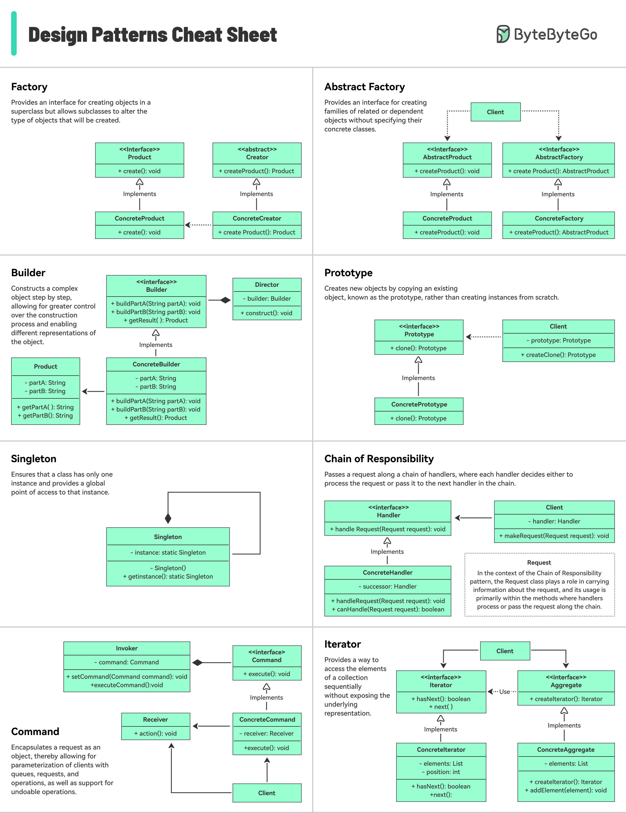

**Source:** [https://twitter.com/i/web/status/1930120127519031582](https://twitter.com/i/web/status/1930120127519031582)
**Original Post Date:** 2025-06-17 11:51:57

# Design Patterns: Comprehensive Overview of Creational and Behavioral Patterns

## Introduction
Design patterns represent proven solutions to common software development challenges. This article provides a detailed exploration of key creational and behavioral design patterns, their structures, implementations, and practical applications. Understanding these patterns is essential for writing maintainable, scalable, and efficient code in object-oriented systems.

## Creational Patterns

Creational patterns focus on object creation mechanisms.

Factory Pattern provides an interface for creating objects without specifying concrete classes.

- Interfaces: Product, Creator
- Classes: ConcreteProduct, ConcreteCreator
- Methods: create(), createProduct()

> **Note/Tip:** Use Factory when object creation logic needs to be decoupled from the client code.

## Abstract Factory Pattern

Creates families of related objects without specifying concrete classes.

Provides a consistent interface for creating products across different platforms or configurations.

- Interfaces: AbstractProduct, AbstractFactory
- Classes: ConcreteProduct, ConcreteFactory

> **Note/Tip:** Ideal for systems requiring multiple product variants.

## Behavioral Patterns

Patterns that define communication between objects.

Command Pattern encapsulates requests as objects, enabling parameterization and queuing of operations.

1. Defines command interface with execute() method
1. Separates invoker from receiver classes

> **Note/Tip:** Use Command pattern for undo/redo functionality or event handling systems.

## Key Takeaways

- Design patterns provide reusable solutions to common software design problems
- Creational patterns focus on object creation and management
- Behavioral patterns define communication between objects
- Each pattern has specific use cases and trade-offs

## Conclusion
Understanding these design patterns is crucial for creating maintainable and scalable software systems. Each pattern offers a unique solution to common problems, enabling developers to write more efficient and flexible code.

## External References

- [Design Patterns: Elements of Reusable Object-Oriented Software](https://www.goodreads.com/book/show/35487.Design_Patterns)
- [Head First Design Patterns](https://www.oreilly.com/library/view/head-first-design/9780596007126/)

## Media

**Image Description:** ### Image Description: Design Patterns Cheat Sheet

The image is a comprehensive **cheat sheet** for **design patterns**, which are reusable solutions to common software design problems. The sheet is organized into a grid format, with each cell representing a different design pattern. The patterns are categorized into **creational**, **structural**, and **behavioral** patterns, though the sheet does not explicitly label them as such. Below is a detailed breakdown of the content:

---

### **1. Factory**
- **Description**: Provides an interface for creating objects in a superclass but allows subclasses to alter the type of objects that will be created.
- **Diagram**:
  - **Interfaces**: 
    - `<<interface>> Product`: Defines the product interface.
    - `<<abstract>> Creator`: Abstract class or interface for creating products.
  - **Classes**:
    - `ConcreteProduct`: Implements the `Product` interface.
    - `ConcreteCreator`: Implements the `Creator` interface and specifies the type of `Product` to create.
  - **Methods**:
    - `create()`: Creates a product.
    - `createProduct()`: Creates a specific product.

---

### **2. Abstract Factory**
- **Description**: Provides an interface for creating families of related or dependent objects without specifying their concrete classes.
- **Diagram**:
  - **Interfaces**:
    - `<<interface>> AbstractProduct`: Defines the abstract product interface.
    - `<<interface>> AbstractFactory`: Defines the abstract factory interface.
  - **Classes**:
    - `ConcreteProduct`: Implements the `AbstractProduct` interface.
    - `ConcreteFactory`: Implements the `AbstractFactory` interface and specifies the type of `AbstractProduct` to create.
  - **Methods**:
    - `createProduct()`: Creates a product.
    - `createProduct()`: Creates a specific product.

---

### **3. Builder**
- **Description**: Constructs a complex object step by step, allowing for greater control over the construction process and enabling different representations of the object.
- **Diagram**:
  - **Interfaces**:
    - `<<interface>> Builder`: Defines the builder interface.
  - **Classes**:
    - `ConcreteBuilder`: Implements the `Builder` interface.
    - `Director`: Coordinates the construction process using the `Builder`.
    - `Product`: The final complex object being built.
  - **Methods**:
    - `buildPartA()`: Builds part A of the product.
    - `buildPartB()`: Builds part B of the product.
    - `getResult()`: Returns the final product.
  - **Attributes**:
    - `partA`: String representing part A.
    - `partB`: String representing part B.

---

### **4. Prototype**
- **Description**: Creates new objects by copying an existing object, known as the prototype, rather than creating instances from scratch.
- **Diagram**:
  - **Interfaces**:
    - `<<interface>> Prototype`: Defines the prototype interface.
  - **Classes**:
    - `ConcretePrototype`: Implements the `Prototype` interface.
  - **Methods**:
    - `clone()`: Creates a copy of the prototype object.
  - **Usage**:
    - The `Client` interacts with the `Prototype` interface to create clones.

---

### **5. Singleton**
- **Description**: Ensures that a class has only one instance and provides a global point of access to that instance.
- **Diagram**:
  - **Class**:
    - `Singleton`: The class that ensures only one instance exists.
  - **Methods**:
    - `getInstance()`: Static method to get the single instance.
  - **Attributes**:
    - `instance`: Static instance of the `Singleton` class.
  - **Usage**:
    - The `Client` accesses the `Singleton` instance through the `getInstance()` method.

---

### **6. Chain of Responsibility**
- **Description**: Passes a request along a chain of handlers, where each handler decides whether to process the request or pass it to the next handler in the chain.
- **Diagram**:
  - **Interfaces**:
    - `<<interface>> Handler`: Defines the handler interface.
  - **Classes**:
    - `ConcreteHandler`: Implements the `Handler` interface.
  - **Methods**:
    - `handleRequest(Request request)`: Handles the request or passes it to the next handler.
    - `canHandle(Request request)`: Determines if the handler can process the request.
    - `makeRequest(Request request)`: Initiates the request.
  - **Attributes**:
    - `successor`: Reference to the next handler in the chain.
  - **Usage**:
    - The `Client` sends a request to the chain, and handlers process it sequentially.

---

### **7. Command**
- **Description**: Encapsulates a request as an object, allowing for parameterization of clients, queuing of requests, and support for undoable operations.
- **Diagram**:
  - **Interfaces**:
    - `<<interface>> Command`: Defines the command interface.
  - **Classes**:
    - `ConcreteCommand`: Implements the `Command` interface.
    - `Receiver`: The object that performs the actual operation.
    - `Invoker`: The object that triggers the command.
  - **Methods**:
    - `execute()`: Executes the command.
    - `executeCommand()`: Invokes the command.
  - **Attributes**:
    - `receiver`: Reference to the `Receiver` object.
    - `action()`: The actual operation performed by the `Receiver`.
  - **Usage**:
    - The `Client` creates a `Command` object and passes it to the `Invoker`.

---

### **8. Iterator**
- **Description**: Provides a way to access the elements of a collection sequentially without exposing the underlying representation.
- **Diagram**:
  - **Interfaces**:
    - `<<interface>> Iterator`: Defines the iterator interface.
    - `<<interface>> Aggregate`: Defines the aggregate interface.
  - **Classes**:
    - `ConcreteIterator`: Implements the `Iterator` interface.
    - `ConcreteAggregate`: Implements the `Aggregate` interface.
  - **Methods**:
    - `hasNext()`: Checks if there are more elements.
    - `next()`: Gets the next element.
    - `createIterator()`: Creates an iterator for the aggregate.
  - **Attributes**:
    - `elements`: List of elements in the aggregate.
    - `position`: Current position in the iteration.
  - **Usage**:
    - The `Client` uses the `Iterator` to traverse the `Aggregate`.

---

### **General Observations**
1. **Structure**: Each pattern is represented with a UML-like diagram, showing interfaces, classes, and their relationships.
2. **Terminology**: Standard UML notations are used, such as `<<interface>>` for interfaces and arrows for inheritance or implementation.
3. **Clarity**: The patterns are organized in a grid format, making it easy to compare and contrast them.
4. **Purpose**: The sheet serves as a quick reference for understanding and implementing common design patterns.

---

### **Conclusion**
This image is a well-organized and visually clear **cheat sheet** for design patterns, providing a concise overview of each pattern's purpose, structure, and usage. It is particularly useful for developers and software engineers who need a quick reference for implementing design patterns in their projects.
