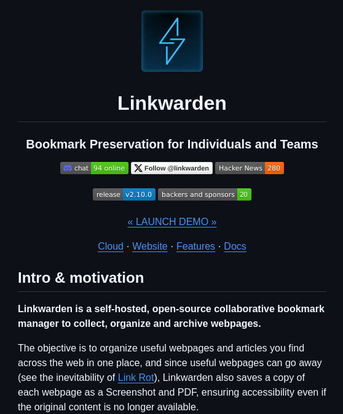

**Source:** [https://twitter.com/i/web/status/1915737215428108636](https://twitter.com/i/web/status/1915737215428108636)
**Original Post Date:** 2025-05-28 05:38:39

# Linkwarden: Self-Hosted Collaborative Bookmark Manager with Link Rot Mitigation

## Introduction
Webpage preservation has become increasingly critical as digital content faces rapid obsolescence. Linkwarden emerges as a robust solution that combines collaborative features with automated archiving capabilities. By leveraging self-hosted infrastructure, it offers organizations complete control over their web bookmarks while mitigating the risk of link rot through systematic screenshot and PDF preservation.

## Technical Architecture and Implementation

Linkwarden's architecture is designed for scalability and data integrity. The system comprises a backend server that handles bookmark processing, archiving services for generating screenshots and PDFs, and a frontend interface for user interaction.

The self-hosting approach allows organizations to implement comprehensive security measures through firewalls, access controls, and encryption protocols.

```bash
# Example deployment command using Docker
sudo docker run -d --name linkwarden -p 80:80 linkwarden/linkwarden:v2.10.0
```

## Archiving and Preservation Mechanism

Linkwarden's core strength lies in its dual-archival strategy. Each bookmarked webpage is simultaneously captured as a screenshot and converted to PDF format, ensuring content accessibility even when original links become invalid.

The system automatically retries failed archive attempts and implements intelligent caching to optimize resource usage.

## Collaboration Features

Team collaboration is enabled through role-based access control and shared bookmark collections. The platform supports real-time updates, group tagging, and cross-team organization of resources.

Integration capabilities with other tools enhance workflow efficiency in collaborative environments.

- Role-Based Access Control (RBAC) implementation
- Shared collections for team projects
- Real-time synchronization across devices

> **Note/Tip:** Consider implementing periodic archiving checks to ensure content integrity.

> **Note/Tip:** Regular database maintenance is crucial for performance optimization.

## Key Takeaways

- Self-hosted deployment provides maximum control over data security and compliance requirements
- Dual-archival strategy (screenshots + PDFs) effectively mitigates link rot risks
- Collaborative features enable efficient team knowledge management

## Conclusion
Linkwarden represents a significant advancement in bookmark management by combining robust preservation mechanisms with collaborative capabilities. Its self-hosted nature makes it an ideal solution for organizations prioritizing data sovereignty while maintaining comprehensive web resource archiving.

## External References

- [Official Linkwarden Documentation](https://docs.linkwarden.com)
- [Linkwarden GitHub Repository](https://github.com/linkwarden/linkwarden)


## Media

**Image Description:** The image is a screenshot of a webpage or documentation for a software project called **Linkwarden**. Below is a detailed description of the content and layout:

### **Main Subject: Linkwarden**
- **Title**: The main subject of the image is **Linkwarden**, which is described as a self-hosted, open-source collaborative bookmark manager. Its purpose is to help users collect, organize, and archive webpages.

### **Header Section**
1. **Logo**:
   - At the top center, there is a blue lightning bolt icon enclosed in a dark blue square. This serves as the logo for Linkwarden.
   
2. **Online Chat and Social Links**:
   - Below the logo, there are links and indicators:
     - **Chat**: A Discord chat icon with the text "94 online," indicating active users in the chat.
     - **Follow**: A link to follow the project on Twitter with the handle `@linkwarden`.
     - **Hacker News**: A link to the project's Hacker News page, showing "280" points or votes.

### **Main Content**
1. **Project Name and Tagline**:
   - The project name, **Linkwarden**, is prominently displayed in large, bold white text.
   - Below the name, the tagline reads:  
     **"Bookmark Preservation for Individuals and Teams"**  
     This highlights the primary purpose of the tool.

2. **Navigation Links**:
   - Below the tagline, there are several navigation links:
     - **Launch Demo**: A button to launch a demo of the application.
     - **Cloud**, **Website**, **Features**, and **Docs**: Links to different sections of the project, providing access to the cloud service, website, feature details, and documentation.

3. **Release and Backers Information**:
   - **Release Version**: The current release version is displayed as **v2.10.0**.
   - **Backers and Sponsors**: A link to the backers and sponsors, with a count of **20**.

### **Introduction and Motivation**
1. **Intro & Motivation Section**:
   - The section is titled **"Intro & motivation"** in bold white text.
   - The text explains the purpose and motivation behind Linkwarden:
     - **Description**:  
       Linkwarden is a **self-hosted, open-source collaborative bookmark manager** designed to collect, organize, and archive webpages.
     - **Objective**:  
       The primary goal is to organize useful webpages and articles found across the web in one place.
     - **Problem Addressed**:  
       The text highlights the issue of **link rot** (the phenomenon where useful webpages and articles disappear over time). Linkwarden addresses this by saving each webpage as a **screenshot** and **PDF**, ensuring accessibility even if the original content is no longer available.

### **Design and Layout**
- **Background**: The background is entirely black, creating a high-contrast, clean, and modern look.
- **Text Color**: The text is primarily in white, with links and interactive elements highlighted in blue or other contrasting colors.
- **Icons**: The use of icons (e.g., Discord chat, Twitter, Hacker News) adds visual cues for quick navigation.
- **Structure**: The content is well-organized into sections, with clear headings and subheadings for easy readability.

### **Technical Details**
- **Self-Hosted**: Emphasizes that Linkwarden can be hosted on personal or private servers, offering control over data.
- **Open-Source**: Indicates that the project is open-source, allowing users to contribute, modify, and audit the code.
- **Collaborative**: Highlights the collaborative nature of the tool, suggesting it can be used by teams.
- **Features Mentioned**:
  - Saving webpages as screenshots and PDFs.
  - Addressing the issue of link rot.

### **Overall Impression**
The image effectively communicates the purpose, features, and motivation behind Linkwarden, targeting users who value organization, accessibility, and the preservation of web content. The design is modern, clean, and user-friendly, with clear calls to action and navigation links.
