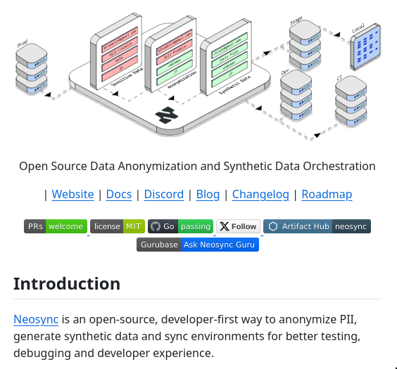

# Data Anonymizer

## Description
Neosync is a tool for anonymizing PII, generating synthetic data, and syncing environments to facilitate testing, debugging, and compliance with data privacy regulations...

## Content
Neosync is a tool for anonymizing PII, generating synthetic data, and syncing environments to facilitate testing, debugging, and compliance with data privacy regulations

## Category Information

- Main Category: development_tools
- Sub Category: debugging_tools
- Item Name: data_anonymizer

## Source

- Original Tweet: [https://twitter.com/i/web/status/1866615462844383425](https://twitter.com/i/web/status/1866615462844383425)
- Date: 2025-02-20 15:36:34

## Media

### Media 1

**Description:** This image depicts a webpage for Neosync, an open-source data anonymization tool, featuring an illustration of a flowchart at the top. The chart consists of a series of boxes connected by arrows, each representing a step in the process: "Prod" (input), "Anonymization," "Synthetic Data Generation," and "CI/CD" (output).

Below the illustration is a brief description of Neosync's purpose as an open-source developer-first tool for generating synthetic data. At the bottom of the page, links to various sections of the website are provided in black text on a white background.

Overall, this image appears to be a screenshot of a webpage dedicated to showcasing and promoting the features and capabilities of Neosync.

*Last updated: 2025-02-20 15:36:34*