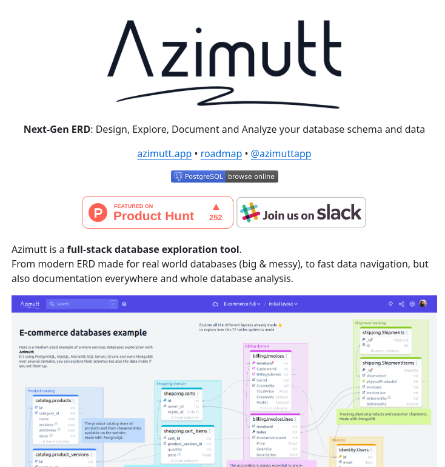

Azimutt is a next-generation Entity-Relationship Diagram (ERD) tool designed for database designers and developers to design, explore, document, and analyze their database schema and data. It offers a user-friendly interface and interactive features to visualize and manage complex databases.

#### Technical Content
Azimutt provides a comprehensive platform for database exploration and analysis. The tool allows users to create a visual representation of their database schema, including tables, relationships, and data types. This visualization enables developers to better understand the structure of their database and identify potential issues or areas for improvement.

The Azimutt interface features various components, such as:
* A diagram view that displays the database schema
* Buttons and menus for interacting with the schema
* Support for exploring and analyzing complex databases

For example, a developer using Azimutt can create a diagram of their database schema, including tables for customers, orders, and products. The tool would then display the relationships between these tables, such as a customer having multiple orders, and an order being associated with one or more products.

#### Key Takeaways and Best Practices
* Use Azimutt to visualize and understand complex database schemas
* Leverage the tool's interactive features to explore and analyze database structures
* Utilize Azimutt's ERD capabilities to design and document database schemas

Best practices for using Azimutt include:
* Regularly updating the database schema diagram to reflect changes in the database structure
* Using the tool's analysis features to identify potential performance bottlenecks or data inconsistencies
* Collaborating with team members to ensure that the database schema is well-documented and easily understandable

#### References
* [Azimutt Website](https://azimutt.com) - The official website for Azimutt, featuring information on its features, pricing, and contact details.
* Entity-Relationship Diagram (ERD) - A conceptual representation of the structure of a database, used to design and understand complex databases.

By following these guidelines and utilizing Azimutt's powerful features, developers can improve their understanding of complex database schemas and create more efficient, scalable, and maintainable databases.
## Source

- Original Tweet: [https://twitter.com/i/web/status/1878802958004957344](https://twitter.com/i/web/status/1878802958004957344)
- Date: 2025-02-20 17:04:33

## Media

### Media 1

**Description:** The image is a screenshot of the Azimutt website, which appears to be a database exploration tool. The purpose of the image is likely to showcase the features and capabilities of the platform.

Here are some key observations about the image:

* **Header**
	+ The header contains the logo "Azimutt" in large text.
	+ Below the logo, there is a tagline that reads "Next-Gen ERD: Design, Explore, Document and Analyze your database schema and data".
* **Main Content**
	+ The main content area features a screenshot of the Azimutt interface, which displays a diagram of a database schema.
	+ The diagram includes various components such as tables, relationships, and data types.
	+ There are also several buttons and menus visible in the screenshot, suggesting that users can interact with the database schema in different ways.
* **Footer**
	+ The footer section contains links to other pages on the website, including "Features", "Pricing", and "Contact".
	+ There is also a call-to-action button that invites visitors to try Azimutt for free.

Overall, the image suggests that Azimutt is a powerful tool for database designers and developers who want to visualize and manage their database schema. The platform's user-friendly interface and interactive features make it easy to explore and analyze complex databases.

*Last updated: 2025-02-20 17:04:33*