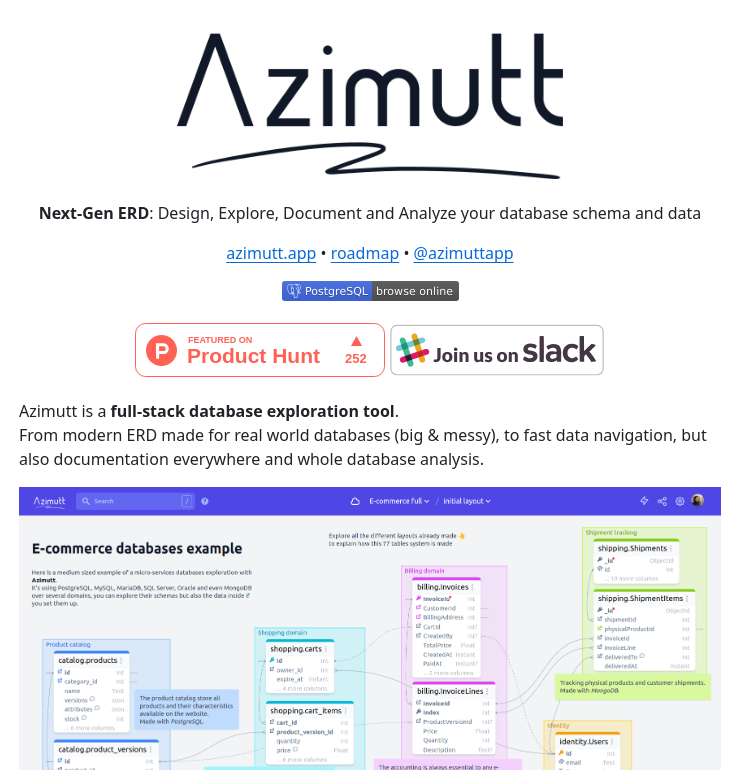

# Database Schema Explorer

## Description
Azimutt: Database schema explorer and analyzer...

## Content
Azimutt: Database schema explorer and analyzer

## Category Information

- Main Category: development_tools
- Sub Category: debugging_tools
- Item Name: database_schema_explorer

## Source

- Original Tweet: [https://twitter.com/i/web/status/1878802958004957344](https://twitter.com/i/web/status/1878802958004957344)
- Date: 2025-02-20 15:36:34

## Media

### Media 1

**Description:** The image is a screenshot of the Azimutt website, which appears to be a database exploration tool. The purpose of the image is likely to showcase the features and capabilities of the platform.

Here are some key observations about the image:

* **Header**
	+ The header contains the logo "Azimutt" in large text.
	+ Below the logo, there is a tagline that reads "Next-Gen ERD: Design, Explore, Document and Analyze your database schema and data".
* **Main Content**
	+ The main content area features a screenshot of the Azimutt interface, which displays a diagram of a database schema.
	+ The diagram includes various components such as tables, relationships, and data types.
	+ There are also several buttons and menus visible in the screenshot, suggesting that users can interact with the database schema in different ways.
* **Footer**
	+ The footer section contains links to other pages on the website, including "Features", "Pricing", and "Contact".
	+ There is also a call-to-action button that invites visitors to try Azimutt for free.

Overall, the image suggests that Azimutt is a powerful tool for database designers and developers who want to visualize and manage their database schema. The platform's user-friendly interface and interactive features make it easy to explore and analyze complex databases.

*Last updated: 2025-02-20 15:36:34*