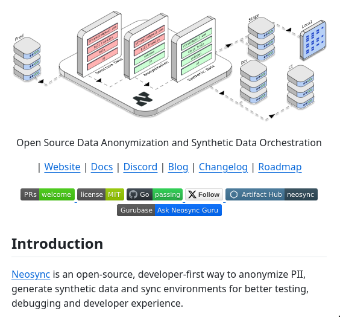

Neosync is a powerful, open-source tool designed for anonymizing personally identifiable information (PII), generating synthetic data, and syncing environments. This facilitates smoother testing, debugging, and ensures compliance with stringent data privacy regulations. By leveraging Neosync, developers can protect sensitive data while still enabling effective development and testing processes.

#### Technical Overview
Neosync operates by taking in production data (referred to as "Prod" input) and processing it through an anonymization step. This critical phase transforms PII into de-identified or pseudonymized data, significantly reducing the risk of privacy breaches. Following anonymization, Neosync generates synthetic data that mimics the statistical properties of the original data set but does not contain any real PII. This synthetic data can then be seamlessly integrated into Continuous Integration/Continuous Deployment (CI/CD) pipelines for testing and development purposes.

The process can be visualized as follows:
1. **Input (Prod)**: Real production data that may contain PII.
2. **Anonymization**: The process of de-identifying or pseudonymizing the input data to protect privacy.
3. **Synthetic Data Generation**: Creating artificial data that statistically resembles the anonymized data but is entirely synthetic and safe for use in non-production environments.
4. **Output (CI/CD)**: The integration of synthetic data into development and testing pipelines, ensuring compliance with data privacy laws while facilitating thorough application testing.

#### Examples and Use Cases
- **Testing and Debugging**: Developers can use Neosync to create synthetic datasets that mimic real user interactions without exposing actual user data. This is particularly useful for testing scenarios that require diverse and sensitive information.
- **Compliance**: For organizations handling large amounts of personal data, Neosync helps ensure compliance with regulations like GDPR and CCPA by anonymizing data used in development and testing environments.

#### Key Takeaways and Best Practices
- **Adopt Privacy by Design**: Incorporate tools like Neosync early in the development cycle to prioritize data privacy.
- **Use Synthetic Data for Testing**: Minimize the use of real PII in testing environments to reduce privacy risks.
- **Regularly Update Compliance Measures**: Stay abreast of changing data privacy regulations and update anonymization and synthetic data generation strategies accordingly.

#### References
- [Neosync Official Website](link-to-website) - For detailed documentation, tutorials, and community support.
- Data Privacy Regulations:
  - [GDPR (General Data Protection Regulation)](https://gdpr.eu/)
  - [CCPA (California Consumer Privacy Act)](https://oag.ca.gov/privacy/ccpa)

By integrating Neosync into their development workflows, organizations can strike a balance between the need for realistic data in testing environments and the imperative to protect user privacy. This not only aids in compliance with data protection laws but also fosters a culture of privacy and security within the development community.
## Source

- Original Tweet: [https://twitter.com/i/web/status/1866615462844383425](https://twitter.com/i/web/status/1866615462844383425)
- Date: 2025-02-20 16:23:05

## Media

### Media 1

**Description:** This image depicts a webpage for Neosync, an open-source data anonymization tool, featuring an illustration of a flowchart at the top. The chart consists of a series of boxes connected by arrows, each representing a step in the process: "Prod" (input), "Anonymization," "Synthetic Data Generation," and "CI/CD" (output).

Below the illustration is a brief description of Neosync's purpose as an open-source developer-first tool for generating synthetic data. At the bottom of the page, links to various sections of the website are provided in black text on a white background.

Overall, this image appears to be a screenshot of a webpage dedicated to showcasing and promoting the features and capabilities of Neosync.

*Last updated: 2025-02-20 16:23:05*