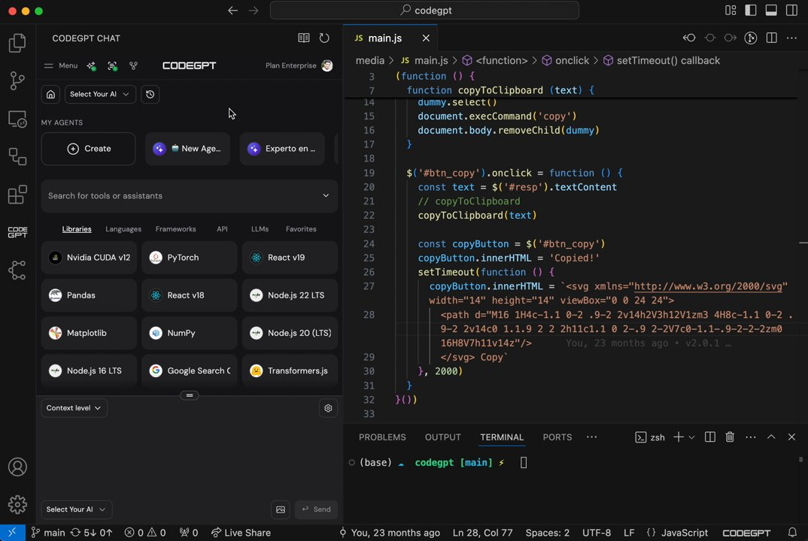

**Source:** [https://twitter.com/i/web/status/1881468220550307939](https://twitter.com/i/web/status/1881468220550307939)
**Original Post Date:** 2025-05-27 21:07:57

# Clipboard Copy Utility in JavaScript: Implementation and Integration with AI-Driven IDE

## Introduction
This knowledge base item examines a practical implementation of clipboard copy functionality in web applications, paired with an overview of its context within an advanced development environment featuring AI capabilities. The code demonstrates robust text copying mechanisms while the surrounding ecosystem showcases how contemporary IDEs leverage artificial intelligence to enhance developer workflows.

## Core Clipboard Implementation

The primary clipboard functionality is implemented through a dedicated function that creates and manages temporary DOM elements for safe text copying. This approach avoids direct interaction with clipboard data, adhering to modern web security standards.

By using a dynamically created textarea element, the implementation ensures cross-browser compatibility while maintaining clean separation from the main document structure.

_Core function that safely copies text to clipboard using temporary DOM elements._

```javascript
function copyToClipboard(text) {
    const dummy = document.createElement('textarea');
    document.body.appendChild(dummy);
    dummy.value = text;
    dummy.select();
    document.execCommand('copy');
    document.body.removeChild(dummy);
}
```

- Creates isolated textarea element for secure copy operation
- Manages element lifecycle within document body
- Executes standard clipboard command

> **Note/Tip:** Always remove temporary elements from DOM to prevent memory leaks.

> **Note/Tip:** Consider using navigator.clipboard.writeText() for modern browsers where supported.

## UI Integration and Feedback

The implementation includes sophisticated user feedback mechanisms through dynamic button states, enhancing the copy operation's interactivity and usability.

Visual indicators provide immediate confirmation of successful operations while maintaining clean UI state management post-action.

```javascript
const copyButton = $('#btn_copy');
copyButton.innerHTML = 'Copied!';
setTimeout(function () {
    copyButton.innerHTML = '<svg>...</svg> Copy';
}, 2000);
```

1. Initial state: SVG icon + text button
1. Post-click: 'Copied!' message
1. Auto-reset after 2 seconds

## AI-Driven Development Environment Context

The clipboard implementation exists within a modern IDE featuring AI integration through the CODEGPT CHAT section, offering enhanced developer productivity and tooling.

Pre-built agents and contextual libraries provide immediate access to relevant tools like PyTorch, React v19, and Transformers.js.

- AI-assisted code generation through CODEGPT CHAT
- Integrated library selection for quick prototyping
- Context-aware tool suggestions

## Key Takeaways

- Clipboard copy implementation requires careful DOM management and temporary element handling.
- Modern IDEs integrate AI features to streamline common development tasks.
- UI feedback is crucial for user experience in clipboard operations.

## Conclusion
This implementation demonstrates effective clipboard functionality within a modern, AI-enhanced development environment. The combination of secure text copying mechanisms with intelligent tooling showcases the evolution of web development workflows toward more automated and efficient practices.

## External References

- [MDN Clipboard API Documentation](https://developer.mozilla.org/en-US/docs/Web/API/Clipboard_API)
- [WebAIM Accessibility Guidelines for Copy Operations](https://webaim.org/articles/copy/)


## Media

**Image Description:** The image depicts a development environment, specifically a code editor, with a focus on a JavaScript file named `main.js`. The editor is part of a larger interface that includes a sidebar with various tools, libraries, and frameworks. Below is a detailed breakdown of the image:

---

### **Main Subject: Code Editor**
The central part of the image shows the code editor with the file `main.js` open. The code is written in JavaScript and appears to implement a functionality for copying text to the clipboard. Here are the key elements of the code:

#### **Code Structure**
1. **Function Definition:**
   ```javascript
   function copyToClipboard(text) {
       const dummy = document.createElement('textarea');
       document.body.appendChild(dummy);
       dummy.value = text;
       dummy.select();
       document.execCommand('copy');
       document.body.removeChild(dummy);
   }
   ```
   - This function creates a temporary `<textarea>` element, appends it to the document body, sets its value to the provided `text`, selects the text, executes the `copy` command, and then removes the `<textarea>` from the DOM.

2. **Event Listener for Button Click:**
   ```javascript
   $('#btn_copy').onclick = function () {
       const text = $('#resp').textContent;
       copyToClipboard(text);
   };
   ```
   - This attaches an `onclick` event listener to an element with the ID `btn_copy`. When the button is clicked, it retrieves the text content from an element with the ID `resp` and passes it to the `copyToClipboard` function.

3. **Dynamic Button Text Update:**
   ```javascript
   const copyButton = $('#btn_copy');
   copyButton.innerHTML = 'Copied!';
   setTimeout(function () {
       copyButton.innerHTML = '<svg>...</svg> Copy';
   }, 2000);
   ```
   - When the button is clicked, its inner HTML is temporarily updated to display "Copied!" to indicate that the text has been copied to the clipboard. After 2 seconds, the button's text reverts to its original state, which includes an SVG icon and the word "Copy."

4. **SVG Icon:**
   - The SVG icon is embedded directly in the code and serves as a visual element for the "Copy" button.

---

### **Sidebar: Tools and Libraries**
The left sidebar of the interface is organized into several sections:

1. **"CODEGPT CHAT" Section:**
   - This section includes a dropdown labeled "Select Your AI," suggesting integration with AI tools or models.
   - Below it, there are options to "Create" new agents or tools, and a search bar for finding tools or assistants.

2. **"MY AGENTS" Section:**
   - Lists pre-defined agents or tools, such as "New Age..." and "Experto en...," indicating customizable or pre-built functionalities.

3. **"Libraries, Languages, Frameworks, API, LL.Ms, Favorites" Section:**
   - This section provides a list of commonly used tools and libraries, including:
     - **Libraries:** PyTorch, React v19, Pandas, Matplotlib, NumPy, Node.js LTS.
     - **Languages:** Node.js LTS.
     - **Frameworks:** React v19, React v8.
     - **APIs:** Google Search.
     - **LLMs:** Transformers.js.
   - These tools are likely available for quick integration into the project.

---

### **Terminal and Other Tabs**
At the bottom of the image, there is a terminal tab labeled `TERMINAL`, indicating that the user can run commands or scripts directly from the terminal. The terminal shows the current directory as `codegpt` and the branch as `main`.

---

### **Additional Interface Elements**
1. **Top Bar:**
   - The top bar includes navigation controls, a search bar labeled "codegpt," and various icons for settings, notifications, and other functionalities.

2. **Status Bar:**
   - The bottom status bar provides details about the file, such as the line and column number (Ln 28, Col 77), encoding (UTF-8), and file type (JavaScript).

3. **Context Level:**
   - The sidebar includes a "Context level" dropdown, suggesting the ability to adjust the context or scope of the tools being used.

---

### **Overall Context**
The image appears to be from a development environment that integrates AI tools, libraries, and frameworks, likely for building applications or automating tasks. The main focus is on the JavaScript code for copying text to the clipboard, which is a common utility function in web development. The interface suggests a modern, AI-driven development workflow with easy access to various tools and libraries.

---

### **Summary**
The main subject of the image is the JavaScript code in `main.js`, which implements a clipboard copying functionality with dynamic button feedback. The surrounding interface includes a sidebar with AI tools, libraries, and frameworks, as well as a terminal for command-line operations. The environment is designed for efficient development, with a focus on integrating AI and automation.
