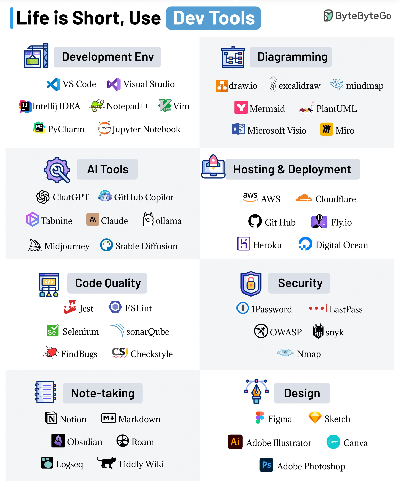

**Source:** [https://twitter.com/i/web/status/1881934073058431112](https://twitter.com/i/web/status/1881934073058431112)
**Original Post Date:** 2025-05-27 17:42:24

# Essential Development Tools and AI Features: A Comprehensive Guide

## Introduction
Modern software development requires a robust toolkit to maximize efficiency and code quality. This guide presents an exhaustive catalog of development tools organized into eight key categories, emphasizing the integration of AI-powered features in modern IDEs and development workflows. Each section highlights must-have tools that address specific aspects of software development lifecycle, from environment setup to deployment and maintenance.

## Development Environment Tools

Modern development environments are pivotal for productivity. VS Code leads with its extensive extensibility and cross-platform support, while IntelliJ IDEA provides robust features for JVM-based languages. PyCharm excels in Python development with integrated debugging and testing capabilities.

Traditional tools like Vim offer efficiency through keyboard-driven interfaces, while Jupyter Notebook enables interactive coding and data visualization.

- VS Code: Extensive marketplace of extensions for customization
- IntelliJ IDEA: Advanced refactoring tools and debugging support
- PyCharm: Integrated virtual environment management

## AI-Enhanced Development Tools

Artificial Intelligence has transformed coding workflows through intelligent code completion, generation, and debugging assistance.

GitHub Copilot revolutionizes pair programming with AI suggestions, while Tabnine offers context-aware autocompletion.

1. ChatGPT: Code explanation and documentation generation
1. Ollama: On-premise AI model deployment for privacy-sensitive projects

> **Note/Tip:** Consider license implications when using AI tools in production environments.

> **Note/Tip:** Test AI-generated code thoroughly before integration.

## Deployment and Security

Cloud infrastructure platforms like AWS provide scalable deployment solutions, while security tools ensure robust protection.

Snyk integrates seamlessly with CI/CD pipelines to detect vulnerabilities in third-party dependencies.

- AWS: Comprehensive IaaS and PaaS offerings
- Cloudflare: Global CDN and DDoS protection

## Productivity Tools

Efficient development requires proper documentation, diagramming, and note-taking tools.

Miro's collaborative whiteboarding enables real-time design discussions, while Notion facilitates knowledge management.

1. draw.io: Cross-platform diagram creation
1. Notion: All-in-one workspace for documentation and project tracking

## Key Takeaways

- Adopt AI-enhanced tools for faster development cycles, but maintain human oversight.
- Choose development environments based on specific language needs and team workflows.
- Integrate security tools early in the development process to prevent vulnerabilities.

## Conclusion
The right combination of tools can significantly enhance developer productivity and code quality. This guide provides a foundation for selecting appropriate tools across different categories, with special emphasis on AI integration that's reshaping modern software development workflows.

## External References

- [VS Code Documentation](https://code.visualstudio.com/docs)
- [GitHub Copilot Guide](https://github.com/features/copilot)
- [AWS Developer Resources](https://aws.amazon.com/developer/)

## Media

**Image Description:** The image is a comprehensive infographic titled **"Life is Short, Use Dev Tools"**, which categorizes and showcases a wide range of development tools, organized into different sections. The layout is clean and visually structured, with icons and names for each tool. Below is a detailed breakdown of the image:

### **Header**
- **Title**: "Life is Short, Use Dev Tools"
  - The title is prominently displayed at the top in a bold, clear font.
  - The phrase emphasizes the importance of utilizing efficient tools to streamline development workflows.
- **Logo**: In the top-right corner, there is a logo with the text **"ByteByteByteGo"**, which suggests the creator or source of the infographic.

### **Sections**
The infographic is divided into **eight main categories**, each with its own set of tools. Each category is visually separated by a light gray background, and the tools within each category are listed with their respective icons and names.

---

### **1. Development Env (Development Environment)**
- **Tools**:
  - **VS Code**: A popular code editor known for its extensibility and cross-platform support.
  - **Visual Studio**: A full-featured IDE for Windows, macOS, and Linux.
  - **IntelliJ IDEA**: A powerful IDE for Java and other JVM-based languages.
  - **Notepad++**: A lightweight text editor for Windows.
  - **Vim**: A highly configurable text editor, popular among developers for its efficiency.
  - **PyCharm**: An IDE specifically designed for Python development.
  - **Jupyter Notebook**: An open-source web application for creating and sharing documents that contain live code, equations, visualizations, and narrative text.

---

### **2. Diagramming**
- **Tools**:
  - **draw.io**: A web-based tool for creating diagrams and flowcharts.
  - **Excalidraw**: A simple, collaborative drawing tool for creating diagrams.
  - **Mindmap**: A tool for creating mind maps and visualizing ideas.
  - **Mermaid**: A JavaScript-based diagramming and charting tool.
  - **PlantUML**: A tool for creating UML diagrams using a simple text language.
  - **Microsoft Visio**: A professional diagramming tool for creating flowcharts, organizational charts, and more.
  - **Miro**: A collaborative whiteboard tool for brainstorming and visual collaboration.

---

### **3. AI Tools**
- **Tools**:
  - **ChatGPT**: A large language model developed by OpenAI, used for generating human-like text.
  - **GitHub Copilot**: An AI pair programmer that helps developers write code more efficiently.
  - **Tabnine**: An AI-powered code completion tool.
  - **Claude**: An AI language model developed by Anthropic.
  - **Ollama**: A tool for running large language models locally.
  - **Midjourney**: An AI-powered image generation tool.
  - **Stable Diffusion**: An open-source AI model for generating images from text prompts.

---

### **4. Hosting & Deployment**
- **Tools**:
  - **AWS**: Amazon Web Services, a comprehensive cloud computing platform.
  - **Cloudflare**: A content delivery network (CDN) and DDoS mitigation service.
  - **GitHub**: A web-based platform for version control and collaboration.
  - **Fly.io**: A platform for deploying and scaling web applications.
  - **Heroku**: A cloud platform as a service (PaaS) for deploying and scaling applications.
  - **Digital Ocean**: A cloud hosting provider offering virtual private servers.

---

### **5. Code Quality**
- **Tools**:
  - **Jest**: A JavaScript testing framework for unit and integration tests.
  - **ESLint**: A static code analysis tool for identifying and reporting on patterns in JavaScript code.
  - **Selenium**: A suite of tools for automating web browsers.
  - **SonarQube**: A platform for continuous inspection of code quality.
  - **FindBugs**: A tool for detecting bugs in Java code.
  - **Checkstyle**: A tool for enforcing coding standards in Java.

---

### **6. Security**
- **Tools**:
  - **1Password**: A password manager for securely storing credentials.
  - **LastPass**: Another popular password manager.
  - **OWASP**: The Open Web Application Security Project, a community that provides resources for improving software security.
  - **Snyk**: A tool for detecting and fixing vulnerabilities in open-source dependencies.
  - **Nmap**: A network scanning tool for discovering hosts and services on a network.

---

### **7. Note-taking**
- **Tools**:
  - **Notion**: A versatile workspace for note-taking, task management, and collaboration.
  - **Markdown**: A lightweight markup language for formatting plain text documents.
  - **Obsidian**: A note-taking tool that uses markdown files and supports bidirectional links.
  - **Roam**: A note-taking tool that emphasizes interconnected thinking and knowledge management.
  - **Logseq**: A note-taking tool that uses markdown and supports graph-based thinking.
  - **TiddlyWiki**: A non-linear personal web notebook that can be used for note-taking and organizing information.

---

### **8. Design**
- **Tools**:
  - **Figma**: A collaborative interface design tool for creating wireframes, mockups, and prototypes.
  - **Sketch**: A design tool for creating user interfaces and graphics.
  - **Adobe Illustrator**: A vector graphics editor for creating illustrations and designs.
  - **Canva**: An online graphic design tool for creating visual content.
  - **Adobe Photoshop**: A raster graphics editor for photo editing and design.

---

### **Visual Design**
- **Icons**: Each tool is represented by a small, recognizable icon, making it easy to identify the tool at a glance.
- **Color Scheme**: The background is white, with light gray sections separating the categories. The text is primarily black, ensuring readability.
- **Typography**: The font is clean and modern, with clear differentiation between section headers and tool names.

### **Purpose**
The infographic serves as a quick reference guide for developers, designers, and other professionals, highlighting the most popular and useful tools across various categories. It emphasizes the importance of leveraging the right tools to enhance productivity and efficiency.

---

This detailed breakdown provides a comprehensive overview of the image, focusing on the main subject and relevant technical details.
