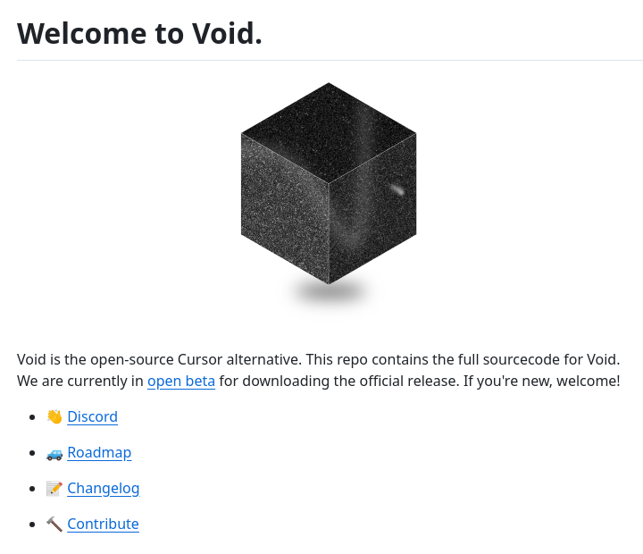

**Source:** [https://twitter.com/i/web/status/1881612829234438609](https://twitter.com/i/web/status/1881612829234438609)
**Original Post Date:** 2025-05-27 19:20:42

# Void: An Open-Source Text Editor AI Platform with IDE Features

## Introduction
Void is a revolutionary open-source text editor that combines advanced AI capabilities with traditional IDE features. Currently in its open beta phase, this project represents a significant step forward in democratizing AI-powered development tools. Built as an alternative to commercial solutions like Cursor, Void offers developers a comprehensive platform for modern coding practices while maintaining transparency through its open-source nature.

## Core Platform Overview

Void stands out in the text editor landscape by integrating AI-driven features directly into an open-source framework. The project's architecture emphasizes extensibility and community involvement, allowing developers to contribute both code and suggestions.

The platform is currently undergoing active development with an open beta release available for testing. This phase allows early adopters to experience the core functionalities while contributing feedback to shape future iterations.

- Real-time code suggestions and completions
- AI-assisted debugging capabilities
- Intelligent refactoring tools
- Cross-platform compatibility

## Community Integration and Development

Void's development process is heavily community-driven, as evidenced by its active Discord channel and comprehensive documentation. The project maintains transparency through regular changelog updates and a well-defined roadmap.

Contributors can engage with the project in multiple ways: from submitting code to participating in beta testing or providing feedback on feature requests.

1. Join the official Discord community for real-time discussions and support
1. Review the changelog regularly to track new features and updates
1. Contribute code through GitHub using established contribution guidelines

> **Note/Tip:** While in beta, users should expect ongoing improvements and potential feature updates.

> **Note/Tip:** Regular community engagement is crucial for shaping future development priorities.

## Technical Architecture

Void's modular architecture allows for easy integration of AI models and traditional editing features. The platform is designed to be both extensible and maintainable, encouraging third-party contributions and customization.

The source code is organized in a way that makes it accessible to developers of various experience levels while maintaining robust performance characteristics.

## Key Takeaways

- Void represents the future of open-source development tools by integrating advanced AI capabilities without compromising on transparency or community involvement.
- The project's beta phase offers an excellent opportunity for early adoption and meaningful contribution to shaping its evolution.
- Developers can leverage Void as a comprehensive platform that combines traditional IDE features with cutting-edge AI functionality.

## Conclusion
Void stands at the intersection of open-source ideals and modern development requirements. As it continues through its beta phase, the project offers developers an opportunity to participate in shaping the future of intelligent coding tools while benefiting from their immediate practical applications.

## External References

- [Official Void GitHub Repository](https://github.com/vstudio/void)
- [Void Documentation and Roadmap](https://docs.void.dev/)

## Media

**Image Description:** ### Description of the Image

The image appears to be a screenshot of a webpage or a documentation page for an open-source project called **Void**. Below is a detailed breakdown of the content and elements present in the image:

---

#### **1. Title**
- At the top of the image, there is a heading in bold text that reads:
  **"Welcome to Void."**
  - This indicates that the page is an introductory or welcome section for the Void project.

---

#### **2. Central Image**
- In the center of the image, there is a 3D rendering of a **black cube** with a textured, grainy surface.
  - The cube has a slightly reflective or metallic appearance, with visible highlights and shadows, giving it a three-dimensional effect.
  - The cube is positioned centrally and serves as the main visual element of the page.
  - Below the cube, there is a subtle shadow, enhancing the 3D effect.

---

#### **3. Text Content**
- Below the title and the central image, there is a block of text providing information about the Void project:
  - **First Paragraph:**
    - **"Void is the open-source-source Cursor alternative. This repo contains the full sourcecode for Void."**
      - This sentence introduces Void as an open-source alternative to another project called **Cursor**.
      - It emphasizes that the repository (repo) contains the complete source code for Void.
  - **Second Paragraph:**
    - **"We are currently in open beta for downloading the official release. If you're new, welcome!"**
      - This indicates that Void is in an **open beta phase**, meaning it is available for public testing and feedback.
      - It encourages new users to join and participate in the project.

---

#### **4. Navigation Links**
- Below the text, there is a list of navigation links, each accompanied by an icon:
  - **Discord:**
    - Icon: A speech bubble with a smiley face (indicating communication or chat).
    - Text: **"Discord"**
    - This link likely directs users to the Void project's Discord server for community interaction and support.
  - **Roadmap:**
    - Icon: A car (indicating progress or direction).
    - Text: **"Roadmap"**
    - This link likely leads to a page detailing the project's development plans, goals, and future features.
  - **Changelog:**
    - Icon: A pencil (indicating updates or changes).
    - Text: **"Changelog"**
    - This link likely provides a log of updates, changes, and improvements made to the Void project over time.
  - **Contribute:**
    - Icon: A hammer and pickaxe (indicating development or contribution).
    - Text: **"Contribute"**
    - This link likely directs users to information on how to contribute to the Void project, such as coding, documentation, or testing.

---

#### **5. Design and Layout**
- The overall layout is clean and minimalistic, with a white background that emphasizes the central black cube and the text.
- The text is well-organized, with clear headings and bullet points for navigation links.
- The use of icons next to the links adds visual clarity and helps users quickly identify the purpose of each link.

---

### **Summary**
The main subject of the image is the **Void project**, an open-source alternative to Cursor. The central black cube serves as the project's visual icon, symbolizing its core identity. The text provides essential information about Void, including its open-source nature, current beta status, and the availability of its source code. The navigation links offer quick access to key resources such as community communication, development plans, updates, and contribution guidelines. The design is clean, user-friendly, and focused on welcoming new users and contributors.
