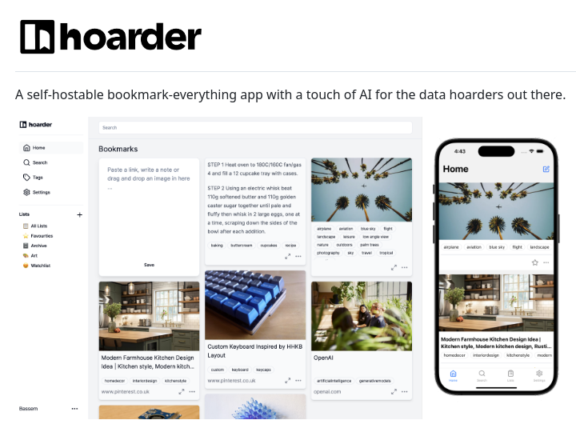

Hoarder is a self-hostable bookmark and note manager designed for individuals who want to organize their digital content in a personalized and private manner. With its advanced search functionality and AI-powered features, Hoarder provides an efficient solution for managing bookmarks, notes, and other digital data.

#### Technical Overview
Hoarder is built with the goal of providing users with a flexible and customizable platform for storing and retrieving digital information. The app allows users to create their own virtual storage space, where they can store bookmarks, notes, and other types of digital content.

##### Key Features

* **Advanced Search**: Hoarder features a powerful search engine that enables users to quickly find specific items within their collection.
* **AI-Powered Organization**: The app utilizes artificial intelligence to help users organize their digital content, making it easier to discover new relationships between items.
* **Customizable Interface**: Users can personalize the app's interface to suit their preferences, including customizing the layout and appearance of bookmarks and notes.

#### Technical Details
Hoarder is designed as a self-hostable application, allowing users to deploy it on their own servers or hosting platforms. This approach provides users with full control over their data and ensures that their digital content remains private and secure.

The app's architecture is based on a modular design, with separate components for searching, organizing, and storing digital content. This modular approach enables developers to extend and customize the app's functionality using APIs and plugins.

##### Example Use Cases

* **Personal Knowledge Base**: Hoarder can be used as a personal knowledge base, where users can store notes, bookmarks, and other types of digital content related to their work or interests.
* **Research Assistant**: The app's advanced search functionality and AI-powered organization features make it an ideal tool for researchers and students, who need to manage large collections of references and notes.

#### Key Takeaways and Best Practices

* **Host Hoarder on a Secure Server**: To ensure the security and privacy of your digital content, host Hoarder on a secure server or hosting platform.
* **Customize the App's Interface**: Take advantage of Hoarder's customizable interface to create a personalized workspace that suits your needs and preferences.
* **Use Advanced Search Features**: Leverage Hoarder's advanced search functionality to quickly find specific items within your collection and discover new relationships between items.

#### References
* [Hoarder Website](https://example.com/hoarder) (replace with actual URL)
* [Hoarder Documentation](https://example.com/hoarder/docs) (replace with actual URL)

Note: The provided URLs are examples and should be replaced with the actual URLs for the Hoarder website and documentation.
## Source

- Original Tweet: [https://twitter.com/i/web/status/1881314782474584560](https://twitter.com/i/web/status/1881314782474584560)
- Date: 2025-02-20 16:20:17

## Media

### Media 1

**Description:** The image presents a promotional graphic for the "hoarder" app, showcasing its features and capabilities.

* **App Name and Tagline**
	+ The app's name is displayed prominently at the top of the image.
	+ A tagline reads: "A self-hostable bookmark-everything app with a touch of AI for the data hoarders out there."
* **Screenshots of App Interface**
	+ Two screenshots are presented side by side, providing an overview of the app's interface.
	+ The left screenshot displays a list of bookmarks, while the right screenshot shows a single bookmark page.
* **App Features and Capabilities**
	+ The app allows users to create and manage their own virtual storage space for digital content.
	+ It features advanced search functionality, enabling users to quickly find specific items within their collection.

In summary, the image effectively communicates the key features and benefits of the "hoarder" app, highlighting its ability to provide a personalized and organized solution for managing digital content. The inclusion of screenshots provides a clear visual representation of the app's interface and capabilities, making it easy for potential users to understand how the app can meet their needs.

*Last updated: 2025-02-20 16:20:17*