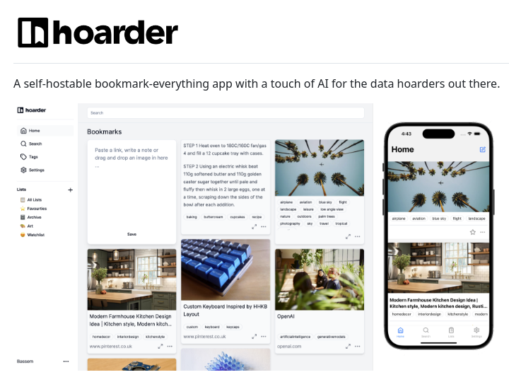

# Note Manager

## Description
Self-hostable bookmark and note manager...

## Content
Self-hostable bookmark and note manager

## Category Information

- Main Category: development_tools
- Sub Category: ide_tools
- Item Name: note_manager

## Source

- Original Tweet: [https://twitter.com/i/web/status/1881314782474584560](https://twitter.com/i/web/status/1881314782474584560)
- Date: 2025-02-20 15:36:34

## Media

### Media 1

**Description:** The image presents a promotional graphic for the "hoarder" app, showcasing its features and capabilities.

* **App Name and Tagline**
	+ The app's name is displayed prominently at the top of the image.
	+ A tagline reads: "A self-hostable bookmark-everything app with a touch of AI for the data hoarders out there."
* **Screenshots of App Interface**
	+ Two screenshots are presented side by side, providing an overview of the app's interface.
	+ The left screenshot displays a list of bookmarks, while the right screenshot shows a single bookmark page.
* **App Features and Capabilities**
	+ The app allows users to create and manage their own virtual storage space for digital content.
	+ It features advanced search functionality, enabling users to quickly find specific items within their collection.

In summary, the image effectively communicates the key features and benefits of the "hoarder" app, highlighting its ability to provide a personalized and organized solution for managing digital content. The inclusion of screenshots provides a clear visual representation of the app's interface and capabilities, making it easy for potential users to understand how the app can meet their needs.

*Last updated: 2025-02-20 15:36:34*