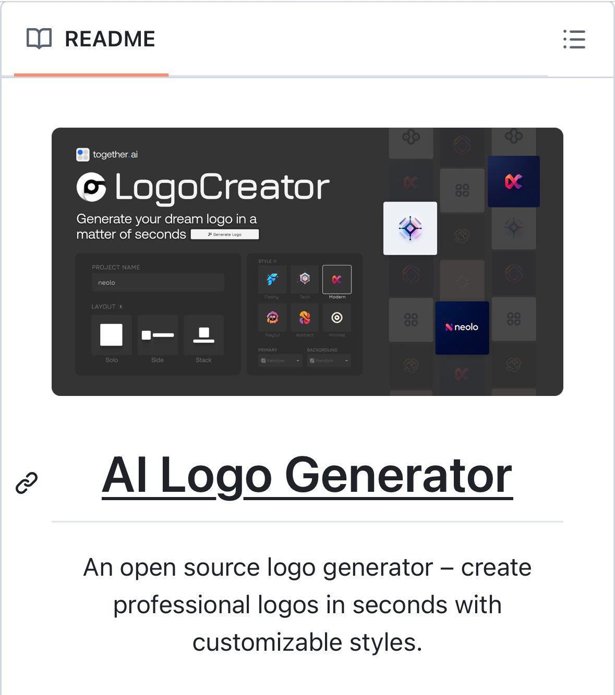

The open-source AI powered logo generator is a self-hosted tool that allows users to create professional-looking logos quickly and easily. This tool is available on GitHub at https://github.com/Nutlope/logocreator and offers a range of features, including AI-powered logo generation, customization options, and high-quality output without watermarks.

#### Technical Content
The logo generator is built using open-source technologies and is designed to be self-hosted, giving users full control over their logo creation process. The tool uses artificial intelligence to generate custom logos based on user input, such as company name, industry, and preferred design style.

Here are the key features of the logo generator:

* **AI-Powered Logo Generation**: The tool uses machine learning algorithms to generate unique and professional-looking logos.
* **Customization Options**: Users can customize their logos by selecting from a range of templates, colors, fonts, and design elements.
* **High-Quality Output**: The tool produces high-quality logos in various formats, including vector and raster images.
* **Self-Hosted**: The logo generator is designed to be self-hosted, giving users full control over their logo creation process and ensuring that their designs are not shared with third-party services.
* **No Watermarks**: Unlike other logo generators, this tool does not apply watermarks to generated logos, allowing users to use their creations freely.

#### Examples
To get started with the logo generator, follow these steps:

1. Clone the repository from GitHub using `git clone https://github.com/Nutlope/logocreator.git`
2. Install the required dependencies using `npm install` or `yarn install`
3. Start the server using `npm start` or `yarn start`
4. Access the logo generator by navigating to `http://localhost:3000` in your web browser
5. Enter your company name, industry, and preferred design style to generate a custom logo

#### Key Takeaways and Best Practices
When using the open-source AI powered logo generator, keep the following best practices in mind:

* **Customize Your Logo**: Use the tool's customization options to create a unique logo that reflects your brand identity.
* **Experiment with Different Designs**: Try out different design styles and templates to find the one that works best for your company.
* **Use High-Quality Images**: Ensure that you use high-quality images and fonts in your logo to maintain a professional look.

#### References
The open-source AI powered logo generator is built using the following tools and technologies:

* **GitHub**: The tool is hosted on GitHub, a popular platform for open-source software development.
* **Node.js**: The tool uses Node.js as its backend framework.
* **JavaScript**: The tool's frontend is built using JavaScript and HTML/CSS.
* **Machine Learning Algorithms**: The tool uses machine learning algorithms to generate custom logos.

By following the instructions and best practices outlined in this technical knowledge base entry, users can create professional-looking logos quickly and easily using the open-source AI powered logo generator.
## Source

- Original Tweet: [https://twitter.com/i/web/status/1891015177836884059](https://twitter.com/i/web/status/1891015177836884059)
- Date: 2025-02-20 15:49:09

## Media

### Media 1

**Description:** The image shows a screenshot of a website for an AI logo generator. The purpose of the image is to showcase the features and functionality of the website.

* **Header**
	+ Reads "README" in black text
	+ Features a small icon of an open book
* **Logo Generator**
	+ Has a dark gray background with white text that reads "LogoCreator"
	+ Includes a tagline that says "Generate your dream logo in a matter of seconds"
	+ Displays a grid of various logos, each with its own unique design and style
* **Title**
	+ Reads "AI Logo Generator" in large, bold font
	+ Suggests that the website uses artificial intelligence to generate custom logos for users
* **Description**
	+ Provides a brief overview of how the website works
	+ States that it is an open-source logo generator that allows users to create professional-looking logos quickly and easily

Overall, the image effectively showcases the key features and benefits of the AI logo generator website, highlighting its ease of use, customization options, and ability to produce high-quality logos.

*Last updated: 2025-02-20 15:49:09*