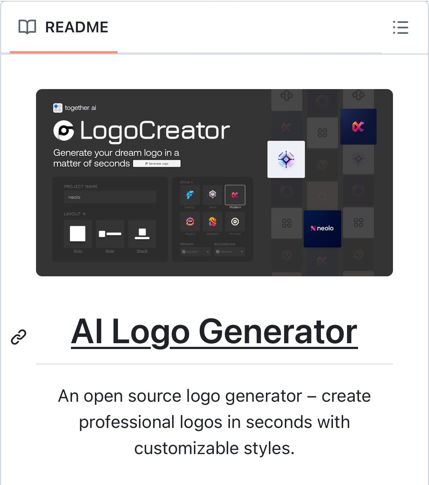

# Open Source Logo Generator

## Description
Logo generator, but open-source, self-host, AI powered plus you get no-watermark :)

https://github.com/Nutlope/logocreator…...

## Content
Logo generator, but open-source, self-host, AI powered plus you get no-watermark :)

https://github.com/Nutlope/logocreator…

## Category Information

- Main Category: development_tools
- Sub Category: ide_tools
- Item Name: open_source_logo_generator

## Source

- Original Tweet: [https://twitter.com/i/web/status/1891015177836884059](https://twitter.com/i/web/status/1891015177836884059)
- Date: 2025-02-20 15:36:34

## Media

### Media 1

**Description:** The image shows a screenshot of a website for an AI logo generator. The purpose of the image is to showcase the features and functionality of the website.

* **Header**
	+ Reads "README" in black text
	+ Features a small icon of an open book
* **Logo Generator**
	+ Has a dark gray background with white text that reads "LogoCreator"
	+ Includes a tagline that says "Generate your dream logo in a matter of seconds"
	+ Displays a grid of various logos, each with its own unique design and style
* **Title**
	+ Reads "AI Logo Generator" in large, bold font
	+ Suggests that the website uses artificial intelligence to generate custom logos for users
* **Description**
	+ Provides a brief overview of how the website works
	+ States that it is an open-source logo generator that allows users to create professional-looking logos quickly and easily

Overall, the image effectively showcases the key features and benefits of the AI logo generator website, highlighting its ease of use, customization options, and ability to produce high-quality logos.

*Last updated: 2025-02-20 15:36:34*