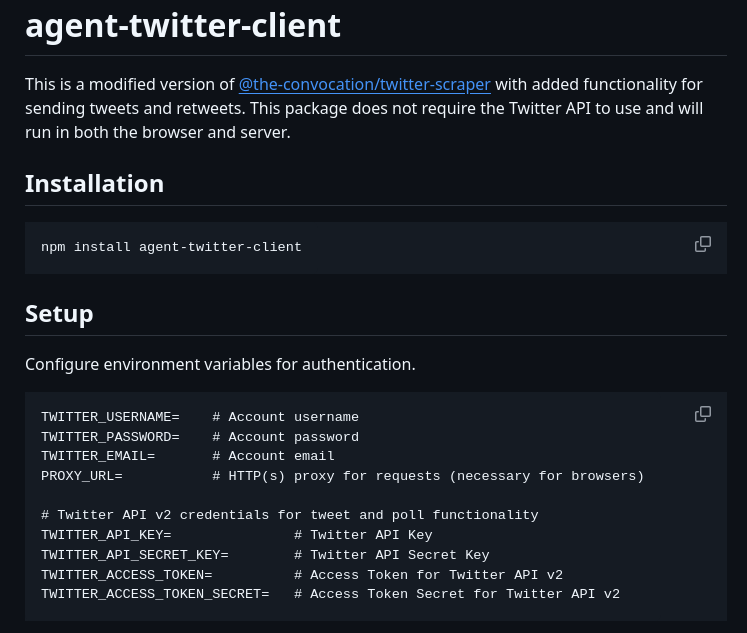

# Twitter Client Setup

## Description
Twitter client for agents, no API key needed...

## Content
Twitter client for agents, no API key needed

## Category Information

- Main Category: development_tools
- Sub Category: installation_guides
- Item Name: twitter_client_setup

## Source

- Original Tweet: [https://twitter.com/i/web/status/1890865597660938276](https://twitter.com/i/web/status/1890865597660938276)
- Date: 2025-02-20 15:36:34

## Media

### Media 1

**Description:** The image shows a screenshot of a computer screen displaying the installation process for an application called "agent-twitter-client". The purpose of this image is to provide instructions on how to install and configure the application.

* **Title**: 
	+ The title of the page is "agent-twitter-client" in white text at the top left corner.
* **Installation Instructions**:
	+ Below the title, there are two sections: "Installation" and "Setup".
	+ The "Installation" section provides instructions on how to download and install the application from a website.
	+ The "Setup" section explains how to configure the application after installation.
* **Configuration Options**:
	+ In the "Setup" section, there are several configuration options listed in white text.
	+ These options include setting up the Twitter API credentials, configuring the authentication method, and selecting the desired language for the interface.
* **Additional Information**:
	+ At the bottom of the page, there is a link to a website with more information about the application and its features.

Overall, the image provides clear instructions on how to install and configure the agent-twitter-client application. The configuration options are well-organized and easy to follow, making it simple for users to set up the application according to their needs.

*Last updated: 2025-02-20 15:36:34*