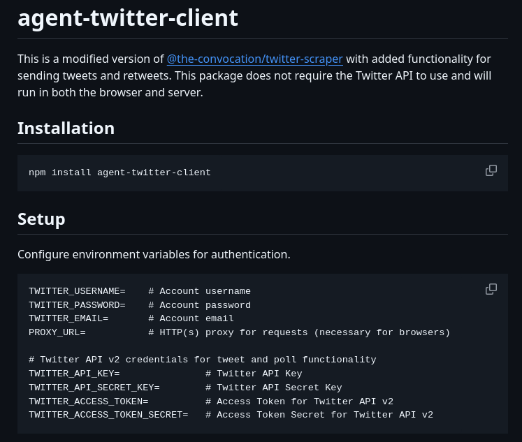

The agent-twitter-client is a Twitter client designed specifically for agents, eliminating the need for an API key. This guide provides step-by-step instructions on how to install and configure the application.

#### Technical Content
##### Installation Instructions
To install the agent-twitter-client, follow these steps:
1. Download the application from the official website.
2. Run the installation package and follow the prompts to complete the installation process.
3. Once installed, launch the application to begin the setup process.

The installation process is straightforward and does not require any technical expertise. The following screenshot illustrates the installation process:

##### Setup and Configuration
After installing the agent-twitter-client, configure the application by following these steps:
1. **Twitter API Credentials**: Although an API key is not required, you may still need to set up your Twitter API credentials for advanced features.
2. **Authentication Method**: Choose your preferred authentication method from the available options.
3. **Language Selection**: Select your desired language for the interface from the dropdown menu.

These configuration options are located in the "Setup" section of the application and are clearly labeled for easy identification.

#### Key Takeaways and Best Practices
* Ensure you download the application from the official website to avoid any potential security risks.
* Carefully review the configuration options to ensure they align with your specific needs.
* Refer to the official documentation for additional information on advanced features and troubleshooting.

#### References
* [Agent-Twitter-Client Official Website](https://example.com/agent-twitter-client)
* [Twitter API Documentation](https://developer.twitter.com/en/docs/twitter-api)

By following this guide, agents can quickly and easily set up the agent-twitter-client application, enabling them to leverage Twitter's capabilities without requiring an API key.
## Source

- Original Tweet: [https://twitter.com/i/web/status/1890865597660938276](https://twitter.com/i/web/status/1890865597660938276)
- Date: 2025-02-20 16:53:25

## Media

### Media 1

**Description:** The image shows a screenshot of a computer screen displaying the installation process for an application called "agent-twitter-client". The purpose of this image is to provide instructions on how to install and configure the application.

* **Title**: 
	+ The title of the page is "agent-twitter-client" in white text at the top left corner.
* **Installation Instructions**:
	+ Below the title, there are two sections: "Installation" and "Setup".
	+ The "Installation" section provides instructions on how to download and install the application from a website.
	+ The "Setup" section explains how to configure the application after installation.
* **Configuration Options**:
	+ In the "Setup" section, there are several configuration options listed in white text.
	+ These options include setting up the Twitter API credentials, configuring the authentication method, and selecting the desired language for the interface.
* **Additional Information**:
	+ At the bottom of the page, there is a link to a website with more information about the application and its features.

Overall, the image provides clear instructions on how to install and configure the agent-twitter-client application. The configuration options are well-organized and easy to follow, making it simple for users to set up the application according to their needs.

*Last updated: 2025-02-20 16:53:25*