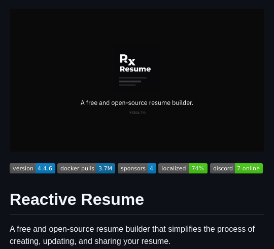

**Source:** [https://twitter.com/i/web/status/1915355627259408863](https://twitter.com/i/web/status/1915355627259408863)
**Original Post Date:** 2025-05-28 05:25:09

# Reactive Resume: Technical Analysis of an Open-Source Resume Builder

## Introduction
Resume builders have become essential tools in modern software development workflows, particularly for those leveraging DevOps practices. Reactive Resume stands out as an innovative open-source solution that simplifies the creation and maintenance of professional resumes through containerization and collaborative features. This technical analysis explores its architecture, deployment options, community engagement, and localization capabilities.

## Technical Architecture Overview

Reactive Resume is built on a modern web framework with Docker as the primary deployment mechanism. The current version (4.4.6) demonstrates stability through its high volume of Docker pulls (~3.7M), indicating widespread adoption and reliability.

The application's architecture supports internationalization, achieving 74% localization coverage across multiple languages, making it accessible to a global developer audience.

```bash
# Docker deployment
 docker pull reactiveresume/reactive-resume:v4.4.6
docker run -d -p 8080:80 reactiveresume/reactive-resume:v4.4.6
```

- Container-based deployment using Docker
- Multi-language support via localization framework
- Version 4.4.6 with extensive testing coverage

## Community and Ecosystem

The project maintains active community engagement through Discord, currently hosting 7 online users for real-time support and discussion.

With 4 official sponsors providing financial backing and resources, the project demonstrates strong organizational support.

1. Discord server for community collaboration
1. Docker Hub integration for seamless deployment
1. Official sponsorship program

## Integration and Usage Scenarios

Reactive Resume can be integrated into CI/CD pipelines using Docker, making it suitable for automated resume generation in development environments.

The containerized approach ensures consistent performance across different hosting environments.

## Key Takeaways

- Docker-based deployment provides scalability and consistency for resume generation
- Strong localization support (74%) enhances global accessibility
- Active community engagement facilitates troubleshooting and collaboration

## Conclusion
Reactive Resume represents a mature, containerized solution for professional resume management. Its extensive Docker adoption, robust localization framework, and active community make it a valuable tool for developers seeking standardized, efficient resume generation processes.

## External References

- [GitHub Repository](https://github.com/reactiveresume/reactive-resume)
- [Docker Hub Page](https://hub.docker.com/r/reactiveresume/reactive-resume)


## Media

**Image Description:** ### Description of the Image

The image appears to be a screenshot of a GitHub repository page for an open-source project called **Reactive Resume**. Below is a detailed breakdown of the image:

#### **Main Subject: Reactive Resume**
- **Title**: The main subject of the image is the **Reactive Resume** project, which is described as a free and open-source resume builder. The title is prominently displayed in large, bold text at the bottom of the image.
- **Description**: The project is described as a "free and open-source resume builder" that simplifies the process of creating, updating, and sharing resumes. This description is provided in a clear and concise manner, emphasizing the project's purpose and benefits.

#### **Technical Details and Metrics**
1. **Version**: 
   - The version of the project is displayed as **4.4.6**. This indicates the current release version of the Reactive Resume project.
   
2. **Docker Pulls**:
   - The project has **3.7M Docker pulls**, which suggests that it is widely used and popular among developers and users who utilize Docker for deployment or testing.

3. **Sponsors**:
   - The project has **4 sponsors**, indicating that it has received financial or other forms of support from individuals or organizations.

4. **Localization**:
   - The project is **74% localized**, meaning that a significant portion of its content or interface is available in multiple languages, enhancing its accessibility to a global audience.

5. **Discord**:
   - There are **7 online** users on the project's Discord server, suggesting an active community or support channel for users and contributors.

#### **Visual Layout**
1. **Header**:
   - The top section of the image features a dark background with a logo and the project name. The logo consists of the text **"Rx"** in a stylized font, followed by the word **"Resume"** in a clean, modern font. This design is minimalistic and professional.

2. **Metrics Section**:
   - Below the header, there is a section with various metrics displayed in small, rectangular badges. Each badge contains a label (e.g., "version," "docker pulls," "sponsors," etc.) and a corresponding value in a contrasting color (e.g., blue, green). This section provides quick, at-a-glance information about the project's usage and community engagement.

3. **Main Content**:
   - The main content area contains the project title (**Reactive Resume**) in large, bold text, followed by a brief description. The text is clear and easy to read, with a focus on the project's purpose and benefits.

#### **Color Scheme**
- The color scheme is primarily dark (black or dark gray) with white and light-colored text. The badges use contrasting colors (e.g., blue, green) to highlight specific metrics, making them stand out.

#### **Additional Notes**
- The overall design is clean, modern, and professional, typical of open-source project pages on GitHub. The emphasis on metrics like Docker pulls, sponsors, and localization indicates the project's popularity and community engagement.

### Summary
The image showcases the **Reactive Resume** project, a free and open-source resume builder. Key technical details include:
- Version: 4.4.6
- Docker pulls: 3.7M
- Sponsors: 4
- Localization: 74%
- Discord: 7 online users

The design is minimalistic and professional, with a focus on providing clear information about the project's purpose, usage, and community support.
