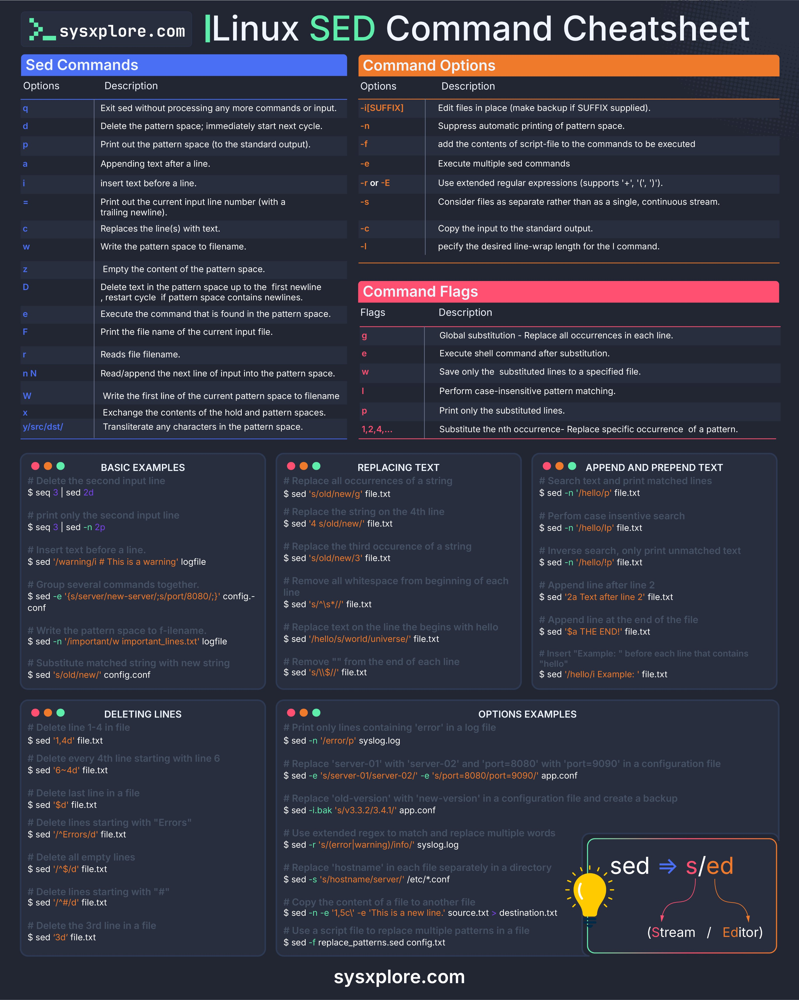

# Linux Sed Cheatsheet

## Description
Linux sed command for sysadmins...

## Content
Linux sed command for sysadmins

## Category Information

- Main Category: development_tools
- Sub Category: shell_scripting
- Item Name: linux_sed_cheatsheet

## Source

- Original Tweet: [https://twitter.com/i/web/status/1881322615945777273](https://twitter.com/i/web/status/1881322615945777273)
- Date: 2025-02-20 15:36:34

## Media

### Media 1

**Description:** The infographic, titled "Linux SED Command Cheatsheet," provides a comprehensive overview of the Sed command's functionality. The title is displayed at the top in white text against a black background, accompanied by the website URL "sysxplore.com" and its logo on either side.

**Sed Commands**

*   This section lists various options available for the Sed command, including:
    *   `q`: Exit without processing any more commands or input.
    *   `d`: Delete the pattern space immediately after the current cycle.
    *   `p`: Print out the pattern space (to the standard output).
    *   `a`: Append text after a line.
    *   `i`: Insert text before a line.
    *   `c`: Replace the contents of the file with the contents of the pattern space.
    *   `w`: Write the pattern space to the specified file name.
    *   `D`: Delete the first line that matches the pattern.

**Command Options**

*   This section explains the different command options available for Sed, including:
    *   `-n`: Suppress automatic printing of pattern space.
    *   `-1`: Add the contents of script-file to the commands to be executed.
    *   `e`: Execute multiple Sed commands.
    *   `s`: Use extended regular expressions (supports '+', '?', and '*').

**Command Flags**

*   This section lists various flags that can be used with Sed, including:
    *   `-i`: Edit files in place (make backup if SUFFIX supplied).
    *   `-l`: Suppress automatic printing of pattern space.
    *   `--help`: Display a help message and exit.

**Basic Examples**

*   This section provides examples of basic Sed commands, including:
    *   Deleting the second input line.
    *   Printing only the second input line.
    *   Replacing all occurrences of a string with another string.

**Replacing Text**

*   This section explains how to replace text using Sed, including:
    *   Replacing all occurrences of a string with another string.
    *   Replacing the first occurrence of a string with another string.

**Appending and Prepending Text**

*   This section describes how to append or prepend text to a file using Sed, including:
    *   Appending text at the end of each line.
    *   Preferring text before each line.

**Deleting Lines**

*   This section explains how to delete lines from a file using Sed, including:
    *   Deleting every 4th line starting with line 6.
    *   Deleting all empty lines.

Overall, this infographic provides a comprehensive guide to the Sed command and its various options, flags, and examples. It is an essential resource for anyone looking to learn more about this powerful text processing tool.

*Last updated: 2025-02-20 15:36:34*