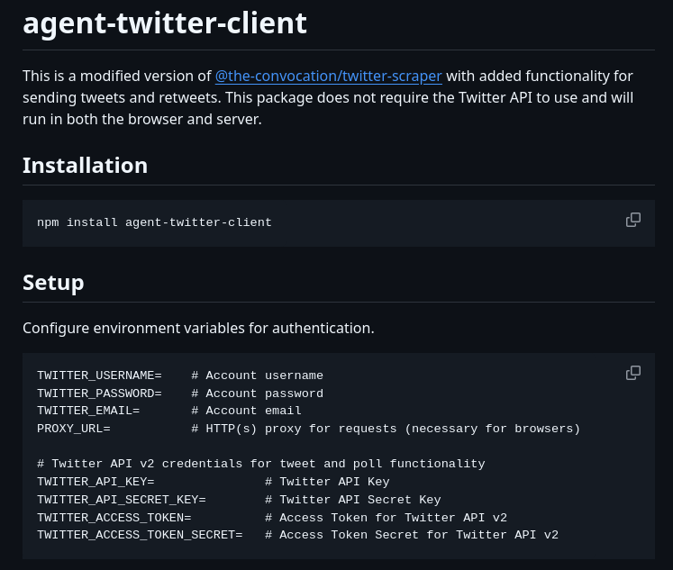

**Source:** [https://twitter.com/i/web/status/1890865597660938276](https://twitter.com/i/web/status/1890865597660938276)
**Original Post Date:** 2025-05-28 01:16:24

# Agent-Twitter-Client Package: Installation & Setup Guide

## Introduction
The agent-twitter-client is an enhanced version of @the-convocation/twitter-scraper designed for modern web applications. This package introduces tweet sending and retweet capabilities while maintaining cross-environment compatibility (browser/server) without requiring Twitter's official API. Understanding its installation, setup process, and security considerations is crucial for implementing robust social media integration.

## Package Overview

The agent-twitter-client represents a significant evolution over the base twitter-scraper package by adding native tweet and retweet functionality. Its distinguishing feature is the ability to operate independently of Twitter's official API, enabling developers to integrate Twitter capabilities without navigating complex API authentication processes.

Cross-platform compatibility ensures consistent performance across both browser-based applications (using JavaScript) and server-side implementations (via Node.js), making it a versatile choice for diverse deployment scenarios.

## Installation

```bash
# Install via npm
npm install agent-twitter-client
```

- Supports both Node.js (server) and browser environments
- No complex dependency tree, minimal installation footprint
- Compatible with modern JavaScript tooling ecosystems

## Setup Configuration

Proper configuration requires setting up several environment variables for authentication and functionality. These credentials are essential for establishing secure connections while respecting Twitter's rate limits.

1. Account Authentication (Required): TWITTER_USERNAME, TWITTER_PASSWORD, TWITTER_EMAIL
1. Proxy Configuration: PROXY_URL - Critical for browser environments to avoid CORS issues
1. API Access (Optional): Twitter API v2 credentials for advanced features

> **Note/Tip:** Store environment variables in a .env file or secure configuration management system

> **Note/Tip:** Avoid hardcoding credentials directly in source files

> **Note/Tip:** Proxy URL must support HTTPS to ensure secure data transmission

## Technical Implementation Details

The package implements a dual authentication strategy - browser-based login for basic operations and Twitter API v2 for advanced features. This approach balances security requirements with functional capabilities.

Proxy support is particularly valuable in browser environments, where direct Twitter requests may trigger CORS restrictions.

- Authentication: Session-based cookies + optional API tokens
- Request Handling: Handles rate limiting and request queuing automatically
- Error Management: Built-in retry logic with exponential backoff

## Key Takeaways

- agent-twitter-client provides tweet/retweet capabilities without Twitter API dependency
- Cross-environment support enables flexible deployment strategies (browser/server)
- Environment variables must be configured securely for authentication and proxy settings
- Optional Twitter API v2 integration extends functionality to advanced use cases

## Conclusion
The agent-twitter-client represents a robust solution for integrating Twitter capabilities into modern applications without the complexity of traditional API integrations. Its cross-platform nature, combined with flexible authentication options, makes it suitable for diverse development scenarios. Proper setup and configuration following security best practices are essential to ensure reliable operation.

## External References

- [Official Package Documentation](https://npmjs.com/package/agent-twitter-client)
- [Twitter API Best Practices Guide](https://developer.twitter.com/en/docs/best-practices.html)


## Media

**Image Description:** The image is a screenshot of a README or documentation file for a software package named **agent-twitter-client**. The content is structured to provide information about the package, its installation, and setup process. Below is a detailed breakdown:

### **Main Subject**
The main subject of the image is the **agent-twitter-client**, which is described as a modified version of another package, **@the-convocation/twitter-scraper**. This package has been enhanced with additional functionality for sending tweets and retweets. Notably, it does not require the Twitter API to function and can operate in both browser and server environments.

### **Key Sections and Details**

#### **1. Package Overview**
- **Name**: `agent-twitter-client`
- **Description**: 
  - A modified version of **@the-convocation/twitter-scraper**.
  - Added functionality for sending tweets and retweets.
  - Does not require the Twitter API.
  - Can run in both browser and server environments.

#### **2. Installation**
- **Command**: 
  ```bash
  npm install agent-twitter-client
  ```
  - This section provides the command to install the package using npm (Node Package Manager).

#### **3. Setup**
- **Environment Variables**: 
  The setup requires configuring several environment variables for authentication and functionality. These variables are listed below, along with their purposes:
  - **TWITTER_USERNAME**: Account username.
  - **TWITTER_PASSWORD**: Account password.
  - **TWITTER_EMAIL**: Account email.
  - **PROXY_URL**: HTTP(s) proxy for requests (necessary for browsers).
  - **TWITTER_API_KEY**: Twitter API Key (for Twitter API v2 functionality).
  - **TWITTER_API_SECRET_KEY**: Twitter API Secret Key.
  - **TWITTER_API_ACCESS_TOKEN**: Access Token for Twitter API v2.
  - **TWITTER_API_ACCESS_SECRET_TOKEN**: Access Token Secret for Twitter API v2.

#### **4. Technical Details**
- **Authentication**: 
  - The package relies on environment variables for authentication, including username, password, and email.
  - For advanced features like tweet and poll functionality, Twitter API v2 credentials are required.
- **Proxy Support**: 
  - A `PROXY_URL` environment variable is specified, indicating that the package supports proxy configurations, which is particularly useful for browser environments.
- **Compatibility**: 
  - The package is designed to work in both browser and server environments, making it versatile for different use cases.

#### **5. Formatting and Structure**
- The text is formatted in a clean, markdown-like style, with clear headings and bullet points.
- Environment variables are listed in a structured format, with comments explaining their purposes.
- The use of `#` indicates comments or explanations, providing additional context for each variable.

### **Visual Elements**
- **Background**: The background is dark, likely black or a very dark gray, with white and light-colored text for high contrast.
- **Code Blocks**: 
  - Installation commands and environment variable configurations are presented in code blocks, making them easily distinguishable.
  - Copy icons (`⧉`) are present next to the code blocks, suggesting that the text can be copied directly.

### **Purpose**
The primary purpose of this documentation is to guide users through the installation and setup process of the `agent-twitter-client` package. It emphasizes the package's enhanced functionality compared to its predecessor and provides clear instructions for configuring the necessary environment variables.

### **Summary**
This image is a comprehensive guide for installing and setting up the `agent-twitter-client` package. It highlights the package's key features, such as sending tweets and retweets without requiring the Twitter API, and provides detailed instructions for configuring authentication and proxy settings. The structured and clear presentation ensures that users can easily follow the steps to integrate the package into their projects.
