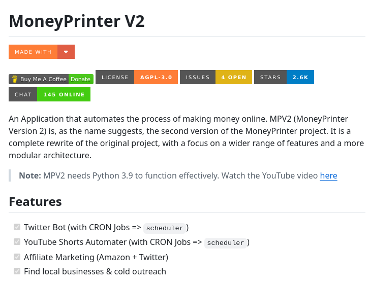

# Online Money Maker

## Description
GitHub repository for automating online money-making...

## Content
GitHub repository for automating online money-making

## Category Information

- Main Category: development_tools
- Sub Category: version_control
- Item Name: online_money_maker

## Source

- Original Tweet: [https://twitter.com/i/web/status/1877813420260536777](https://twitter.com/i/web/status/1877813420260536777)
- Date: 2025-02-20 15:36:34

## Media

### Media 1

**Description:** The image is a screenshot of a webpage for MoneyPrinter V2, an application that automates the process of making money online.

* **Title**: 
	+ The title "MoneyPrinter V2" is prominently displayed at the top left corner of the page.
	+ It is written in large black font with a gray background.
* **Navigation Bar**:
	+ Below the title, there are several tabs and links to other pages or features of the application.
	+ These include "MADE WITH", "Buy Me A Coffee", "Donate", "CHAT", and others.
	+ Each tab has a distinct color scheme and icon, making it easy to distinguish between them.
* **Main Content**:
	+ The main content of the page is centered below the navigation bar.
	+ It provides an overview of what MoneyPrinter V2 is and its features.
	+ A brief description explains that it's an application that automates the process of making money online, with a focus on creating digital products and selling them through various channels.
* **Features Section**:
	+ At the bottom of the page, there is a section titled "Features".
	+ This section lists some of the key features of MoneyPrinter V2, including Twitter Bot integration, YouTube Shorts automation, affiliate marketing tools, and more.
	+ Each feature has a small icon next to it, making it easy to visualize what each one does.

Overall, the image effectively communicates the purpose and capabilities of MoneyPrinter V2, making it clear that this application is designed to help users create and sell digital products online.

*Last updated: 2025-02-20 15:36:34*