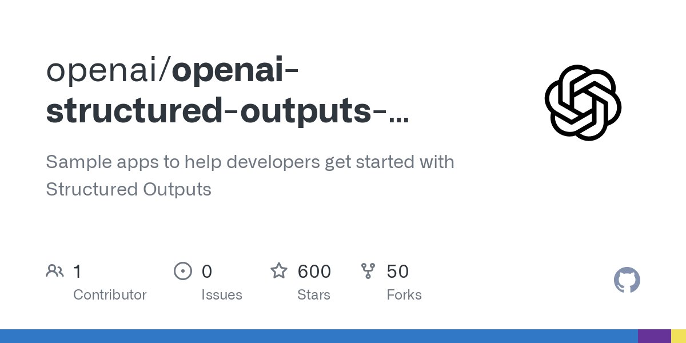

The OpenAI Structured Outputs sample apps repository is a collection of example applications demonstrating how to build reliable software using Large Language Model (LLM) outputs with strict JSON schemas.

#### Technical Content
The repository, hosted on GitHub at [https://github.com/openai/openai-structured-outputs-samples](https://github.com/openai/openai-structured-outputs-samples), contains three example apps that showcase the integration of LLM outputs with structured data formats. By leveraging strict JSON schemas, developers can ensure the consistency and reliability of their applications.

The sample apps are designed to help developers get started with Structured Outputs, providing a foundation for building more complex and robust software systems. Each app demonstrates a different aspect of working with LLM outputs, including:

* **Data Processing**: One example app showcases how to process and transform LLM output data into a structured format, using JSON schema validation to ensure data integrity.
* **API Integration**: Another app demonstrates how to integrate LLM outputs with external APIs, highlighting the importance of strict data formatting for seamless communication.
* **User Interface**: The third example app focuses on presenting LLM output data in a user-friendly interface, leveraging JSON schema-defined data structures to enable intuitive and interactive visualizations.

By exploring these sample apps, developers can gain hands-on experience with Structured Outputs and learn how to effectively incorporate LLM outputs into their own applications.

#### Key Takeaways and Best Practices
When working with Structured Outputs and LLM outputs, keep the following key takeaways and best practices in mind:

* **Use strict JSON schemas**: Define and enforce strict JSON schemas to ensure data consistency and reliability.
* **Validate output data**: Validate LLM output data against predefined schemas to prevent errors and inconsistencies.
* **Leverage example apps**: Utilize sample apps and repositories, like the OpenAI Structured Outputs repository, as a starting point for exploring new technologies and techniques.

#### References
This technical knowledge base entry references the following tools and technologies:

* **OpenAI**: A leading AI research organization providing access to advanced language models and developer tools.
* **GitHub**: A popular version control platform hosting open-source projects, including the OpenAI Structured Outputs sample apps repository.
* **JSON schema**: A standard for describing the structure and constraints of JSON data, enabling strict validation and formatting.
## Source

- Original Tweet: [https://twitter.com/i/web/status/1876307987314483226](https://twitter.com/i/web/status/1876307987314483226)
- Date: 2025-02-20 21:10:29

## Media

### Media 1

**Description:** The image shows a screenshot of a GitHub repository page for an open-source project called "openai/openai-structured-outputs". 

*   The title is centered at the top of the page.
    *   It reads "openai/openai-structured-outputs" in large black text.
    *   Below it, there is smaller gray text that says "Sample apps to help developers get started with Structured Outputs".
*   There are several sections below the title:
    *   A section labeled "Contributors" shows that there is 1 contributor to the project.
    *   Another section displays the number of issues reported for the project, which is 0.
    *   The third section indicates that the project has received 600 stars from users.
    *   Finally, a fourth section lists the forks made by other developers, with a total of 50 listed.

Overall, the image provides an overview of the openai/openai-structured-outputs repository on GitHub, including information about its contributors, issues, and popularity.

*Last updated: 2025-02-20 21:10:29*