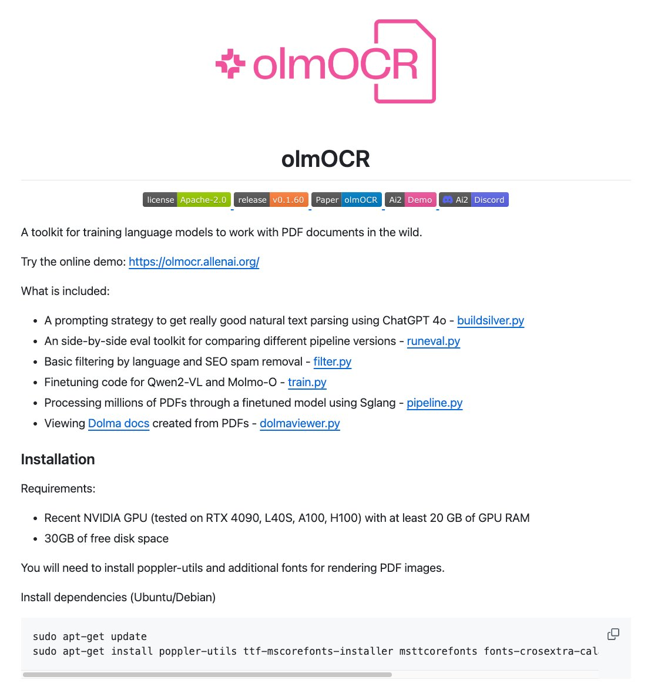

**Source:** [https://twitter.com/i/web/status/1915671922488316384](https://twitter.com/i/web/status/1915671922488316384)
**Original Post Date:** 2025-05-28 01:20:19

# Training Language Models for PDF Document Processing with olmOCR

## Introduction
The olmOCR toolkit provides a comprehensive framework for training language models to process PDF documents in real-world scenarios. It offers researchers and developers advanced capabilities including prompt engineering, evaluation pipelines, and document filtering tools. The toolkit integrates with state-of-the-art AI models like Qwen2-VL and Molmo-O, making it particularly valuable for NLP tasks involving structured content extraction and analysis.

## Core Features and Components

The olmOCR toolkit comprises six essential components designed for end-to-end PDF document processing:

Each component is implemented as a Python script, providing modular functionality that can be integrated into larger systems or used independently.

1. Prompting Strategy (buildsilver.py): Implements ChatGPT 4.0-based natural text parsing
1. Evaluation Toolkit (runeval.py): Enables side-by-side comparison of pipeline versions
1. Basic Filtering (filter.py): Handles language filtering and SEO spam removal
1. Finetuning Code (train.py): Supports training on Qwen2-VL and Molmo-O models
1. Pipeline Processing (pipeline.py): Manages large-scale model processing using Sglang
1. PDF Viewing (dolmaviewer.py): Provides Dolma doc visualization through finetuned models

> **Note/Tip:** The modular architecture allows for flexible deployment and customization based on specific use cases

## System Requirements

olmOCR requires substantial computational resources to handle large-scale PDF processing tasks.

Proper system setup is crucial for optimal performance.

```bash
sudo apt-get update
sudo apt-get install poppler-utils ttf-mscorefonts-installer msttcorefonts fonts-crosextra-cal
```

- NVIDIA GPU (RTX 4090, L40S, A100, H100) with minimum 20GB VRAM
- 30GB free disk space
- Poppler utilities for PDF processing support

> **Note/Tip:** Performance may degrade significantly without meeting the GPU requirements due to the computational intensity of model training and inference.

## Technical Architecture

The toolkit's architecture leverages Sglang for pipeline processing, enabling efficient handling of millions of documents.

Integration with visual language models (Qwen2-VL, Molmo-O) ensures robust understanding of PDF content structure and context.

- Modular component design for flexibility
- GPU-accelerated processing pipeline
- Integrated evaluation framework

## Key Takeaways

- olmOCR provides a complete toolkit for training language models on PDF documents with robust evaluation capabilities.
- Hardware requirements are substantial, necessitating high-end GPUs for optimal performance.
- The modular architecture allows customization of specific components while maintaining integration with the full pipeline.

## Conclusion
For developers and researchers working on document understanding tasks involving PDFs, olmOCR offers a comprehensive solution combining advanced language model training techniques with efficient processing pipelines. The toolkit's modular design and GPU-accelerated capabilities make it particularly suitable for large-scale PDF analysis projects.

## External References

- [Online Demo](https://olmocr.allenai.org/)
- [Research Paper](https://allenai.org/olmocr)


## Media

**Image Description:** The image is a screenshot of a webpage or documentation for a project called **olmOCR**, which is a toolkit for training language models to work with PDF documents. Below is a detailed description of the content and technical details:

### **Header**
- **Logo and Title**: 
  - The logo at the top features a stylized pink design with the text "olmOCR" in pink. The logo includes a document icon with a plus sign, suggesting the focus on document processing.
  - The title "olmOCR" is prominently displayed in black text below the logo.

### **Introduction**
- **Description**: 
  - The project is described as a toolkit for training language models to work with PDF documents in the wild.
  - It encourages users to try the online demo, providing a link: `[https://olmocr.allenai.org/`.](https://olmocr.allenai.org/`.)

### **Key Features and Components**
- **List of Included Features**:
  - The toolkit includes several components, each with a corresponding Python script or tool:
    1. **Prompting Strategy**: A strategy for natural text parsing using ChatGPT 4.0, implemented in `buildsilver.py`.
    2. **Evaluation Toolkit**: A side-by-side evaluation toolkit for comparing pipeline versions, implemented in `runeval.py`.
    3. **Basic Filtering**: Filtering by language and SEO spam removal, implemented in `filter.py`.
    4. **Finetuning Code**: Code for finetuning models like Qwen2-VL and Molmo-O, implemented in `train.py`.
    5. **Pipeline Processing**: Processing millions of Qwen2-VL and Molmo-O finetuned models using Sglang, implemented in `pipeline.py`.
    6. **PDF Viewing**: Viewing Dolma docs (created from PDFs) through a finetuned model using Sglang, implemented in `dolmaviewer.py`.

### **Installation Section**
- **Requirements**:
  - The installation section outlines the hardware and software prerequisites:
    - **GPU**: A recent NVIDIA GPU (tested on RTX 4090, L40S, A100, H100) with at least 20 GB of GPU RAM.
    - **Disk Space**: 30 GB of free disk space.
  - **Software Dependencies**:
    - **Poppler Utilities**: Required for PDF processing.
    - **Additional Fonts**: Necessary for rendering PDF images.

- **Installation Steps**:
  - The installation instructions are provided for Ubuntu/Debian systems:
    ```bash
    sudo apt-get update
    sudo apt-get install poppler-utils ttf-mscorefonts-installer msttcorefonts fonts-crosextra-cal
    ```
  - These commands ensure that the necessary dependencies, including Poppler utilities and additional fonts, are installed.

### **Additional Links and Badges**
- **Badges and Links**:
  - The page includes several badges and links:
    - **License**: Apache-2.0.
    - **Release**: Version 0.1.6.
    - **Paper**: Link to the research paper related to olmOCR.
    - **AI2 Demo**: Links to demonstrations of the AI2 (Allen Institute for AI) tools.
    - **Discord**: Link to the project's Discord server for community support and discussions.

### **Design and Layout**
- **Clean and Organized Layout**: 
  - The content is structured with clear headings, bullet points, and code blocks for easy readability.
  - Links are provided for additional resources, such as the online demo and research paper.

### **Technical Details**
- **Focus on PDF Processing**: The toolkit is designed to handle large-scale PDF processing, leveraging language models and finetuning techniques.
- **Integration with AI Models**: The project integrates with models like Qwen2-VL and Molmo-O, indicating a focus on visual language models.
- **GPU Dependency**: The requirement for a high-end GPU highlights the computational intensity of the tasks, such as finetuning and processing large datasets.

### **Overall Purpose**
- The olmOCR toolkit is aimed at researchers and developers working on natural language processing and document understanding tasks, particularly those involving PDFs. It provides a comprehensive set of tools for training, evaluating, and deploying models for PDF-related tasks.

This detailed description covers the main subject and technical aspects of the olmOCR project as presented in the image.
