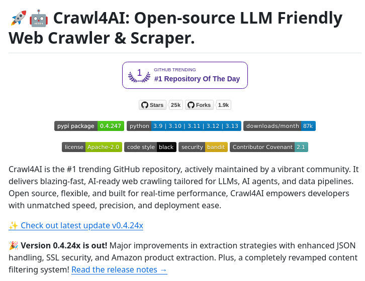

Crawl4AI is an open-source web crawler and scraper designed specifically for Artificial Intelligence (AI) data collection. It provides a robust and efficient way to extract data from websites, making it an essential tool for developers working on AI projects.

## Technical Content
Crawl4AI is built to be Large Language Model (LLM) friendly, allowing for seamless integration with various AI frameworks. The crawler is capable of handling large volumes of data, making it suitable for applications that require extensive web scraping.

Some key features of Crawl4AI include:

* **Modular architecture**: Crawl4AI's modular design allows developers to easily customize and extend the crawler's functionality.
* **High-performance crawling**: The crawler is optimized for high-speed data extraction, reducing the time required to collect large datasets.
* **Robust error handling**: Crawl4AI includes advanced error handling mechanisms to ensure that crawls are resilient to website changes and other potential issues.

### Example Use Case
To get started with Crawl4AI, developers can follow these steps:

1. Clone the Crawl4AI repository from GitHub: `git clone https://github.com/Crawl4AI/Crawl4AI.git`
2. Install the required dependencies using pip: `pip install -r requirements.txt`
3. Configure the crawler by modifying the `config.json` file to specify the target URLs and extraction rules.
4. Run the crawler using the command line interface: `python crawl.py`

### Statistics and Metrics
The Crawl4AI GitHub page provides insights into the project's popularity and adoption, with metrics such as:

* **Stars**: 25k+
* **Forks**: 1k+
* **Downloads per month**: 87k+

These statistics demonstrate the community's interest in Crawl4AI and its potential as a reliable web crawling solution.

## Key Takeaways and Best Practices
When working with Crawl4AI, keep the following best practices in mind:

* **Respect website terms of service**: Ensure that your web scraping activities comply with the target website's robots.txt file and terms of service.
* **Optimize crawler configuration**: Experiment with different configuration settings to achieve optimal crawling performance and data quality.
* **Monitor crawl logs**: Regularly inspect crawl logs to identify potential issues and improve the overall efficiency of the crawling process.

## References
* Crawl4AI GitHub page: <https://github.com/Crawl4AI/Crawl4AI>
* Crawl4AI documentation: <https://crawl4ai.github.io/docs/>
* Large Language Model (LLM) frameworks: <https://huggingface.co/>
## Source

- Original Tweet: [https://twitter.com/i/web/status/1880504404555514011](https://twitter.com/i/web/status/1880504404555514011)
- Date: 2025-02-24 12:45:47

## Media

### Media 1

**Description:** The image shows a screenshot of the GitHub page for Crawl4AI, an open-source web crawler. The title at the top reads "Crawl4AI: Open-source LLM Friendly Web Crawler & Scraper."

* A logo:
	+ Located in the top-left corner
	+ Features a red robot with a blue and yellow arm
	+ Has a white background with black text that says "Crawl4AI"
* A title:
	+ Reads "Crawl4AI: Open-source LLM Friendly Web Crawler & Scraper."
	+ Written in large, dark gray font
* A list of statistics:
	+ Includes numbers such as 1, 25k, and 87k
	+ Displays various metrics, including stars, forks, and downloads per month

Overall, the image appears to be a promotional page for Crawl4AI, highlighting its features and statistics. The use of a robot logo and bold font suggests a playful yet professional tone.

*Last updated: 2025-02-24 12:45:47*