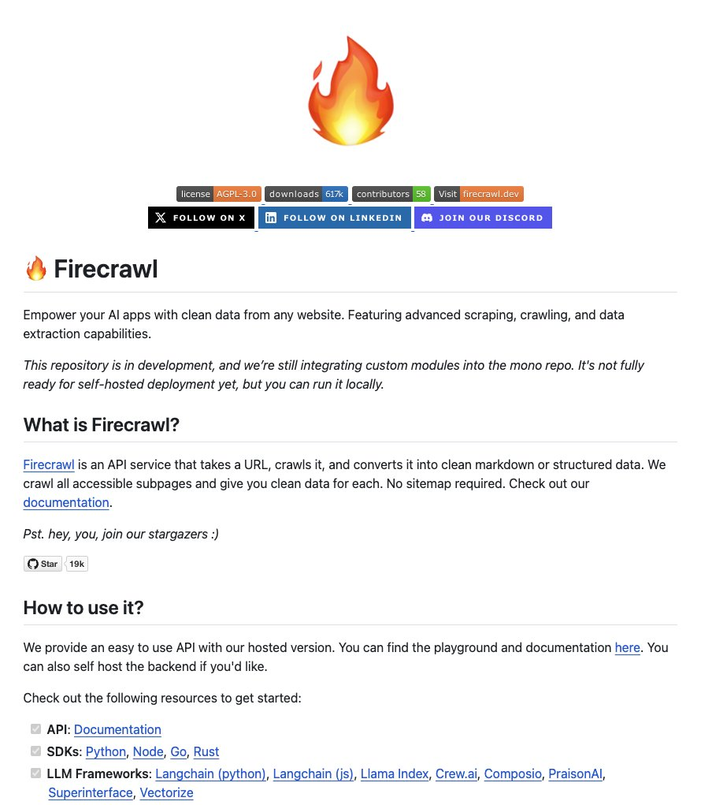

Firecraw is an open-source framework that enables users to convert any website into Large Language Model (LLM)-ready data in just 2 minutes. This tool simplifies the process of extracting clean, structured data from websites, handling complexities such as proxies, anti-bots, and dynamic content.

## Technical Content
Firecraw takes a URL as input, crawls the website, and converts the data into a clean markdown or structured format. The framework offers several features that make it a game-changer in web scraping:
* **LLM-ready formats**: Firecraw outputs data in markdown, HTML, and other structured formats, making it easily consumable by LLMs.
* **Handling complexity**: The tool can handle proxies, anti-bots, and dynamic content, ensuring accurate data extraction even from complex websites.
* **Customizability**: Users can exclude specific tags, headers, or depth levels to tailor the output to their needs.
* **Reliability**: Firecraw provides accurate and consistent results, making it a reliable choice for web scraping tasks.
* **Batching**: The tool allows users to scrape thousands of URLs in batches, streamlining large-scale data extraction projects.
* **Media parsing**: Firecraw can parse media files such as PDFs, DOCX, and images, expanding its capabilities beyond text-based data extraction.
* **Actions**: The framework supports actions like click, scroll, input, and wait, enabling users to interact with websites programmatically.

### Example Use Cases
1. **Data enrichment**: Use Firecraw to extract structured data from websites and enrich existing datasets for LLM training or other applications.
2. **Monitoring website changes**: Employ Firecraw to track changes on websites over time, detecting updates, additions, or removals of content.
3. **Automating data entry**: Leverage Firecraw to automate data entry tasks by extracting relevant information from websites and populating forms or databases.

## Key Takeaways and Best Practices
* When using Firecraw, ensure you have the necessary permissions to scrape websites and comply with terms of service and robots.txt directives.
* Customize Firecraw's output to suit your specific needs, excluding unnecessary data or tags to improve efficiency.
* For large-scale projects, utilize Firecraw's batching capabilities to streamline data extraction and processing.

## References
* [Firecraw GitHub Repository](https://github.com/Firecrawl-Dev/Firecraw) (20k+ stars)
* [Firecraw Website](https://firecraw.com/) (features, documentation, and managed service information)

By leveraging Firecraw's open-source framework, developers can efficiently convert websites into LLM-ready data, unlocking new possibilities for natural language processing, machine learning, and data analysis applications.
## Source

- Original Tweet: [https://twitter.com/i/web/status/1868635172842918323](https://twitter.com/i/web/status/1868635172842918323)
- Date: 2025-02-20 21:05:30

## Media

### Media 1

**Description:** The image displays a screenshot of the Firecraw website, which appears to be a web-based tool for scraping data from websites.

*   The top section features:
    *   A logo with a flame icon.
    *   A row of social media links (e.g., Facebook, Twitter) and other icons.
    *   A navigation bar with options such as "Home", "Documentation", "Contribute", and more.
*   Below the navigation bar is the main content area, which includes:
    *   A brief introduction to Firecraw and its purpose.
    *   A call-to-action (CTA) button that says "Get Started".
    *   A section highlighting key features of Firecraw, including data extraction capabilities and user-friendly interface.
*   At the bottom of the page is a footer with:
    *   Copyright information.
    *   Links to other resources or pages on the website.

Overall, the image suggests that Firecraw is an online platform designed to help users extract data from websites in a simple and efficient manner. The presence of social media links and a navigation bar implies that the site may also offer additional features or tools beyond basic data scraping capabilities.

*Last updated: 2025-02-20 21:05:30*