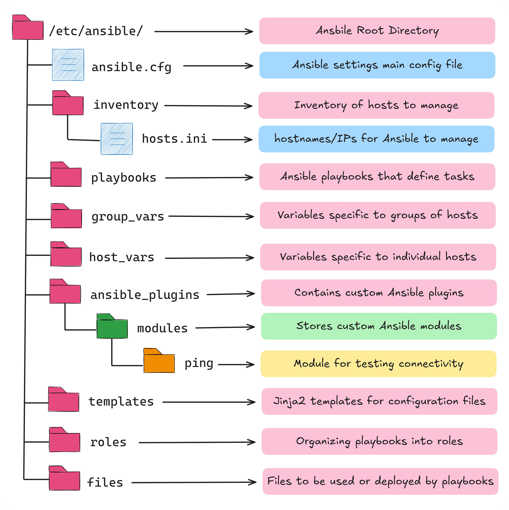

**Source:** [https://twitter.com/i/web/status/1925774635754258815](https://twitter.com/i/web/status/1925774635754258815)
**Original Post Date:** 2025-05-28 10:02:49

# Ansible Directory Structure: Organized Automation for Infrastructure Management

## Introduction
Understanding the organized structure of an Ansible configuration is crucial for implementing efficient infrastructure automation. This knowledge base explores the standard directory layout under /etc/ansible/, detailing how each component contributes to streamlined operations and maintainable configurations.

## Root Directory Structure

The /etc/ansible/ directory serves as the primary configuration root, containing all essential components for Ansible operations. This centralized location ensures consistent management of automation tasks across environments.

```bash
# Example structure of /etc/ansible/
├── ansible.cfg
├── inventory
│   └── hosts.ini
├── group_vars
├── host_vars
├── playbooks
└── roles
```

## Configuration and Inventory Management

The ansible.cfg file defines global settings such as inventory locations, connection types, and control options. The inventory directory manages hosts through structured INI files like hosts.ini.

```ini
[webservers]
web1.example.com
web2.example.com
[group_vars/webservers.yml]
apache_port: 80
```

## Variable Management and Templates

Variables are managed through group_vars for group-wide settings and host_vars for individual configurations. Jinja2 templates in the templates directory enable dynamic configuration generation.

```yaml
# Example template
server_name: {{ inventory_hostname }}
listen_port: {{ apache_port | default(80) }}
```

## Roles and Customization

Roles in the roles directory modularize configurations into reusable units. The ansible_plugins directory extends functionality through custom modules, enhancing automation capabilities.

- Use roles for consistent deployment patterns across projects
- Implement plugins for specialized tasks not covered by core Ansible
- Utilize templates for dynamic configuration generation

> **Note/Tip:** Keep custom modules in version control alongside playbooks

> **Note/Tip:** Document plugin dependencies clearly

## Best Practices and Organization

Maintain a clear directory structure with separate directories for files, roles, and variables. Use consistent naming conventions to enhance readability and maintainability.

1. Organize playbooks by function or environment
1. Keep inventory groups logical and hierarchical
1. Use version control for all Ansible configurations

## Key Takeaways

- Structured directory organization improves configuration management and collaboration
- Proper variable management through group_vars and host_vars enhances reusability
- Roles and custom plugins provide extensibility while maintaining modularity
- Template-driven configurations enable dynamic infrastructure provisioning

## Conclusion
Mastering Ansible's directory structure is fundamental for creating scalable, maintainable automation solutions. By organizing components logically and utilizing roles, templates, and variables effectively, teams can build robust DevOps workflows that adapt to growing infrastructures.

## External References

- [Ansible Official Documentation](https://docs.ansible.com/ansible/latest/user_guide/playbooks_best_practices.html)
- [Ansible Best Practices Guide](https://www.redhat.com/en/blog/best-practices-ansible-project-organization-and-directory-structure)


## Media

**Image Description:** The image is a detailed diagram illustrating the directory structure and organization of an Ansible configuration setup. Ansible is a powerful automation tool used for configuration management, deployment, and orchestration. The diagram provides a clear breakdown of how files and directories are organized within the `/etc/ansible/` directory, which is the root directory for Ansible configurations. Below is a detailed description of the image:

### **Main Subject: Directory Structure of Ansible**
The diagram shows a hierarchical structure of directories and files, with each component labeled and explained. The structure is color-coded and annotated to provide clarity on the purpose of each directory and file.

### **Key Components:**

#### **1. `/etc/ansible/`**
- **Description:** This is the root directory for Ansible configurations.
- **Color:** Pink
- **Purpose:** Contains all the essential files and directories required for managing Ansible configurations.

#### **2. `ansible.cfg`**
- **Description:** The main configuration file for Ansible.
- **Color:** Light blue
- **Purpose:** Defines global settings for Ansible, such as inventory file locations, connection types, and other configuration options.

#### **3. `inventory` Directory**
- **Description:** Contains inventory files that define the hosts and groups of hosts Ansible will manage.
- **Color:** Pink
- **Purpose:** Organizes the list of managed hosts and their groupings.

  - **`hosts.ini`**
    - **Description:** A specific inventory file that lists hostnames or IP addresses.
    - **Color:** Light blue
    - **Purpose:** Specifies the hosts and their attributes that Ansible will interact with.

#### **4. `playbooks` Directory**
- **Description:** Contains Ansible playbooks.
- **Color:** Pink
- **Purpose:** Playbooks are YAML files that define tasks to be executed on managed hosts. They are the core of Ansible automation.

#### **5. `group_vars` Directory**
- **Description:** Contains variables specific to groups of hosts.
- **Color:** Pink
- **Purpose:** Stores variables that are applied to entire groups of hosts, allowing for centralized management of group-specific configurations.

#### **6. `host_vars` Directory**
- **Description:** Contains variables specific to individual hosts.
- **Color:** Pink
- **Purpose:** Stores variables that are applied to individual hosts, allowing for host-specific configurations.

#### **7. `ansible_plugins` Directory**
- **Description:** Contains custom Ansible plugins.
- **Color:** Pink
- **Purpose:** Stores custom plugins that extend Ansible's functionality, such as custom modules or callbacks.

  - **`modules` Directory**
    - **Description:** Contains custom Ansible modules.
    - **Color:** Green
    - **Purpose:** Stores custom modules that can be used in playbooks to perform specific tasks.

      - **`ping` Directory**
        - **Description:** A specific module for testing connectivity.
        - **Color:** Orange
        - **Purpose:** A module that checks the connectivity of a host.

#### **8. `templates` Directory**
- **Description:** Contains Jinja2 templates.
- **Color:** Pink
- **Purpose:** Stores templates used to generate configuration files dynamically. Jinja2 is a templating language that allows for variable substitution and logic in templates.

#### **9. `roles` Directory**
- **Description:** Contains Ansible roles.
- **Color:** Pink
- **Purpose:** Organizes playbooks, tasks, and other components into reusable roles. Roles help in modularizing and reusing Ansible configurations.

#### **10. `files` Directory**
- **Description:** Contains files to be deployed or used by playbooks.
- **Color:** Pink
- **Purpose:** Stores files that can be copied to managed hosts or used in playbooks for various tasks.

### **Overall Structure:**
The diagram is organized in a tree-like structure, with each directory and file clearly labeled and connected to its purpose. Arrows point from each directory/file to a description box on the right, providing additional context about the function of each component.

### **Technical Details:**
1. **Inventory Management:**
   - The `inventory` directory and `hosts.ini` file are crucial for defining the hosts and groups Ansible will manage.
   - Variables specific to groups (`group_vars`) and individual hosts (`host_vars`) allow for granular configuration management.

2. **Playbook Organization:**
   - Playbooks are the primary mechanism for defining tasks and automation workflows.
   - Roles help in organizing playbooks into reusable and modular components.

3. **Customization:**
   - Custom modules and plugins can be added to extend Ansible's capabilities.
   - The `modules` directory under `ansible_plugins` allows for the inclusion of custom modules.

4. **Dynamic Configuration:**
   - Jinja2 templates in the `templates` directory enable dynamic generation of configuration files based on variables.

5. **File Deployment:**
   - The `files` directory is used to store files that can be deployed to managed hosts or used in playbooks.

### **Summary:**
The image provides a comprehensive overview of the Ansible directory structure, highlighting how different components work together to manage automation tasks. It emphasizes the importance of organization, modularity, and customization in Ansible configurations. The use of color-coding and annotations makes it easy to understand the purpose of each directory and file.
