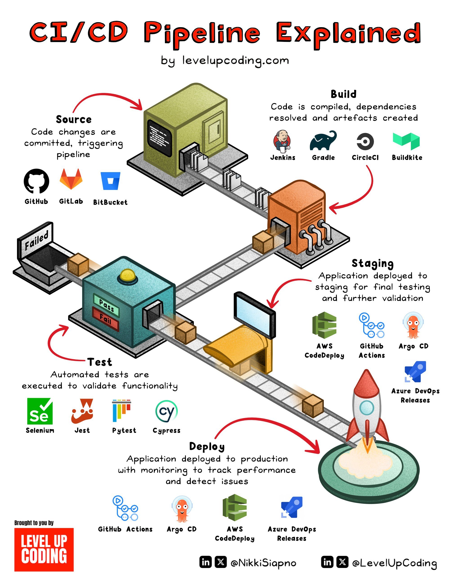

**Source:** [https://twitter.com/i/web/status/1941112827001131289](https://twitter.com/i/web/status/1941112827001131289)
**Original Post Date:** 2025-07-14 20:47:07

# CI/CD Pipeline Best Practices: A Comprehensive Guide

## Introduction
Continuous Integration (CI) and Continuous Deployment (CD) are essential practices in modern software development, enabling teams to deliver high-quality applications rapidly and reliably. This guide provides a comprehensive overview of the CI/CD pipeline, breaking down each stage and highlighting best practices for implementation. We will explore tools commonly used at each stage and discuss strategies for optimizing your pipeline.

## Source Stage

The source stage is where code changes are committed and pushed to a version control system. This stage sets the foundation for the entire CI/CD pipeline by ensuring that all team members have access to the latest codebase.

Best practices include using feature branches, writing descriptive commit messages, and ensuring that each commit passes basic linting and formatting checks.

- Use version control systems like GitHub, GitLab, or BitBucket.
- Implement branch strategies such as feature branches or GitFlow.
- Ensure code quality with pre-commit hooks and linting tools.

> **Note/Tip:** Regularly update the main branch to minimize merge conflicts.

> **Note/Tip:** Use pull requests for code reviews to ensure code quality.

## Build Stage

The build stage involves compiling the code, resolving dependencies, and creating artifacts. This stage ensures that the code is in a deployable state before moving on to testing.

Best practices include using build tools like Jenkins, Gradle, or CircleCI to automate the build process. Ensure that your build scripts are idempotent and can be run multiple times without side effects.

- Use build automation tools such as Jenkins, Gradle, or CircleCI.
- Ensure dependency management with tools like Maven or npm.
- Create build artifacts that are versioned and traceable.

> **Note/Tip:** Optimize build times by parallelizing tasks where possible.

> **Note/Tip:** Use caching for dependencies to speed up the build process.

## Test Stage

The test stage involves executing automated tests to validate the functionality of the code. This stage is critical for catching bugs early and ensuring that new changes do not break existing functionality.

Best practices include using testing frameworks like Selenium, Jest, or Pytest to automate the testing process. Ensure that your tests are comprehensive, covering both unit and integration scenarios.

- Use testing frameworks such as Selenium, Jest, or Pytest.
- Implement different types of tests: unit, integration, system, and end-to-end.
- Ensure test coverage with tools like JaCoCo or Istanbul.

> **Note/Tip:** Run tests in parallel to reduce overall testing time.

> **Note/Tip:** Use mocking frameworks to isolate components during testing.

## Staging Stage

The staging stage involves deploying the application to a staging environment for final testing and validation. This stage mimics the production environment, allowing teams to catch any issues before deployment.

Best practices include using tools like AWS, GitHub Actions, or Argo CD to automate the staging process. Ensure that your staging environment is as close to production as possible in terms of configuration and resources.

- Use deployment tools such as AWS, GitHub Actions, or Argo CD.
- Ensure the staging environment mirrors the production environment.
- Perform final validation tests in the staging environment.

> **Note/Tip:** Monitor performance and resource usage in the staging environment.

> **Note/Tip:** Use feature flags to enable/disable features in the staging environment.

## Deploy Stage

The deploy stage involves deploying the application to the production environment. This stage is the final step in the CI/CD pipeline and should be highly automated to minimize human error.

Best practices include using deployment tools like AWS CodeDeploy, GitHub Actions, or Argo CD to automate the deployment process. Ensure that your deployment scripts are idempotent and can be run multiple times without side effects.

- Use deployment tools such as AWS CodeDeploy, GitHub Actions, or Argo CD.
- Implement blue-green deployments or canary releases for safer rollouts.
- Monitor the production environment for any issues post-deployment.

> **Note/Tip:** Use rollback strategies to quickly revert to a previous version if issues arise.

> **Note/Tip:** Implement logging and monitoring in production to track application health.

## Monitoring and Tracking

Monitoring and tracking performance in the production environment is crucial for maintaining application health and catching issues early. This stage involves setting up tools to monitor key metrics, logs, and traces.

Best practices include using monitoring tools like Prometheus, Grafana, or New Relic to track performance metrics. Ensure that your logging strategy captures relevant information for debugging and troubleshooting.

- Use monitoring tools such as Prometheus, Grafana, or New Relic.
- Implement comprehensive logging with tools like ELK Stack or Splunk.
- Set up alerts for critical metrics to notify the team of potential issues.

> **Note/Tip:** Regularly review logs and metrics to identify trends and anomalies.

> **Note/Tip:** Use distributed tracing to track requests across microservices.

## Key Takeaways

- The CI/CD pipeline is essential for delivering high-quality applications rapidly and reliably.
- Each stage in the pipeline has specific best practices and tools that should be followed.
- Automation is key to minimizing human error and speeding up the delivery process.
- Monitoring and tracking performance in production is crucial for maintaining application health.

## Conclusion
In conclusion, implementing a robust CI/CD pipeline involves understanding each stage's requirements and best practices. By following these guidelines and using the right tools, teams can ensure that their applications are delivered rapidly, reliably, and with high quality.

## External References

- [CI/CD Pipeline Explained by levelupcoding.com](https://levelupcoding.com/ci-cd-pipeline-explained)
- [Jenkins Documentation](https://www.jenkins.io/doc/)
- [Gradle Documentation](https://gradle.org/documentation/)

## Media

**Image Description:** ### Description of the Image

The image is an infographic titled **"CI/CD Pipeline Explained"** by **levelupcoding.com**. It visually represents the **Continuous Integration (CI)** and **Continuous Deployment (CD)** pipeline, breaking it down into key stages: **Source**, **Build**, **Test**, **Staging**, and **Deploy**. The pipeline is depicted as a conveyor belt system, with each stage represented by a distinct section of the belt. Below is a detailed breakdown of the image:

---

### **1. Title and Source**
- The title is prominently displayed at the top in bold, red text: **"CI/CD Pipeline Explained"**.
- The source is credited to **levelupcoding.com**, with social media handles (@NikkiSiapno and @LevelUpCoding) provided at the bottom.

---

### **2. Main Visual: Conveyor Belt System**
The pipeline is illustrated as a conveyor belt, with each stage represented by a distinct section of the belt. The flow of the pipeline is from left to right, indicating the progression of code from source to deployment.

---

### **3. Stages of the CI/CD Pipeline**

#### **a. Source**
- **Description**: This is the starting point of the pipeline, where code changes are committed and pushed to a version control system.
- **Visual**: A green box labeled **"Source"** is shown at the beginning of the conveyor belt.
- **Tools**: The image lists popular version control systems:
  - **GitHub** (GitHub logo)
  - **GitLab** (GitLab logo)
  - **BitBucket** (BitBucket logo)

---

#### **b. Build**
- **Description**: This stage involves compiling the code, resolving dependencies, and creating artifacts.
- **Visual**: A yellow box labeled **"Build"** is shown next in the conveyor belt.
- **Tools**: The image lists popular build tools:
  - **Jenkins** (Jenkins logo)
  - **Gradle** (Gradle logo)
  - **CircleCI** (CircleCI logo)
  - **Buildkite** (Buildkite logo)

---

#### **c. Test**
- **Description**: Automated tests are executed to validate the functionality of the code.
- **Visual**: A blue box labeled **"Test"** is shown, with a green light indicating a **"Pass"** and a red light indicating a **"Fail"**.
- **Tools**: The image lists popular testing frameworks:
  - **Selenium** (Selenium logo)
  - **Jest** (Jest logo)
  - **Pytest** (Pytest logo)
  - **Cypress** (Cypress logo)

---

#### **d. Staging**
- **Description**: The application is deployed to a staging environment for final testing and validation.
- **Visual**: An orange box labeled **"Staging"** is shown, with a monitor displaying the application.
- **Tools**: The image lists popular deployment tools for staging:
  - **AWS** (AWS logo)
  - **GitHub Actions** (GitHub Actions logo)
  - **Argo CD** (Argo CD logo)

---

#### **e. Deploy**
- **Description**: The application is deployed to the production environment.
- **Visual**: A yellow box labeled **"Deploy"** is shown, leading to a rocket launch, symbolizing the deployment to production.
- **Tools**: The image lists popular deployment tools:
  - **AWS CodeDeploy** (AWS CodeDeploy logo)
  - **GitHub Actions** (GitHub Actions logo)
  - **Argo CD** (Argo CD logo)
  - **Azure DevOps** (Azure DevOps logo)

---

### **4. Additional Elements**
- **Monitoring and Tracking**: At the bottom of the image, there is a section highlighting the importance of monitoring and tracking performance in production. Tools mentioned include:
  - **GitHub Actions**
  - **Argo CD**
  - **AWS CodeDeploy**
  - **Azure DevOps**

- **Failed Tests**: The image includes a visual of a failed test (a red light labeled **"Failed"**) to emphasize the importance of testing and the potential for rework if tests fail.

- **Releases**: The final stage is depicted with a rocket launch, symbolizing the deployment of the application to production.

---

### **5. Design and Layout**
- The image uses a playful, isometric style with bright colors and icons to make the content engaging and easy to understand.
- Arrows and labels guide the viewer through the flow of the pipeline, ensuring clarity in the sequence of stages.
- The repetition of the word **"Explained"** in the title adds a humorous touch, emphasizing the educational purpose of the infographic.

---

### **Summary**
The image provides a comprehensive and visually appealing explanation of the CI/CD pipeline, breaking it down into stages: **Source**, **Build**, **Test**, **Staging**, and **Deploy**. Each stage is accompanied by relevant tools and icons, making it an effective resource for understanding the process of continuous integration and deployment in software development. The use of a conveyor belt metaphor and visual cues like lights and a rocket launch enhances the clarity and engagement of the content.
