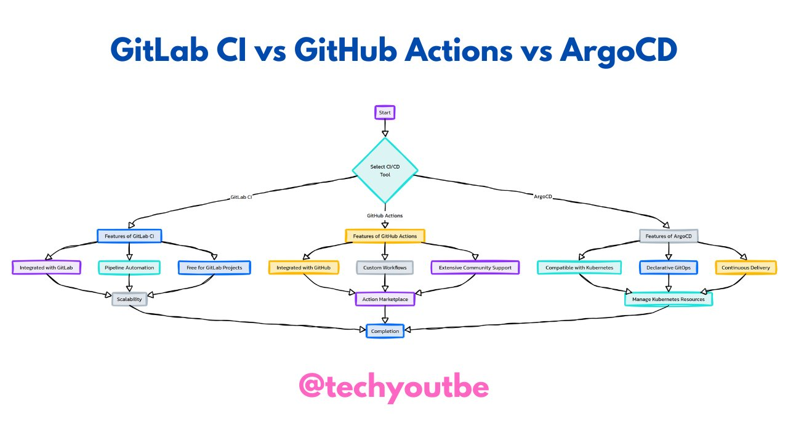

**Source:** [https://twitter.com/i/web/status/1870189039745163540](https://twitter.com/i/web/status/1870189039745163540)
**Original Post Date:** 2025-06-17 08:52:40

# Comparative Analysis of GitLab CI, GitHub Actions, and ArgoCD for Modern DevOps Pipelines

## Introduction
Modern DevOps teams require robust CI/CD solutions to automate their software delivery processes. This analysis examines three leading tools - GitLab CI, GitHub Actions, and ArgoCD - comparing their core functionalities, integrations, scalability, and use cases. Each tool offers distinct advantages based on project requirements and ecosystem preferences.

## Integration and Ecosystem

GitLab CI provides seamless integration with GitLab's monolithic platform, offering a unified experience for source control, issue tracking, and CI/CD execution. This tight coupling simplifies setup and reduces external dependencies.

GitHub Actions integrates deeply with GitHub repositories, leveraging the existing code hosting ecosystem. It supports both private and public workflows while maintaining compatibility with third-party integrations through its marketplace.

- GitLab CI: Native GitLab integration reduces setup complexity
- GitHub Actions: Leverages existing GitHub infrastructure
- ArgoCD: Kubernetes-native for containerized deployments

## Feature Comparison and Use Cases

GitLab CI excels in monolithic platforms with built-in scalability. It's ideal for teams already using GitLab for version control.

GitHub Actions offers extensive customization via marketplace actions and community support, making it suitable for diverse project requirements.

_Basic GitLab CI pipeline configuration demonstrating multi-stage deployment_

```yaml
.gitlab-ci.yml example:
  stages:
    - build
    - test
    - deploy
deploy_to_staging:
  stage: deploy
  script:
    - echo 'Deploying to staging'
  only:
    - main
```

> **Note/Tip:** Consider team's existing ecosystem when selecting a tool to minimize friction

> **Note/Tip:** Evaluate community support and marketplace availability for custom requirements

## Kubernetes Integration

ArgoCD distinguishes itself with native Kubernetes integration, supporting GitOps workflows through declarative configurations.

Both GitLab CI and GitHub Actions can integrate with Kubernetes, but require additional configuration compared to ArgoCD's built-in support.

_Basic ArgoCD installation command demonstrating Kubernetes-native deployment_

```yaml
kubectl apply -f https://raw.githubusercontent.com/argoproj/argo-cd/stable/manifests/install.yaml
```

## Key Takeaways

- Choose GitLab CI for teams already invested in the GitLab ecosystem requiring tight integration
- Select GitHub Actions when flexibility and extensive marketplace options are priorities
- Opt for ArgoCD specifically for Kubernetes-centric workflows with strong GitOps requirements

## Conclusion
The choice between these tools depends on your existing infrastructure, team expertise, and project requirements. GitLab CI offers unified platform benefits, GitHub Actions provides versatility through its marketplace, while ArgoCD excels in Kubernetes-native deployments.

## External References

- [GitLab CI Documentation](https://docs.gitlab.com/ee/ci/)
- [GitHub Actions Official Guide](https://docs.github.com/en/actions)
- [ArgoCD Documentation](https://argo-cd.readthedocs.io/)


## Media

**Image Description:** The image is a flowchart comparing three popular CI/CD (Continuous Integration/Continuous Deployment) tools: **GitLab CI**, **GitHub Actions**, and **ArgoCD**. The flowchart is structured to guide the viewer through the selection process for a CI/CD tool, highlighting the features of each tool. Below is a detailed description:

### **Main Title**
- The title at the top reads: **"GitLab CI vs GitHub Actions vs ArgoCD"**.
- This indicates that the flowchart is designed to compare these three tools.

### **Flowchart Structure**
The flowchart is organized as a decision-making process, starting from the top and branching out to the features of each tool. Here's a breakdown:

#### **1. Start**
- The flowchart begins with a **"Start"** node, which is a purple diamond shape. This is the entry point for the decision-making process.

#### **2. Select CI/CD Tool**
- From the "Start" node, there is a decision point labeled **"Select CI/CD Tool"**, also represented as a diamond shape.
- This node branches out into three paths, each leading to a different CI/CD tool: **GitLab CI**, **GitHub Actions**, and **ArgoCD**.

#### **3. Features of Each Tool**
Each tool has its own branch, detailing its key features. The features are color-coded for clarity:
- **GitLab CI** (Blue)
- **GitHub Actions** (Orange)
- **ArgoCD** (Green)

##### **GitLab CI (Blue Branch)**
- **Integrated with GitLab**: Indicates that GitLab CI is tightly integrated with the GitLab platform.
- **Pipeline Automation**: Highlights the automation capabilities of GitLab CI pipelines.
- **Free for GitLab Projects**: Emphasizes that GitLab CI is free for projects hosted on GitLab.
- **Scalability**: Mentions the scalability of GitLab CI.

##### **GitHub Actions (Orange Branch)**
- **Integrated with GitHub**: Indicates that GitHub Actions are tightly integrated with the GitHub platform.
- **Custom Workflows**: Highlights the ability to create custom workflows.
- **Action Marketplace**: Mentions the availability of a marketplace for reusable actions.
- **Extensive Community Support**: Emphasizes the strong community support for GitHub Actions.
- **Continuous Delivery**: Indicates the tool's support for continuous delivery processes.

##### **ArgoCD (Green Branch)**
- **Integrated with Kubernetes**: Highlights the integration with Kubernetes, making it suitable for Kubernetes-based deployments.
- **Manage Kubernetes Resources**: Indicates the ability to manage Kubernetes resources.
- **Compatible with Kubernetes**: Reinforces the Kubernetes compatibility.
- **Declarative GitOps**: Emphasizes the declarative nature of ArgoCD, aligning with GitOps principles.
- **Continuous Delivery**: Indicates support for continuous delivery processes.

#### **4. Completion**
- All branches converge into a **"Completion"** node, represented as a blue rectangle. This signifies the end of the decision-making process.

### **Visual Design**
- **Color Coding**: Each tool's features are color-coded to distinguish them:
  - GitLab CI: Blue
  - GitHub Actions: Orange
  - ArgoCD: Green
- **Shapes**:
  - **Start/End**: Represented by rectangles.
  - **Decision Points**: Represented by diamonds.
  - **Features**: Represented by rounded rectangles.
- **Arrows**: Black arrows connect the nodes, guiding the flow of the decision process.

### **Footer**
- At the bottom, there is a watermark or signature: **"@techyoutbe"**, written in pink text. This suggests the creator or source of the flowchart.

### **Purpose**
The flowchart serves as a comparative guide for developers or teams looking to choose a CI/CD tool. It highlights the key features of each tool, making it easier to evaluate which tool best fits their needs based on integration, automation, scalability, community support, and other factors.

### **Summary**
This flowchart is a clear and structured comparison of GitLab CI, GitHub Actions, and ArgoCD, designed to help users make an informed decision about which CI/CD tool to use based on their specific requirements and preferences. The use of color coding and a logical flow makes the information easy to follow and understand.
