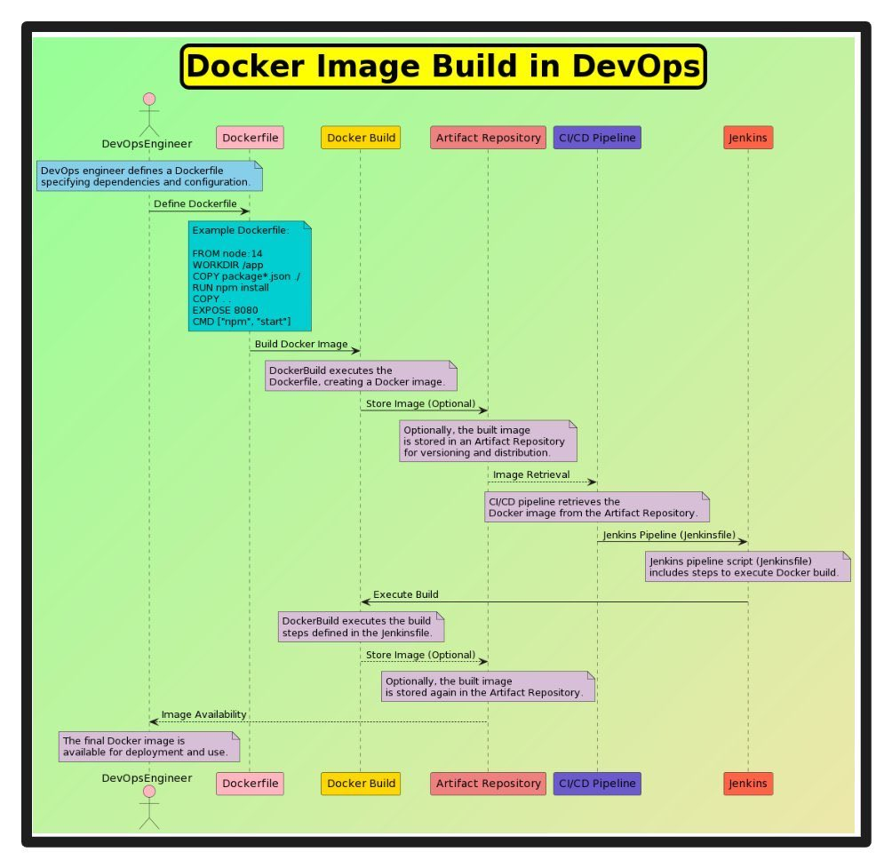

Creating a Docker image is an essential step in the DevOps pipeline, enabling efficient deployment and management of applications. The Docker image build flow involves several stages, from defining the Dockerfile to storing and managing artifacts. This entry provides a comprehensive overview of the Docker image build process, highlighting the role of Continuous Integration and Continuous Deployment (CI/CD) and tools like Jenkins.

#### Technical Content
The Docker image build flow can be broadly categorized into four sections: Docker Build, Artifact Repository, CI/CD Pipeline, and Jenkins.

##### Docker Build
This stage involves defining the Dockerfile, which contains instructions for building the Docker image. The steps in this section include:
* **Define Dockerfile**: Create a Dockerfile that outlines the base image, copies files, sets environment variables, and defines commands to run during the build process.
* **Build Docker Image**: Use the `docker build` command to create the Docker image from the Dockerfile.
* **Store Image (Optional)**: Store the built image in a registry like Docker Hub for later use.
* **Execute Build**: Execute the build process using the defined Dockerfile and store the resulting image.
* **Store Image (Optional)**: Optionally, store the final image in an artifact repository or a container registry.

Example of a simple Dockerfile:
```dockerfile
# Use an official Python runtime as a parent image
FROM python:3.9-slim

# Set the working directory in the container
WORKDIR /app

# Copy the current directory contents into the container at /app
COPY . /app

# Install any needed packages specified in requirements.txt
RUN pip install --trusted-host pypi.org -r requirements.txt

# Make port 80 available to the world outside this container
EXPOSE 80

# Define environment variable
ENV NAME World

# Run app.py when the container launches
CMD ["python", "app.py"]
```

##### Artifact Repository
An artifact repository is used to store and manage artifacts produced during the build process. This can include Docker images, jar files, or other deployable components. The steps in this section include:
* **Store Image (Optional)**: Store the built Docker image in an artifact repository for version control and easy retrieval.
* **CI/CD Pipeline**: Integrate the artifact repository with a CI/CD pipeline tool like Jenkins to automate the build, test, and deployment process.

##### CI/CD Pipeline
The CI/CD pipeline is crucial for automating the build, testing, and deployment of applications. The steps in this section include:
* **Jenkins Pipeline (Jenkinsfile)**: Define a Jenkinsfile that outlines the stages of the pipeline, including build, test, and deploy.
* **Artifact Repository**: Use an artifact repository to store and manage artifacts produced during the pipeline execution.

Example of a Jenkinsfile for a CI/CD pipeline:
```groovy
pipeline {
    agent any

    stages {
        stage('Build') {
            steps {
                // Build the Docker image
                sh 'docker build -t myapp .'
            }
        }
        stage('Test') {
            steps {
                // Test the application
                sh 'docker run myapp python tests.py'
            }
        }
        stage('Deploy') {
            steps {
                // Deploy the application to production
                sh 'docker tag myapp:latest myregistry/myapp:latest'
                sh 'docker push myregistry/myapp:latest'
            }
        }
    }
}
```

##### Jenkins
Jenkins is a popular tool for automating CI/CD pipelines. It provides a flexible framework for defining pipeline stages and integrating with various tools and technologies. The steps in this section include:
* **Jenkins Pipeline (Jenkinsfile)**: Define a Jenkinsfile to automate the build, test, and deployment process.
* **Artifact Repository**: Integrate Jenkins with an artifact repository to store and manage artifacts produced during the pipeline execution.

#### Key Takeaways and Best Practices
- **Automate the Build Process**: Use CI/CD tools like Jenkins to automate the Docker image build process.
- **Use Artifact Repositories**: Store and manage artifacts in repositories for version control and easy retrieval.
- **Implement Continuous Integration and Deployment**: Regularly integrate code changes into a central repository and automatically deploy to production after testing.
- **Monitor and Log**: Monitor pipeline executions and log events for debugging and auditing purposes.

#### References
- [Docker Documentation](https://docs.docker.com/)
- [Jenkins Documentation](https://www.jenkins.io/doc/)
- [CI/CD Best Practices](https://www.atlassian.com/continuous-delivery/principles/continuous-integration)
## Source

- Original Tweet: [https://twitter.com/i/web/status/1884306371631538367](https://twitter.com/i/web/status/1884306371631538367)
- Date: 2025-02-20 20:58:48


## Media

### Media 1

**Description:** The image presents a flowchart illustrating the process of Docker Image Build in DevOps. The chart is divided into several sections, each representing a different stage of the build process.

*   **Docker Build**
    *   This section outlines the steps involved in building a Docker image.
    *   It includes the following sub-steps:
        *   Define Dockerfile
        *   Build Docker Image
        *   Store Image (Optional)
        *   Execute Build
        *   Store Image (Optional)
*   **Artifact Repository**
    *   This section describes how to store and manage artifacts during the build process.
    *   It includes the following sub-steps:
        *   Store Image (Optional)
        *   CI/CD Pipeline
*   **CI/CD Pipeline**
    *   This section explains the role of Continuous Integration and Continuous Deployment in the build process.
    *   It includes the following sub-steps:
        *   Jenkins Pipeline (Jenkinsfile)
        *   Artifact Repository
*   **Jenkins**
    *   This section highlights the importance of Jenkins in automating the build process.
    *   It includes the following sub-steps:
        *   Jenkins Pipeline (Jenkinsfile)
        *   Artifact Repository

In summary, the flowchart provides a step-by-step guide to building a Docker image using DevOps tools and techniques. It covers various stages, from defining the Dockerfile to storing and managing artifacts, and emphasizes the role of Continuous Integration and Continuous Deployment in automating the build process.

*Last updated: 2025-02-20 20:58:48*