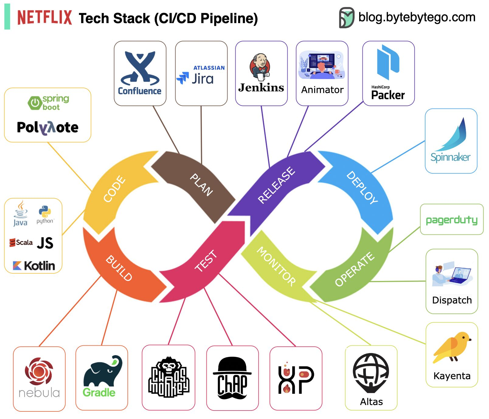

**Source:** [https://twitter.com/i/web/status/1910913333945086365](https://twitter.com/i/web/status/1910913333945086365)
**Original Post Date:** 2025-05-27 19:59:33

# Netflix's Implementation of Jira and Confluence in CI/CD Pipeline: A Technical Architecture Deep Dive

## Introduction
Netflix's renowned CI/CD infrastructure exemplifies enterprise-grade automation through its sophisticated tooling. At the core lies a seamless integration of Atlassian's Jira and Confluence, bridging planning and execution phases with technical implementation.

## The Central CI/CD Pipeline Architecture

Netflix employs a circular flow model divided into six interconnected stages: PLAN, CODE, BUILD, TEST, MONITOR, and OPERATE. This design ensures continuous iteration and feedback loops between phases.

Each stage is color-coded for visual clarity (PLAN-brown, CODE-yellow, BUILD-orange, TEST-pink, MONITOR-green, OPERATE-blue) to facilitate quick comprehension of the pipeline's flow.

- Jira orchestrates issue tracking and project management in PLAN stage
- Confluence provides documentation repository for knowledge sharing
- Spinnaker drives multi-cloud deployments during OPERATE phase

> **Note/Tip:** Integration points between Jira/Confluence and downstream tools are critical for maintaining pipeline cohesion

## Technical Stack Integration Across Stages

The PLAN stage leverages Confluence for requirements documentation while Jira tracks issue progress. Jenkins automates build processes, ensuring seamless transition to coding phases.

Code management employs multiple languages (Java, Python, Scala) and frameworks (Spring Boot), supported by Nebula/Gradle in BUILD phase.

1. Chaos Monkey performs resilience testing during TEST phase
1. Atlas monitors performance metrics post-deployment
1. Kayenta analyzes canary deployments for validation

## Operational Excellence in Netflix's Pipeline

Spinnaker centralizes deployment management, integrating with PagerDuty for incident response and Dispatch for operational automation.

The Animator tool provides visual orchestration of pipeline stages, enhancing visibility into deployment flows.

> **Note/Tip:** Prioritizing infrastructure as code patterns ensures consistent deployments across environments

## Key Takeaways

- Netflix's circular CI/CD model emphasizes continuous feedback and improvement through integrated tooling
- Jira and Confluence serve as cornerstone planning tools, driving technical execution through automation
- Chaos engineering principles are embedded throughout the pipeline to ensure system resilience

## Conclusion
The successful implementation of Netflix's CI/CD infrastructure demonstrates how strategic integration of Jira, Confluence, and complementary tools can create a robust development workflow. The emphasis on continuous improvement, automated testing, and operational visibility enables rapid, reliable software delivery at scale.

## External References

- [Netflix Engineering Blog](https://netflixtechblog.com/)
- [Original Pipeline Visualization Source](blog.bytebytebytego.com)

## Media

**Image Description:** ### Description of the Image

The image is a detailed visualization of **Netflix's Tech Stack** for its **CI/CD (Continuous Integration/Continuous Deployment) Pipeline**. It illustrates the various tools and technologies used in the development, testing, deployment, and monitoring phases of software development. The diagram is structured in a circular flow, representing the continuous nature of the CI/CD pipeline, with each stage connected to the next in a seamless loop.

#### **Main Components and Stages**

1. **Central CI/CD Pipeline Stages**
   - The central part of the image is a circular flow diagram divided into six main stages:
     1. **PLAN**
     2. **CODE**
     3. **BUILD**
     4. **TEST**
     5. **MONITOR**
     6. **OPERATE**

   - These stages represent the core phases of the CI/CD pipeline, highlighting the continuous and iterative nature of software development and deployment.

2. **Tools and Technologies**
   - Various tools and technologies are linked to each stage of the pipeline. These tools are categorized into different groups based on their function.

#### **Tools and Technologies by Stage**

##### **1. PLAN**
   - **Confluence**: A collaboration tool by Atlassian for project planning and documentation.
   - **Jira**: A project management and issue tracking tool by Atlassian.
   - **Jenkins**: An open-source automation server used for building and testing software.

##### **2. CODE**
   - **Spring Boot**: A popular framework for building Java-based applications.
   - **Polyvote**: A tool for decision-making and prioritization in software development.
   - **Java**: A widely used programming language.
   - **Python**: A versatile programming language.
   - **Scala**: A functional programming language.
   - **JavaScript (JS)**: A scripting language for web development.
   - **Kotlin**: A modern programming language for JVM and Android development.

##### **3. BUILD**
   - **Nebula**: A build automation tool for Gradle.
   - **Gradle**: A build automation tool for Java projects.
   - **Chaos Monkey**: A tool for testing system resilience by randomly terminating instances.
   - **Chap**: A tool for managing and automating deployment pipelines.
   - **XP**: Likely refers to eXtreme Programming practices or tools related to it.

##### **4. TEST**
   - **Chaos Monkey**: Also used in the testing phase to simulate failures and test system resilience.
   - **Chap**: Likely used for testing automation and pipeline management.
   - **XP**: Likely related to testing practices or tools.

##### **5. MONITOR**
   - **Altas**: A monitoring tool for infrastructure and application performance.
   - **Kayenta**: A tool for canary analysis, used to monitor and validate new deployments.

##### **6. OPERATE**
   - **Spinnaker**: An open-source, multi-cloud continuous delivery platform for releasing software changes.
   - **PagerDuty**: A tool for incident management and alerting.
   - **Dispatch**: Likely a tool for managing and automating operational tasks.
   - **Animator**: A tool for visualizing and managing deployment pipelines.

#### **Additional Tools**
   - **HashiCorp Packer**: A tool for creating identical machine images for multiple platforms.
   - **Animator**: A tool for visualizing and managing deployment pipelines.

#### **Visual Design**
   - The diagram uses a **circular flow** to represent the continuous nature of the CI/CD pipeline.
   - Each stage is color-coded for clarity:
     - **PLAN**: Brown
     - **CODE**: Yellow
     - **BUILD**: Orange
     - **TEST**: Pink
     - **MONITOR**: Green
     - **OPERATE**: Blue
   - Tools and technologies are represented with their respective logos and names, making it easy to identify them.

#### **Overall Structure**
   - The image is well-organized, with tools and technologies clearly linked to their respective stages in the pipeline.
   - The use of arrows and lines indicates the flow of the pipeline, showing how each stage connects to the next.

#### **Additional Notes**
   - The image is sourced from the blog **blog.bytebytebytego.com**, as indicated in the top-right corner.
   - The diagram effectively communicates the complexity and interconnectedness of Netflix's CI/CD pipeline, showcasing a robust and scalable tech stack.

### Summary
This image provides a comprehensive overview of Netflix's CI/CD pipeline, highlighting the tools and technologies used at each stage of the development and deployment process. The circular flow design emphasizes the continuous and iterative nature of the pipeline, while the use of color coding and clear labeling ensures that the information is easily digestible. The tools listed cover a wide range of functionalities, from planning and coding to testing, monitoring, and operations, reflecting Netflix's sophisticated approach to software development and deployment.
