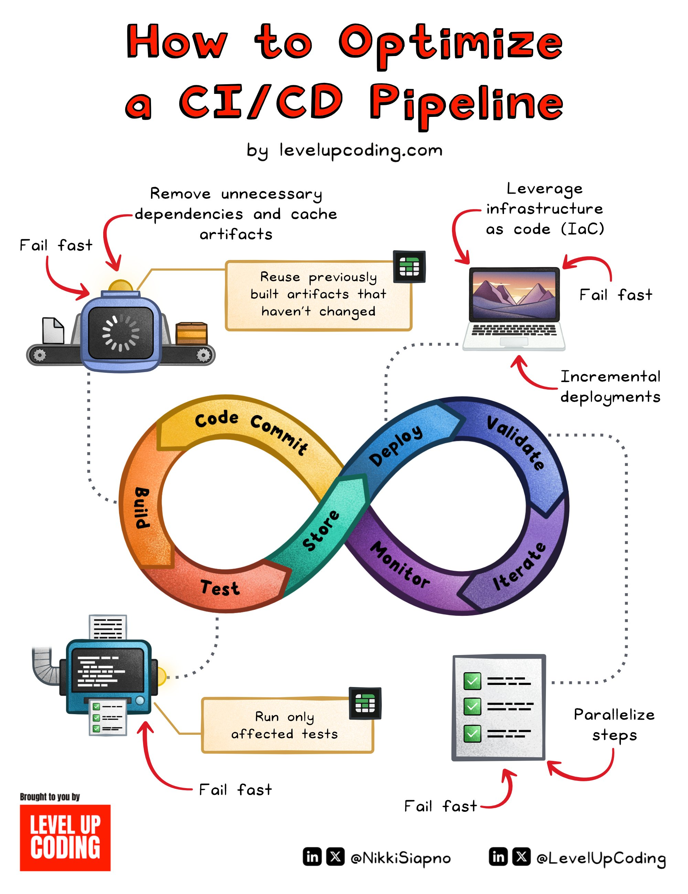

**Source:** [https://twitter.com/i/web/status/1880865586378571960](https://twitter.com/i/web/status/1880865586378571960)
**Original Post Date:** 2025-06-17 11:46:38

# Optimizing CI/CD Pipeline Performance: Advanced Strategies and Techniques

## Introduction
Continuous Integration and Continuous Deployment (CI/CD) are fundamental practices in modern software development. However, many teams struggle with slow, inefficient pipelines that hinder rapid delivery. This knowledge base article explores advanced optimization techniques to significantly improve pipeline performance through strategic implementations of caching, parallelization, and selective test execution.

## Understanding the CI/CD Pipeline Structure

The CI/CD pipeline consists of two interdependent loops: the outer Continuous Integration loop (Code → Commit → Build → Test → Store) and the inner Continuous Deployment loop (Validate → Deploy → Monitor → Iterate). Each stage presents opportunities for optimization.

Effective optimization requires understanding how these stages interact and identifying bottlenecks within each component.

1. Code stage: Source control integration and validation
1. Build stage: Compilation and artifact generation
1. Test stage: Automated testing suite execution
1. Deploy stage: Infrastructure provisioning and application deployment

> **Note/Tip:** Monitor each stage's duration to identify performance bottlenecks.

> **Note/Tip:** Consider implementing distributed build systems for parallel compilation.

## Artifact Caching and Reuse

Artifact caching is one of the most effective strategies for pipeline optimization. By storing previously built artifacts, teams can significantly reduce redundant builds when code changes don't affect specific components.

Implementation requires careful consideration of cache invalidation policies to ensure only necessary rebuilds occur.

_Example of caching configuration in a CI pipeline_

```yaml
---
build:
  steps:
    - name: Build Application
      cache:
        key: build-${BRANCH}-${COMMIT}
        paths:
          - node_modules/
          - .next/
```

## Optimization Strategies

Implementing 'fail fast' principles through early validation can reduce wasted cycles on doomed builds.

Incremental deployments focus only on changed components, reducing deployment risk and time.

- Parallelize independent test suites for faster execution
- Remove unused dependencies to speed up build processes
- Leverage Infrastructure as Code (IaC) for consistent environments

> **Note/Tip:** Use selective test execution based on changed files to minimize test runtime.

> **Note/Tip:** Implement proper monitoring after optimization to ensure stability.

## Key Takeaways

- Artifact caching can reduce build times by up to 70% in most applications
- Parallel execution of independent tasks is crucial for pipeline speed
- Selective test execution should be based on code change analysis

## Conclusion
Optimizing CI/CD pipelines requires a systematic approach combining artifact caching, parallelization, and selective execution. By implementing these strategies thoughtfully, teams can achieve significant improvements in delivery velocity while maintaining quality standards.

## External References

- [LevelUpCoding CI/CD Optimization Guide](https://levelupcoding.com/cicd-optimization)
- [GitLab Pipeline Caching Documentation](https://docs.gitlab.com/ee/ci/pipelines/caching/)


## Media

**Image Description:** ### Image Description: How to Optimize a CI/CD Pipeline

#### **Main Subject**
The image is a detailed infographic titled **"How to Optimize a CI/CD Pipeline"**, created by **levelupcoding.com**. It provides a comprehensive guide on optimizing a Continuous Integration (CI) and Continuous Deployment (CD) pipeline, highlighting best practices and strategies to improve efficiency, speed, and reliability.

#### **Structure and Layout**
The infographic is visually organized into two main sections:
1. **Top Section**: Focuses on the **CI/CD pipeline stages** and optimization strategies.
2. **Bottom Section**: Highlights specific techniques for optimizing the pipeline.

#### **CI/CD Pipeline Stages**
The core of the infographic is a **double-loop diagram** representing the CI/CD pipeline. The loops are color-coded and labeled to represent different stages:
- **Outer Loop (CI Pipeline)**:
  - **Code**: Represents the initial stage where code is written.
  - **Commit**: Code is committed to version control.
  - **Build**: The code is built into an executable artifact.
  - **Test**: Automated tests are run to validate the code.
  - **Store**: Artifacts are stored for future use.
- **Inner Loop (CD Pipeline)**:
  - **Validate**: Ensures the artifact is ready for deployment.
  - **Deploy**: The artifact is deployed to the target environment.
  - **Monitor**: The deployed application is monitored for performance and issues.
  - **Iterate**: Feedback is used to improve the process.

#### **Optimization Strategies**
The infographic outlines several key strategies for optimizing the CI/CD pipeline, each connected to specific stages of the pipeline:

1. **Fail Fast**:
   - **Description**: Implement early failure detection to minimize wasted time and resources.
   - **Visual**: Arrows pointing to the **Code**, **Build**, and **Test** stages, emphasizing quick feedback loops.

2. **Reuse Previously Built Artifacts**:
   - **Description**: Leverage cached or previously built artifacts that haven’t changed to avoid redundant builds.
   - **Visual**: A conveyor belt-like icon with a robot arm, symbolizing automation and reuse.

3. **Remove Unnecessary Dependencies**:
   - **Description**: Streamline the build process by eliminating unnecessary dependencies.
   - **Visual**: A box with a crossed-out dependency icon, indicating removal.

4. **Leverage Infrastructure as Code (IaC)**:
   - **Description**: Use IaC tools to manage and provision infrastructure consistently and efficiently.
   - **Visual**: A laptop with a sunset background, symbolizing infrastructure management.

5. **Incremental Deployments**:
   - **Description**: Deploy only the changes that have been made, reducing the scope of deployment.
   - **Visual**: A dotted line connecting the **Deploy** stage, indicating incremental updates.

6. **Run Only Affected Tests**:
   - **Description**: Execute only the tests relevant to the changes made, saving time on test execution.
   - **Visual**: A testing machine with a checklist, indicating selective test execution.

7. **Parallelize Steps**:
   - **Description**: Run pipeline steps in parallel to reduce overall execution time.
   - **Visual**: A checklist with green checkmarks, indicating parallel execution.

#### **Visual Elements**
- **Icons and Symbols**:
  - A robot arm represents automation.
  - A conveyor belt symbolizes the flow of artifacts.
  - A laptop with a sunset background represents infrastructure management.
  - A testing machine with a checklist represents selective test execution.
- **Color Coding**:
  - Different stages of the pipeline are color-coded for clarity:
    - **CI Pipeline**: Orange, Yellow, Green, Red.
    - **CD Pipeline**: Blue, Purple, Teal, Dark Blue.
- **Arrows and Dotted Lines**:
  - Arrows indicate the flow of the pipeline and optimization strategies.
  - Dotted lines highlight incremental and parallel steps.

#### **Footer**
- **Branding**:
  - The infographic is brought to you by **levelupcoding.com**.
  - Social media handles are included: **@NikkiSiapno** and **@LevelUpCoding** on LinkedIn and X (formerly Twitter).
- **Call to Action**:
  - The bottom left corner features a red box with the text **"LEVEL UP CODING"**, encouraging viewers to engage with the content.

#### **Overall Theme**
The infographic is designed to be visually engaging and informative, using a combination of icons, colors, and text to explain complex concepts in a digestible manner. It emphasizes the importance of automation, efficiency, and continuous improvement in CI/CD pipelines.

### Summary
This infographic provides a clear and structured guide on optimizing CI/CD pipelines, focusing on strategies like **fail fast**, **reuse artifacts**, **remove unnecessary dependencies**, **leverage IaC**, **incremental deployments**, **run only affected tests**, and **parallelize steps**. The use of visuals, color coding, and clear labeling makes the content accessible and easy to understand for developers and DevOps engineers.
