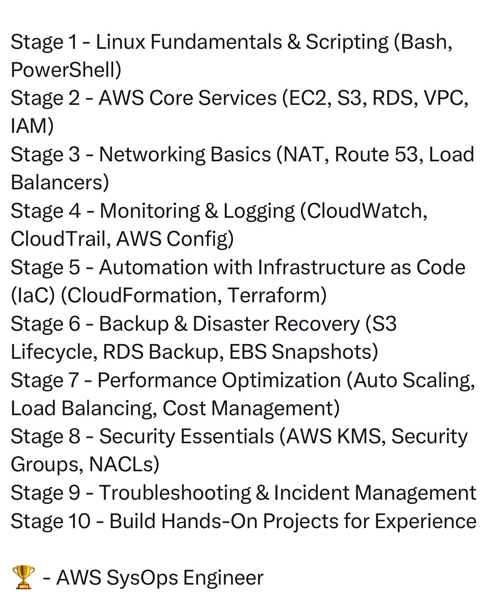

# Aws Devops Learning Plan

## Description
AWS DevOps Engineer - Learning Plan...

## Content
AWS DevOps Engineer - Learning Plan

## Category Information

- Main Category: devops
- Sub Category: cloud_platforms
- Item Name: aws_devops_learning_plan

## Source

- Original Tweet: [https://twitter.com/i/web/status/1890715428307038441](https://twitter.com/i/web/status/1890715428307038441)
- Date: 2025-02-20 15:36:34

## Media

### Media 1

**Description:** The infographic presents a comprehensive outline of the AWS Certified SysOps Administrator - Associate training program, organized into ten stages. Each stage is accompanied by essential topics to be covered during that phase.

**Stage 1: Linux Fundamentals & Scripting**
• Bash
• PowerShell

**Stage 2: AWS Core Services**
• EC2
• S3
• RDS
• VPC
• IAM

**Stage 3: Networking Basics**
• NAT
• Route 53
• Load Balancers

**Stage 4: Monitoring & Logging**
• CloudWatch
• CloudTrail
• AWS Config

**Stage 5: Automation with Infrastructure as Code (IaC)**
• Terraform
• CloudFormation

**Stage 6: Backup & Disaster Recovery**
• S3 Lifecycle
• RDS Backup
• EBS Snapshots

**Stage 7: Performance Optimization**
• Auto Scaling
• Load Balancing
• Cost Management

**Stage 8: Security Essentials**
• AWS KMS
• Security Groups
• NACLs

**Stage 9: Troubleshooting & Incident Management**
• Hands-on experience with real-world projects

**Stage 10: Building Hands-On Projects for Experience**

The infographic provides a clear and structured overview of the training program, highlighting key topics to be covered in each stage. This visual representation enables individuals to quickly understand the scope of the course and plan their learning journey accordingly.

*Last updated: 2025-02-20 15:36:34*