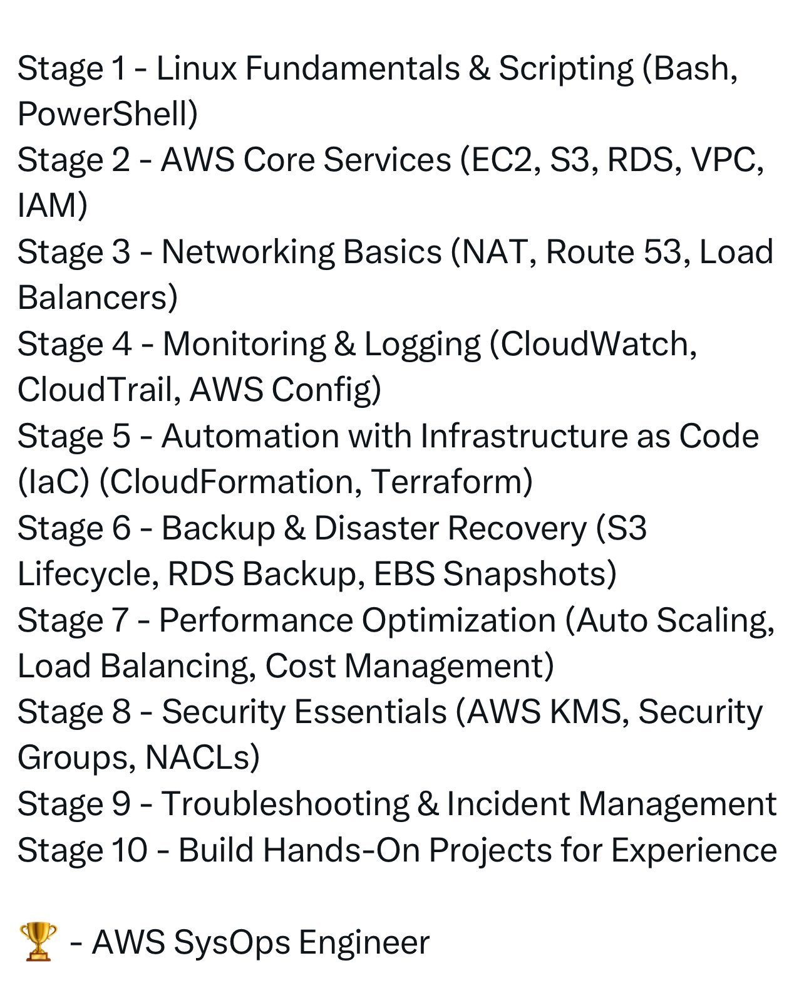

The AWS DevOps Engineer learning plan is a comprehensive outline designed to guide individuals through the process of becoming proficient in AWS DevOps engineering. This structured approach covers a wide range of topics, from Linux fundamentals and AWS core services to performance optimization, security essentials, and troubleshooting.

#### Detailed Technical Content
The learning plan is organized into ten stages, each focusing on specific areas crucial for AWS DevOps engineers:

##### Stage 1: Linux Fundamentals & Scripting
- **Bash**: Understanding Bash scripting is essential for automating tasks in Linux environments. Examples include writing scripts to automate user management or file system operations.
- **PowerShell**: Although primarily used in Windows environments, PowerShell knowledge can be beneficial for interacting with Windows instances in AWS.

##### Stage 2: AWS Core Services
- **EC2 (Elastic Compute Cloud)**: Learning about EC2 instances, including their types, pricing models, and how to manage them.
- **S3 (Simple Storage Service)**: Understanding object storage, bucket policies, and lifecycle management.
- **RDS (Relational Database Service)**: Knowledge of database instances, including MySQL, PostgreSQL, Oracle, SQL Server, and Amazon Aurora.
- **VPC (Virtual Private Cloud)**: Understanding how to create and manage virtual networks in AWS, including subnets, route tables, and network ACLs.
- **IAM (Identity and Access Management)**: Essential for managing access and permissions within AWS, including users, groups, roles, and policies.

##### Stage 3: Networking Basics
- **NAT (Network Address Translation)**: Understanding how NAT gateways allow instances in a private subnet to connect to the internet.
- **Route 53**: Learning about DNS management and how to route traffic to your resources.
- **Load Balancers**: Distributing incoming traffic across multiple targets to improve responsiveness, reliability, and scalability of applications.

##### Stage 4: Monitoring & Logging
- **CloudWatch**: Collecting and tracking metrics, collecting and monitoring log files, and setting alarms.
- **CloudTrail**: Recording API calls made within your account for auditing purposes.
- **AWS Config**: Evaluating and recording resource configurations for compliance and governance purposes.

##### Stage 5: Automation with Infrastructure as Code (IaC)
- **Terraform**: Using Terraform to create, manage, and modify infrastructure resources such as virtual machines, networks, and databases.
- **CloudFormation**: Learning about AWS CloudFormation templates to create and manage related AWS resource collections.

##### Stage 6: Backup & Disaster Recovery
- **S3 Lifecycle**: Managing the lifetime of objects in S3, including archival and deletion policies.
- **RDS Backup**: Understanding automated backups for RDS instances and how to manually create database snapshots.
- **EBS Snapshots**: Creating snapshots of EBS volumes for backup and disaster recovery purposes.

##### Stage 7: Performance Optimization
- **Auto Scaling**: Dynamically adjusting the number of EC2 instances based on workload demands.
- **Load Balancing**: Using Elastic Load Balancer (ELB) to distribute traffic across multiple instances.
- **Cost Management**: Implementing strategies to optimize AWS costs, including reserved instances and rightsizing resources.

##### Stage 8: Security Essentials
- **AWS KMS (Key Management Service)**: Managing encryption keys used to protect data at rest and in transit.
- **Security Groups**: Controlling inbound and outbound traffic at the instance level.
- **NACLs (Network Access Control Lists)**: Regulating traffic flow in and out of subnets.

##### Stage 9: Troubleshooting & Incident Management
Hands-on experience with real-world projects to apply learned concepts, including debugging common issues, managing incidents, and optimizing resources based on performance metrics.

##### Stage 10: Building Hands-On Projects for Experience
Creating comprehensive projects that integrate knowledge from all previous stages, focusing on practical application and problem-solving in real-world scenarios.

#### Key Takeaways and Best Practices
- **Comprehensive Learning**: Covering all stages of the learning plan to ensure a well-rounded understanding of AWS DevOps.
- **Hands-on Practice**: Implementing theoretical knowledge through practical projects and experiments.
- **Continuous Update**: Regularly updating knowledge with the latest AWS features, best practices, and security guidelines.

#### References
- [AWS Official Documentation](https://docs.aws.amazon.com/)
- [Terraform Documentation](https://www.terraform.io/docs)
- [CloudFormation User Guide](https://docs.aws.amazon.com/AWSCloudFormation/latest/UserGuide/)

By following this structured learning plan, individuals can acquire the necessary skills and knowledge to excel as AWS DevOps engineers, capable of designing, deploying, and managing scalable, secure, and efficient cloud-based systems.
## Source

- Original Tweet: [https://twitter.com/i/web/status/1890715428307038441](https://twitter.com/i/web/status/1890715428307038441)
- Date: 2025-02-20 16:51:40

## Media

### Media 1

**Description:** The infographic presents a comprehensive outline of the AWS Certified SysOps Administrator - Associate training program, organized into ten stages. Each stage is accompanied by essential topics to be covered during that phase.

**Stage 1: Linux Fundamentals & Scripting**
• Bash
• PowerShell

**Stage 2: AWS Core Services**
• EC2
• S3
• RDS
• VPC
• IAM

**Stage 3: Networking Basics**
• NAT
• Route 53
• Load Balancers

**Stage 4: Monitoring & Logging**
• CloudWatch
• CloudTrail
• AWS Config

**Stage 5: Automation with Infrastructure as Code (IaC)**
• Terraform
• CloudFormation

**Stage 6: Backup & Disaster Recovery**
• S3 Lifecycle
• RDS Backup
• EBS Snapshots

**Stage 7: Performance Optimization**
• Auto Scaling
• Load Balancing
• Cost Management

**Stage 8: Security Essentials**
• AWS KMS
• Security Groups
• NACLs

**Stage 9: Troubleshooting & Incident Management**
• Hands-on experience with real-world projects

**Stage 10: Building Hands-On Projects for Experience**

The infographic provides a clear and structured overview of the training program, highlighting key topics to be covered in each stage. This visual representation enables individuals to quickly understand the scope of the course and plan their learning journey accordingly.

*Last updated: 2025-02-20 16:51:40*