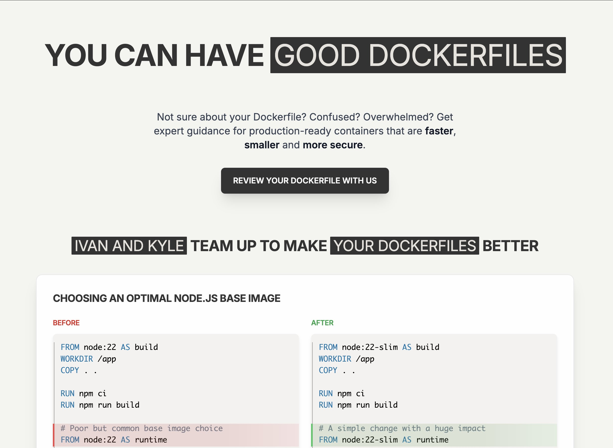

# Better Dockerfiles

## Description
Unpopular opinion: Your container images are bad because Dockerfiles is a no man's land.

- Application developers lack the motivation & relevant skills to write optimal Dockerfiles.

- DevOps enginee...

## Content
Unpopular opinion: Your container images are bad because Dockerfiles is a no man's land.

- Application developers lack the motivation & relevant skills to write optimal Dockerfiles.

- DevOps engineers lack in-depth knowledge of the application stack and up-to-date build best practices.

But both camps can be easily understood! That's a lot of cross-functional knowledge to keep in one's head, especially for a secondary-importance activity such as building good container images.

That's why Kyle and I decided to team up and try to move the needle. If your team is having a hard time building container images, reach out, and we'll provide an expert Dockerfile review.

Free of charge while the program is in the pilot phase 

Apply at http://gooddockerfiles.com

## Category Information

- Main Category: devops
- Sub Category: containerization
- Item Name: better_dockerfiles

## Source

- Original Tweet: [https://twitter.com/i/web/status/1880271036781928683](https://twitter.com/i/web/status/1880271036781928683)
- Date: 2025-02-20 15:36:34

## Media

### Media 1

**Description:** The image presents a comprehensive guide to Dockerfiles, with the title "YOU CAN HAVE GOOD DOCKERFILES" prominently displayed at the top. The content is organized into three sections:

**Section 1: Introduction**

* Title: "YOU CAN HAVE GOOD DOCKERFILES"
* Subtitle: "Not sure about your Dockerfile? Confused? Overwhelmed?"
* Call-to-action: "REVIEW YOUR DOCKERFILE WITH US"

**Section 2: Problem Statement**

* Text: "Get expert guidance for production-ready containers that are faster, smaller, and more secure."
* Button: "REVIEW YOUR DOCKERFILE WITH US"

**Section 3: Solution**

* Title: "IVAN AND KYLE TEAM UP TO MAKE YOUR DOCKERFILES BETTER"
* Image: A screenshot of a Dockerfile with annotations highlighting potential issues
* Text: "CHOOSING AN OPTIMAL NODE.JS BASE IMAGE BEFORE AFTER"

The image effectively communicates the importance of having well-structured Dockerfiles and invites users to review their Dockerfiles with Ivan and Kyle, who can provide expert guidance on improving them.

*Last updated: 2025-02-20 15:36:34*