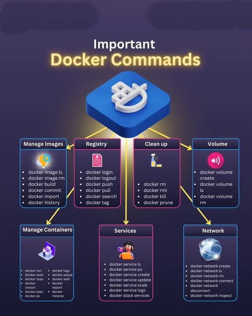

**Source:** [https://twitter.com/i/web/status/1871784185037287586](https://twitter.com/i/web/status/1871784185037287586)
**Original Post Date:** 2025-06-17 12:23:11

# Docker Command Categorization: Essential CLI Groupings for Efficient Container Management

## Introduction
Mastering Docker commands is fundamental to effective containerized development and deployment workflows. This knowledge base item presents a comprehensive categorization of essential Docker CLI commands organized by functional areas, enabling developers and system administrators to efficiently manage containers, images, registries, services, networks, and volumes. Understanding these groupings accelerates workflow optimization and minimizes operational errors.

## Image Management Commands

Docker image commands facilitate the creation, modification, and inspection of container images, forming the foundation of Docker deployments.

```docker
docker build -t myimage .
docker image ls
 docker history nginx:latest
```

```docker
docker commit container_id new_image_name
 docker import file.tar archive/image
```

> **Note/Tip:** Use descriptive tags for images to track versions and environments

> **Note/Tip:** Regularly prune unused images with 'docker image prune' to manage disk space

## Container Lifecycle Management

These commands control container operations, from creation through runtime management.

```docker
docker run -d --name webserver nginx
 docker exec -it mycontainer /bin/bash
```

- - Monitor container resources with 'docker stats'
- - Use 'docker restart' to handle unexpected stops

> **Note/Tip:** Avoid using 'docker kill' unless absolutely necessary; prefer graceful termination

## Registry Operations

Commands for interacting with Docker registries and managing image distribution.

```docker
docker login registry.example.com
 docker push myimage:tag
```

> **Note/Tip:** Always tag images before pushing to avoid overwriting existing versions

## Network and Volume Management

These commands facilitate data persistence and network configuration within Docker environments.

```docker
docker volume create appdata
 docker network create webnet
```

> **Note/Tip:** Volume names should reflect their purpose for clarity

## Service and Orchestration Commands

Commands for managing Docker Swarm services and stack deployments.

```docker
docker service create --name webapp nginx
 docker service scale webapp=3
```

- - Use 'docker stack' for multi-service deployments
- - Monitor services with 'docker service ps'

## Key Takeaways

- Organize Docker workflows around functional command groups to improve efficiency and reduce errors
- Always include appropriate tags when building, pushing, or pulling images
- Implement proper cleanup procedures using prune commands for unused resources
- Use volumes for persistent data storage in containerized applications

## Conclusion
Understanding and effectively utilizing Docker's categorized command structure is crucial for streamlined development and deployment processes. By mastering these groupings, teams can significantly reduce operational overhead while maintaining robust container environments.

## External References

- [Docker Official Documentation](https://docs.docker.com/engine/reference/commandline/cli/)
- [Best Practices for Docker Command Usage](https://docs.docker.com/develop/dev-best-practices/)


## Media

**Image Description:** The image is a visually organized infographic titled **"Important Docker Commands"**, which categorizes and presents various Docker-related commands into different functional groups. The design is modern and colorful, with a dark background and vibrant text and icons to highlight the content. Below is a detailed breakdown:

### **Main Subject**
The main subject of the image is the **Docker commands**, which are essential for managing Docker environments, including images, containers, registries, services, networks, and volumes. The commands are grouped into categories for better organization and understanding.

### **Structure and Layout**
The infographic is divided into several sections, each representing a specific category of Docker commands. The categories are connected to a central Docker logo, emphasizing their relationship to Docker's ecosystem.

### **Central Docker Logo**
- At the center of the image is the **Docker logo**, which is a stylized "D" in white, set against a blue hexagonal background. This serves as the focal point, symbolizing the core of the Docker ecosystem.

### **Categories and Commands**
The categories are arranged around the central Docker logo, with arrows pointing from the logo to each category. Each category is color-coded and includes a relevant icon to represent its function.

#### **1. Manage Images**
- **Color:** Blue
- **Icon:** A colorful globe-like icon.
- **Commands:**
  - `docker image ls`
  - `docker image rm`
  - `docker build`
  - `docker commit`
  - `docker import`
  - `docker history`

#### **2. Registry**
- **Color:** Pink
- **Icon:** A file icon.
- **Commands:**
  - `docker login`
  - `docker logout`
  - `docker pull`
  - `docker push`
  - `docker search`
  - `docker tag`

#### **3. Clean Up**
- **Color:** Pink
- **Icon:** A trash can icon.
- **Commands:**
  - `docker rm`
  - `docker rmi`
  - `docker kill`
  - `docker prune`

#### **4. Volume**
- **Color:** Pink
- **Icon:** A speaker icon.
- **Commands:**
  - `docker volume create`
  - `docker volume ls`
  - `docker volume rm`

#### **5. Manage Containers**
- **Color:** Blue
- **Icon:** A laptop icon.
- **Commands:**
  - `docker run`
  - `docker exec`
  - `docker attach`
  - `docker start`
  - `docker stop`
  - `docker restart`
  - `docker top`
  - `docker wait`
  - `docker port`
  - `docker stats`
  - `docker pause`
  - `docker unpause`
  - `docker kill`
  - `docker rm`
  - `docker rename`
  - `docker ps`

#### **6. Services**
- **Color:** Pink
- **Icon:** A person icon.
- **Commands:**
  - `docker service ls`
  - `docker service logs`
  - `docker service ps`
  - `docker service create`
  - `docker service scale`
  - `docker service update`
  - `docker service rm`
  - `docker service service`
  - `docker service logs`
  - `docker stack services`

#### **7. Network**
- **Color:** Blue
- **Icon:** A network icon.
- **Commands:**
  - `docker network create`
  - `docker network ls`
  - `docker network rm`
  - `docker network connect`
  - `docker network disconnect`
  - `docker network inspect`

### **Design Elements**
- **Background:** Dark blue with a subtle gradient, giving the image a modern and professional look.
- **Text:** White and yellow text for headings and commands, ensuring high contrast and readability.
- **Icons:** Simple, recognizable icons are used to represent each category, enhancing visual clarity.
- **Arrows:** Arrows connect the central Docker logo to each category, emphasizing the relationship between Docker and its functionalities.

### **Purpose**
The infographic serves as a quick reference guide for Docker users, helping them understand and remember the most important Docker commands by categorizing them into logical groups. It is particularly useful for developers, system administrators, and Docker enthusiasts who need to manage Docker environments efficiently.

### **Overall Impression**
The image is well-organized, visually appealing, and functional, making it an effective tool for learning and referencing Docker commands. The use of color coding, icons, and clear categorization ensures that the information is easy to digest and recall.
