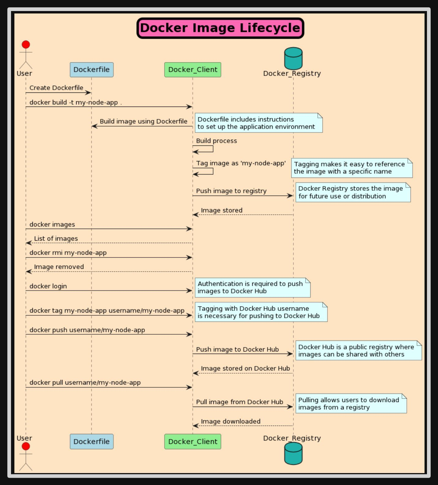

**Source:** [https://twitter.com/i/web/status/1870841169175048233](https://twitter.com/i/web/status/1870841169175048233)
**Original Post Date:** 2025-07-20 09:37:34

# Docker Image Lifecycle Best Practices: A Comprehensive Guide

## Introduction
The Docker image lifecycle is a critical aspect of containerization, encompassing the creation, management, and distribution of Docker images. This guide provides an in-depth analysis of each step in the lifecycle, along with best practices to ensure efficient and secure image management. We will explore the key components involved, including the User, Dockerfile, Docker Client, and Docker Registry, and delve into the technical details that underpin these processes.

## Key Components of the Docker Image Lifecycle

The Docker image lifecycle involves several key components: the User, Dockerfile, Docker Client, and Docker Registry. The User is responsible for creating and managing Docker images through a series of commands executed via the Docker Client. The Dockerfile contains instructions for building the image, while the Docker Registry serves as a repository for storing and distributing these images.

The Docker Client acts as an intermediary between the User and the Docker daemon, executing commands such as `docker build`, `docker tag`, and `docker push`. These commands facilitate the creation, tagging, and distribution of Docker images. The Dockerfile is a crucial component, as it defines the environment and configuration required for the application to run within a container.

- User: Interacts with the Docker environment through commands executed via the Docker Client.
- Dockerfile: A text file containing instructions for building a Docker image.
- Docker Client: The command-line interface used to interact with Docker, allowing users to build, tag, push, pull, and manage images.
- Docker Registry: A repository where Docker images are stored for distribution.

> **Note/Tip:** Ensure that your Dockerfile is optimized for performance by minimizing the number of layers and using multi-stage builds where possible.

> **Note/Tip:** Regularly update your Docker images to include the latest security patches and dependencies.

## Step-by-Step Workflow

The Docker image lifecycle can be broken down into several key steps: creating a Dockerfile, building the Docker image, tagging the image, pushing it to a registry, listing images, removing images, and pulling images from a registry.

Each step involves specific commands executed via the Docker Client. For example, the `docker build` command is used to create an image based on the instructions in the Dockerfile, while the `docker tag` command assigns a name and optional tag to the image for easier reference and distribution.

_These commands illustrate the key steps in the Docker image lifecycle, from building and tagging an image to pushing it to a registry and managing local images._

```bash
docker build -t my-node-app .
docker tag my-node-app username/my-node-app
docker login
docker push username/my-node-app
docker images
docker rmi my-node-app
docker pull username/my-node-app
```

1. Create a Dockerfile: The User writes a Dockerfile containing instructions for setting up the application environment.
1. Build the Docker Image: The User uses the `docker build` command to create an image based on the Dockerfile.
1. Tag the Docker Image: The User tags the image with a specific name using the `docker tag` command.
1. Push the Docker Image to a Registry: The User pushes the tagged image to a Docker Registry using the `docker push` command.
1. List Docker Images: The User lists all available images on their local system using the `docker images` command.
1. Remove a Docker Image: The User removes an image from their local system using the `docker rmi` command.
1. Pull a Docker Image from a Registry: The User pulls an image from a public registry using the `docker pull` command.

> **Note/Tip:** Always test your Docker images locally before pushing them to a public registry.

> **Note/Tip:** Use meaningful tags for your images to facilitate versioning and management.

## Technical Details and Best Practices

Understanding the technical details of each component in the Docker image lifecycle is essential for efficient and secure image management. The Dockerfile, for instance, contains instructions such as installing dependencies, copying files, and defining environment variables. These instructions are executed during the build process to create a functional image.

The Docker Client provides a range of commands that facilitate the management of images throughout their lifecycle. For example, the `docker login` command is used to authenticate with a Docker Registry before pushing an image, while the `docker pull` command retrieves an image from a registry for local use.

- Dockerfile: Contains instructions for building the Docker image, such as installing dependencies, copying files, and defining environment variables.
- Docker Client: Provides commands for interacting with Docker, including `docker build`, `docker tag`, `docker push`, `docker pull`, and `docker rmi`.
- Docker Registry: A repository where Docker images are stored. Public registries like Docker Hub allow for the distribution of images to a wide audience.
- Tagging: Assigns a name and optional tag to an image, making it easier to reference and distribute.
- Authentication: Required for pushing images to a public registry. The `docker login` command is used to authenticate with the registry.

> **Note/Tip:** Regularly review your Dockerfiles to ensure they are up-to-date with best practices and security standards.

> **Note/Tip:** Consider using private registries for sensitive or proprietary images to maintain control over their distribution.

## Visual Elements and Diagram Analysis

The diagram illustrating the Docker image lifecycle uses visual elements such as arrows, dashed lines, and color coding to represent the flow of actions and data between components. These elements provide a clear and concise representation of the lifecycle, making it easier for users to understand the interactions between the User, Dockerfile, Docker Client, and Docker Registry.

Arrows in the diagram indicate the direction of actions and data flow, while dashed lines represent optional or background processes. Color coding is used to differentiate between components: blue for the Dockerfile, green for the Docker Client, teal for the Docker Registry, and red for the User.

- Arrows: Represent the flow of actions and data between components.
- Dashed Lines: Indicate optional or background processes, such as storing images in the Docker Registry.
- Color Coding: Differentiates between components (blue for Dockerfile, green for Docker Client, teal for Docker Registry, red for User).

> **Note/Tip:** When creating diagrams to represent complex processes like the Docker image lifecycle, consider using color coding and arrows to improve clarity and understanding.

> **Note/Tip:** Regularly review and update your diagrams to ensure they accurately reflect changes in your workflow or technology stack.

## Summary of Key Points

The Docker image lifecycle encompasses the creation, management, and distribution of Docker images. The diagram provides a comprehensive overview of this lifecycle, highlighting the key components involved (User, Dockerfile, Docker Client, Docker Registry) and the steps required to build, tag, push, pull, list, and remove images.

Understanding each step in the lifecycle is crucial for efficient and secure image management. Best practices such as optimizing Dockerfiles, using meaningful tags, and regularly updating images ensure that your Docker environment remains functional and secure.

> **Note/Tip:** Regularly review and update your understanding of the Docker image lifecycle to stay current with best practices and technological advancements.

> **Note/Tip:** Consider automating repetitive tasks in your Docker workflow using tools like CI/CD pipelines to improve efficiency and consistency.

## Key Takeaways

- The Docker image lifecycle involves key components: User, Dockerfile, Docker Client, and Docker Registry.
- Each step in the lifecycle (create, build, tag, push, list, remove, pull) involves specific commands executed via the Docker Client.
- Optimizing Dockerfiles and using meaningful tags are essential for efficient and secure image management.
- Regularly updating images and reviewing workflows ensures a functional and secure Docker environment.

## Conclusion
The Docker image lifecycle is a critical aspect of containerization, encompassing the creation, management, and distribution of Docker images. By understanding each step in the lifecycle and adhering to best practices, you can ensure efficient and secure image management. Regularly reviewing and updating your workflows will help maintain a functional and secure Docker environment.

## External References

- [Docker Documentation](https://docs.docker.com/)
- [Best Practices for Writing Dockerfiles](https://docs.docker.com/develop/develop-images/dockerfile_best-practices/)


## Media

**Image Description:** ### Description of the Image: Docker Image Lifecycle

The image illustrates the **Docker Image Lifecycle**, which outlines the steps involved in creating, managing, and distributing Docker images. The diagram is structured as a flowchart, showing the interactions between a **User**, a **Dockerfile**, a **Docker Client**, and a **Docker Registry**. Below is a detailed breakdown of the image:

---

#### **1. Title**
- The title at the top of the image is **"Docker Image Lifecycle"**, written in a pink box with a white border. This emphasizes the main subject of the diagram.

---

#### **2. Main Components**
The diagram involves the following key components:
- **User**: Represented by a stick figure with a red dot at the top, indicating the human interacting with the Docker environment.
- **Dockerfile**: A blue box labeled "Dockerfile," which contains instructions for building a Docker image.
- **Docker Client**: A green box labeled "Docker_Client," which is the tool used to interact with Docker commands.
- **Docker Registry**: A teal cylinder labeled "Docker_Registry," representing a repository where Docker images are stored for distribution.

---

#### **3. Workflow Steps**
The flowchart is divided into several stages, each representing a step in the Docker image lifecycle. Below is a detailed breakdown of each step:

##### **Step 1: Create Dockerfile**
- The **User** creates a **Dockerfile**, which contains instructions for setting up the application environment.
- The Dockerfile is a text file that defines the steps required to build a Docker image.

##### **Step 2: Build the Docker Image**
- The **User** uses the **Docker Client** to build the Docker image using the `docker build` command:
  ```
  docker build -t my-node-app .
  ```
- The `docker build` command reads the Dockerfile and creates a Docker image based on the instructions provided.
- The image is tagged with the name `my-node-app` using the `-t` flag.

##### **Step 3: Tag the Docker Image**
- The **User** tags the Docker image with a specific name using the `docker tag` command:
  ```
  docker tag my-node-app username/my-node-app
  ```
- Tagging makes it easier to reference the image and is necessary for pushing the image to a public registry like Docker Hub.

##### **Step 4: Push the Docker Image to a Registry**
- The **User** logs into the Docker Registry using the `docker login` command:
  ```
  docker login
  ```
- After logging in, the **User** pushes the tagged image to the Docker Registry using the `docker push` command:
  ```
  docker push username/my-node-app
  ```
- The image is now stored in the Docker Registry, making it available for future use or distribution.

##### **Step 5: List Docker Images**
- The **User** can list all available Docker images on their local system using the `docker images` command:
  ```
  docker images
  ```
- This command displays a list of images, including their names, tags, and IDs.

##### **Step 6: Remove a Docker Image**
- The **User** can remove a Docker image from their local system using the `docker rmi` command:
  ```
  docker rmi my-node-app
  ```
- This command deletes the specified image from the local Docker environment.

##### **Step 7: Pull a Docker Image from a Registry**
- The **User** can pull a Docker image from a public registry (e.g., Docker Hub) using the `docker pull` command:
  ```
  docker pull username/my-node-app
  ```
- This command downloads the specified image from the registry and stores it locally.

---

#### **4. Key Technical Details**
- **Dockerfile**: Contains instructions for building the Docker image, such as installing dependencies, copying files, and defining environment variables.
- **Docker Client**: The command-line interface used to interact with Docker, allowing the user to build, tag, push, pull, and manage images.
- **Docker Registry**: A repository where Docker images are stored. The diagram highlights Docker Hub as a public registry.
- **Tagging**: The process of assigning a name and optional tag to an image, making it easier to reference and distribute.
- **Authentication**: Required for pushing images to a public registry like Docker Hub. The `docker login` command is used for this purpose.

---

#### **5. Visual Elements**
- **Arrows**: Represent the flow of actions and data between components.
- **Dashed Lines**: Indicate optional or background processes, such as the storage of images in the Docker Registry.
- **Color Coding**:
  - **Blue**: Represents the Dockerfile and related instructions.
  - **Green**: Represents the Docker Client and its commands.
  - **Teal**: Represents the Docker Registry and its functions.
  - **Red**: Represents the User.

---

#### **6. Summary**
The image provides a comprehensive overview of the Docker image lifecycle, from creating a Dockerfile and building an image to tagging, pushing, pulling, and managing images. It emphasizes the interaction between the User, Dockerfile, Docker Client, and Docker Registry, highlighting the key commands and processes involved in each step.

This flowchart is a valuable resource for understanding how Docker images are created, stored, and distributed in a typical development and deployment workflow.
