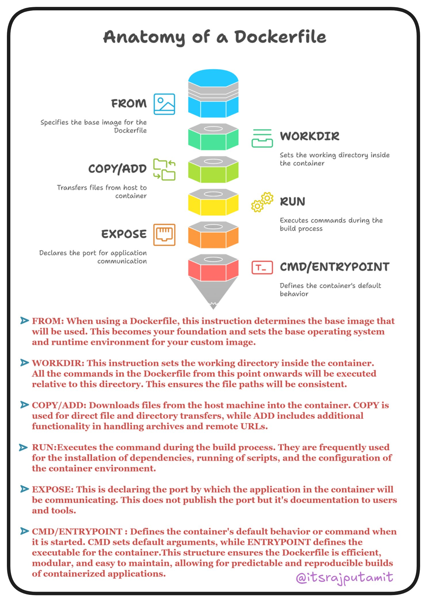

# Dockerfile Anatomy

## Description
Understanding Dockerfile ...

## Content
Understanding Dockerfile 

## Category Information

- Main Category: devops
- Sub Category: containerization
- Item Name: dockerfile_anatomy

## Source

- Original Tweet: [https://twitter.com/i/web/status/1880218561303703586](https://twitter.com/i/web/status/1880218561303703586)
- Date: 2025-02-20 15:36:34

## Media

### Media 1

**Description:** The infographic, titled "Anatomy of a Dockerfile," provides a comprehensive overview of the essential components involved in creating a Docker container using a Dockerfile. The title is prominently displayed at the top of the image.

**Components of a Docker Container**

The infographic illustrates the various stages involved in building a Docker container from scratch. These stages are represented by colorful icons and include:

* FROM: Specifies the base image for the Docker container
* WORKDIR: Sets the working directory inside the container
* COPY/ADD: Copies files into the container
* RUN: Executes commands during the build process
* EXPOSE: Exposes ports to make them accessible from outside the container
* CMD/ENTRYPOINT: Defines the default command to run when the container starts
* ENV: Sets environment variables within the container

Each component is accompanied by a brief description, providing additional context and clarity on its purpose.

**Key Takeaways**

The infographic effectively communicates the importance of each stage in building a Docker container. By understanding these components, developers can create robust and efficient containers that meet their specific needs.

In summary, this infographic serves as an excellent resource for those new to Docker or looking to improve their understanding of the technology. It provides a clear and concise overview of the essential components involved in creating a Docker container, making it an invaluable tool for anyone working with Docker.

*Last updated: 2025-02-20 15:36:34*