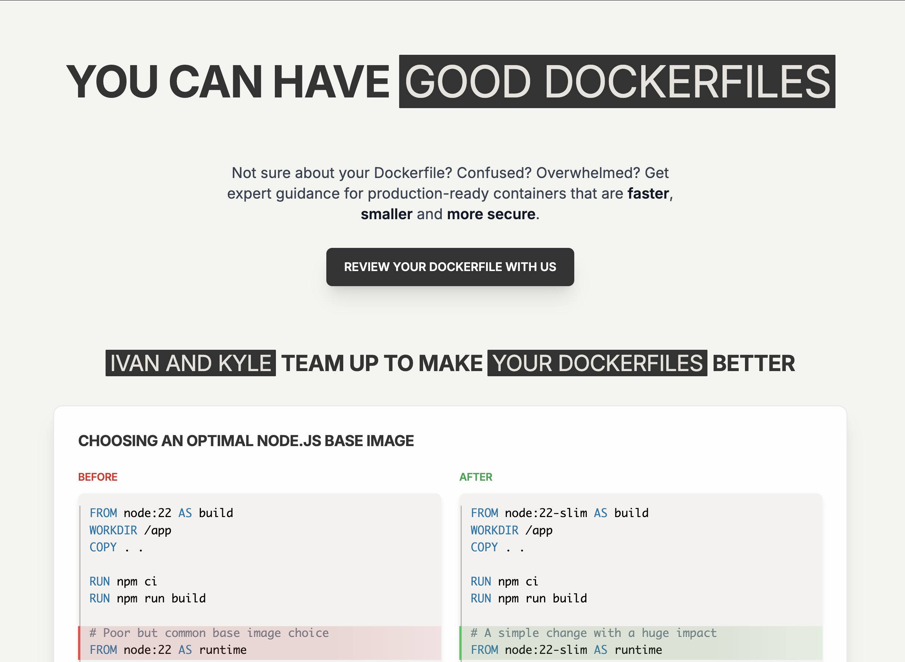

Creating optimal container images is crucial for efficient and secure application deployment. However, writing good Dockerfiles can be challenging due to the lack of motivation and relevant skills among application developers, as well as the limited knowledge of the application stack and build best practices among DevOps engineers. This article provides a detailed guide on how to create better Dockerfiles, including expert review services for improved container images.

#### Introduction
Dockerfiles are a critical component of containerization, serving as a blueprint for creating container images. A well-structured Dockerfile ensures that the resulting container image is efficient, secure, and reliable. However, many teams struggle with writing optimal Dockerfiles due to the complexities involved.

#### Problem Statement
The primary issue with Dockerfiles is that they often fall into a "no man's land" between application development and DevOps. Application developers may lack the motivation and skills to write optimal Dockerfiles, while DevOps engineers may not have in-depth knowledge of the application stack and up-to-date build best practices. This can result in suboptimal container images that are larger, slower, and less secure than necessary.

#### Solution
To address this challenge, Ivan and Kyle have teamed up to provide expert Dockerfile review services. Their goal is to help teams create better container images by providing guidance on optimal Dockerfile configurations. The review process involves analyzing the Dockerfile for potential issues, such as:

* Choosing an optimal base image (e.g., Node.js)
* Optimizing dependencies and packages
* Ensuring proper security configurations
* Minimizing image size

By leveraging their expertise, teams can create production-ready containers that are faster, smaller, and more secure.

#### Example: Choosing an Optimal Node.js Base Image
When creating a Dockerfile for a Node.js application, choosing the right base image is crucial. A good practice is to use an official Node.js image, such as `node:14` or `node:16`, instead of a generic Linux image like `ubuntu`. This ensures that the resulting container image includes the necessary dependencies and configurations for optimal Node.js performance.

```dockerfile
# Bad practice: using a generic Linux image
FROM ubuntu

# Good practice: using an official Node.js image
FROM node:14
```

#### Key Takeaways and Best Practices
To create better Dockerfiles, follow these best practices:

* Use official images from trusted sources (e.g., Docker Hub)
* Minimize dependencies and packages to reduce image size
* Ensure proper security configurations (e.g., expose only necessary ports)
* Regularly review and update Dockerfiles to reflect changing application requirements

#### References
* [Docker](https://www.docker.com/): A popular containerization platform.
* [Docker Hub](https://hub.docker.com/): A registry of Docker images.
* [Good Dockerfiles](https://gooddockerfiles.com/): A website offering expert Dockerfile review services.

By applying these best practices and leveraging expert guidance, teams can create better Dockerfiles that result in more efficient, secure, and reliable container images. Take the first step towards improving your Dockerfiles by visiting [Good Dockerfiles](https://gooddockerfiles.com/) and applying for a free review during the pilot phase.
## Source

- Original Tweet: [https://twitter.com/i/web/status/1880271036781928683](https://twitter.com/i/web/status/1880271036781928683)
- Date: 2025-02-20 18:09:51


## Media

### Media 1

**Description:** The image presents a comprehensive guide to Dockerfiles, with the title "YOU CAN HAVE GOOD DOCKERFILES" prominently displayed at the top. The content is organized into three sections:

**Section 1: Introduction**

* Title: "YOU CAN HAVE GOOD DOCKERFILES"
* Subtitle: "Not sure about your Dockerfile? Confused? Overwhelmed?"
* Call-to-action: "REVIEW YOUR DOCKERFILE WITH US"

**Section 2: Problem Statement**

* Text: "Get expert guidance for production-ready containers that are faster, smaller, and more secure."
* Button: "REVIEW YOUR DOCKERFILE WITH US"

**Section 3: Solution**

* Title: "IVAN AND KYLE TEAM UP TO MAKE YOUR DOCKERFILES BETTER"
* Image: A screenshot of a Dockerfile with annotations highlighting potential issues
* Text: "CHOOSING AN OPTIMAL NODE.JS BASE IMAGE BEFORE AFTER"

The image effectively communicates the importance of having well-structured Dockerfiles and invites users to review their Dockerfiles with Ivan and Kyle, who can provide expert guidance on improving them.

*Last updated: 2025-02-20 18:09:51*