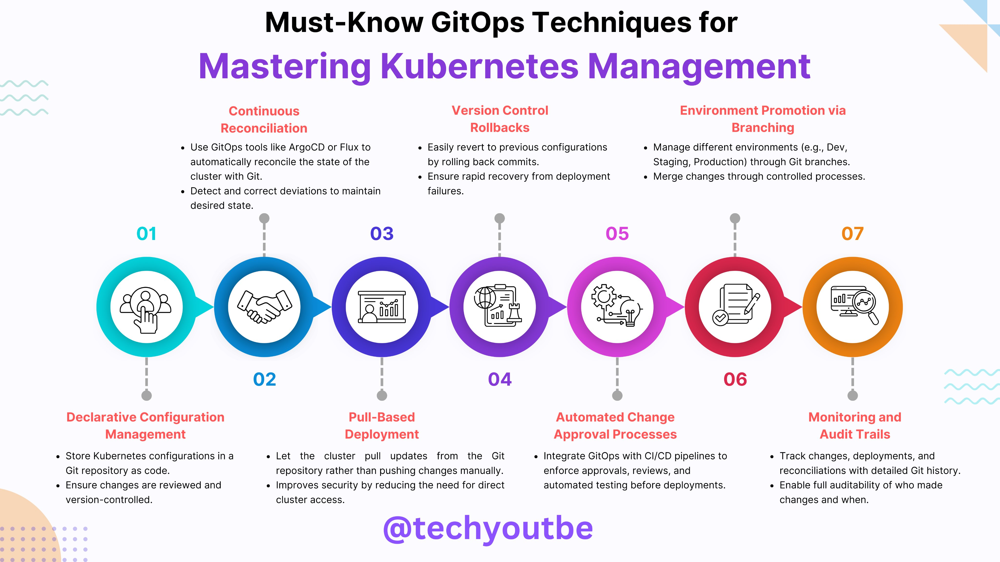

**Source:** [https://twitter.com/i/web/status/1869459079363502574](https://twitter.com/i/web/status/1869459079363502574)
**Original Post Date:** 2025-05-27 20:33:00

# Advanced GitOps Techniques for Enterprise Kubernetes Management

## Introduction
GitOps represents a paradigm shift in DevOps by treating infrastructure as code. This knowledge base explores critical techniques for managing Kubernetes clusters through GitOps principles. By leveraging tools like ArgoCD and Flux, organizations can achieve robust deployment pipelines with built-in compliance and security controls.

## Continuous Reconciliation

GitOps tools maintain desired state alignment by continuously comparing cluster configurations against Git sources. This process automatically detects and corrects deviations in real-time.

_Basic ArgoCD Application configuration showing GitOps reconciliation setup_

```yaml
---
apiVersion: argoproj.io/v1alpha1
kind: Application
metadata:
  name: example-app
spec:
  destination:
    namespace: default
    server: https://kubernetes.default.svc
  source:
    repoURL: https://github.com/your-org/repo.git
    targetRevision: HEAD
    path: ./example
```

> **Note/Tip:** Ensure proper RBAC permissions are configured for the GitOps operator in your cluster

## Declarative Configuration Management

Store all Kubernetes manifests as code in version-controlled repositories. This approach enables full traceability and reduces configuration drift through automated validation.

Implement pre-commit hooks to validate YAML syntax and enforce naming conventions

- Use .gitignore to exclude sensitive data
- Maintain separate directories for different environments

## Pull-Based Deployment Strategy

Adopt a pull-based approach where the cluster actively fetches configurations from Git, enhancing security by avoiding push mechanisms that could introduce unauthorized changes.

```bash
# Example Flux GitRepository
flux create source git myapp --url=https://github.com/org/repo.git
# Create Kustomization for deployment
flux create kustomization myapps --source=myapp --path=./k8s/overlays/prod
```

## Environment Promotion via Branching

Use Git branches to represent different environments (dev/staging/prod). Implement branch protection rules and merge strategies for controlled environment promotions.

1. Create separate branches per environment
1. Implement automated testing on pull requests
1. Use semantic versioning for releases

## Automated Approval Processes

Integrate GitOps with CI/CD pipelines to enforce approvals and automated testing before deployments. Configure webhooks to trigger pipeline runs on Git events.

## Key Takeaways

- Implement continuous reconciliation using ArgoCD or Flux for state alignment
- Store all configurations in version-controlled repositories with strict validation
- Adopt pull-based deployment strategies for enhanced security and traceability

## Conclusion
Mastering these GitOps techniques enables organizations to build secure, scalable Kubernetes management workflows. By treating infrastructure as code and leveraging automated reconciliation, teams can achieve faster deployments while maintaining compliance.

## External References

- [ArgoCD Documentation](https://argo-cd.readthedocs.io)
- [Flux GitOps Platform](https://fluxcd.io)


## Media

**Image Description:** ### Image Description

The image is an infographic titled **"Must-Know GitOps Techniques for Mastering Kubernetes Management"**. It provides a structured overview of key GitOps practices and their application in managing Kubernetes clusters. The infographic is visually organized into seven main sections, each represented by a numbered circle with an icon and a brief explanation. Below is a detailed breakdown of the image:

---

### **Main Title and Subtitle**
- **Title**: "Must-Know GitOps Techniques for Mastering Kubernetes Management"
- **Subtitle**: The subtitle emphasizes the focus on mastering Kubernetes management using GitOps principles.

---

### **Main Sections (Numbered 01 to 07)**
Each section is represented by a circular icon with a distinct color and a corresponding label. Below each icon, there is a brief explanation of the technique or concept.

#### **01. Continuous Reconciliation**
- **Icon**: Two overlapping people icons.
- **Description**:
  - Use GitOps tools like **ArgoCD** or **Flux** to automatically reconcile the state of the Kubernetes cluster with Git.
  - Detect and correct deviations to maintain the desired state of the cluster.

#### **02. Declarative Configuration Management**
- **Icon**: A handshake icon.
- **Description**:
  - Store Kubernetes configurations in a Git repository as code.
  - Ensure changes are reviewed and version-controlled.
  - Improves security by reducing the need for direct cluster access.

#### **03. Pull-Based Deployment**
- **Icon**: A presentation slide with a bar chart.
- **Description**:
  - Let the cluster pull updates from the Git repository rather than pushing updates.
  - Improves security and reduces the risk of unauthorized changes.

#### **04. Version Control Rollbacks**
- **Icon**: A globe with a file and a rollback arrow.
- **Description**:
  - Easily revert to previous configurations by rolling back Git commits.
  - Ensure rapid recovery from deployment failures.

#### **05. Environment Promotion via Branching**
- **Icon**: A gear with multiple connected nodes.
- **Description**:
  - Manage different environments (e.g., Dev, Staging, Production) through Git branches.
  - Merge changes through controlled processes.

#### **06. Automated Change Approval Processes**
- **Icon**: A document with a checkmark and a pen.
- **Description**:
  - Integrate GitOps with CI/CD pipelines to enforce approvals, reviews, and automated testing before deployments.
  - Reduce the need for manual approvals and ensure consistency.

#### **07. Monitoring and Audit Trails**
- **Icon**: A computer screen with a magnifying glass.
- **Description**:
  - Track changes, deployments, and reconciliations with detailed Git history.
  - Enable full auditability of who made changes and when.

---

### **Visual Design**
- **Color Scheme**: The infographic uses a gradient of colors for each section, ranging from teal to orange, making it visually engaging.
- **Icons**: Each section has a simple, clean icon that represents the concept.
- **Typography**: The text is clear and concise, with headings in bold and descriptions in a smaller font.
- **Layout**: The sections are arranged in a horizontal flow, making it easy to follow the sequence of techniques.

---

### **Footer**
- **Social Media Handle**: The infographic includes a social media handle: **@techyoutoutbe**.

---

### **Key Technical Details**
1. **GitOps Tools**:
   - **ArgoCD**: A popular GitOps tool for continuous delivery and deployment.
   - **Flux**: Another GitOps tool for automating Kubernetes deployments.
2. **Kubernetes Concepts**:
   - **Declarative Configuration**: Defining the desired state of the cluster in code.
   - **Pull-Based Deployment**: The cluster pulls updates from Git, reducing the risk of unauthorized changes.
3. **Version Control**:
   - **Git Branches**: Used for managing different environments (Dev, Staging, Production).
   - **Rollbacks**: Easily revert to previous configurations using Git history.
4. **CI/CD Integration**:
   - Automate change approval processes using CI/CD pipelines.
5. **Monitoring and Auditing**:
   - Track changes and deployments with detailed Git history for full auditability.

---

### **Overall Purpose**
The infographic serves as an educational resource for DevOps engineers, Kubernetes administrators, and developers who want to understand and implement GitOps practices for managing Kubernetes clusters effectively. It highlights the key techniques and tools involved in GitOps, emphasizing automation, version control, and security.

---

### **Summary**
The image is a well-structured and visually appealing infographic that outlines the essential GitOps techniques for managing Kubernetes clusters. It covers continuous reconciliation, declarative configuration, pull-based deployment, version control, environment management, automated approvals, and monitoring, all of which are critical for efficient and secure Kubernetes operations. The use of icons, clear text, and a logical flow makes the content easy to understand and follow.
