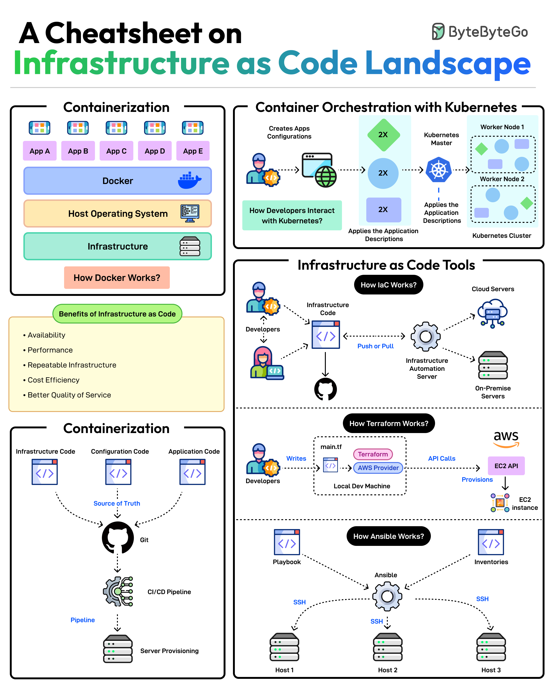

# Iac Cheatsheet

## Description
A Cheatsheet on Infrastructure as Code Landscape...

## Content
A Cheatsheet on Infrastructure as Code Landscape

## Category Information

- Main Category: devops
- Sub Category: infrastructure_as_code
- Item Name: iac_cheatsheet

## Source

- Original Tweet: [https://twitter.com/i/web/status/1876305237247766628](https://twitter.com/i/web/status/1876305237247766628)
- Date: 2025-02-20 15:36:34

## Media

### Media 1

**Description:** The image presents a comprehensive infographic titled "A Cheatsheet on Infrastructure as Code Landscape," which provides an overview of various concepts related to infrastructure as code (IaC). The title is prominently displayed at the top of the image in black, green, and blue text.

**Main Points:**

* **Containerization**
	+ Definition: A process that packages an application and its dependencies into a single container.
	+ Benefits:
		- Improved portability
		- Simplified deployment
		- Enhanced security
	+ Tools: Docker, Kubernetes
* **Infrastructure as Code (IaC)**
	+ Definition: The practice of managing infrastructure using code instead of manual configuration.
	+ Benefits:
		- Increased efficiency
		- Improved consistency
		- Better version control
	+ Tools: Terraform, CloudFormation, Ansible
* **Container Orchestration with Kubernetes**
	+ Definition: A system for automating the deployment, scaling, and management of containers.
	+ Benefits:
		- Simplified container management
		- Improved scalability
		- Enhanced high availability
	+ Tools: Kubernetes, Docker Swarm
* **Infrastructure as Code Tools**
	+ Definition: Software tools that enable IaC.
	+ Examples:
		- Terraform
		- CloudFormation
		- Ansible
* **Benefits of Infrastructure as Code**
	+ Improved efficiency
	+ Increased consistency
	+ Better version control

**Summary:**

The infographic provides a concise overview of the key concepts related to infrastructure as code, including containerization, IaC, and container orchestration with Kubernetes. It highlights the benefits of using these technologies, such as improved efficiency, increased consistency, and better version control. The infographic also lists various tools that can be used for each concept, providing a comprehensive resource for those interested in learning more about infrastructure as code.

*Last updated: 2025-02-20 15:36:34*