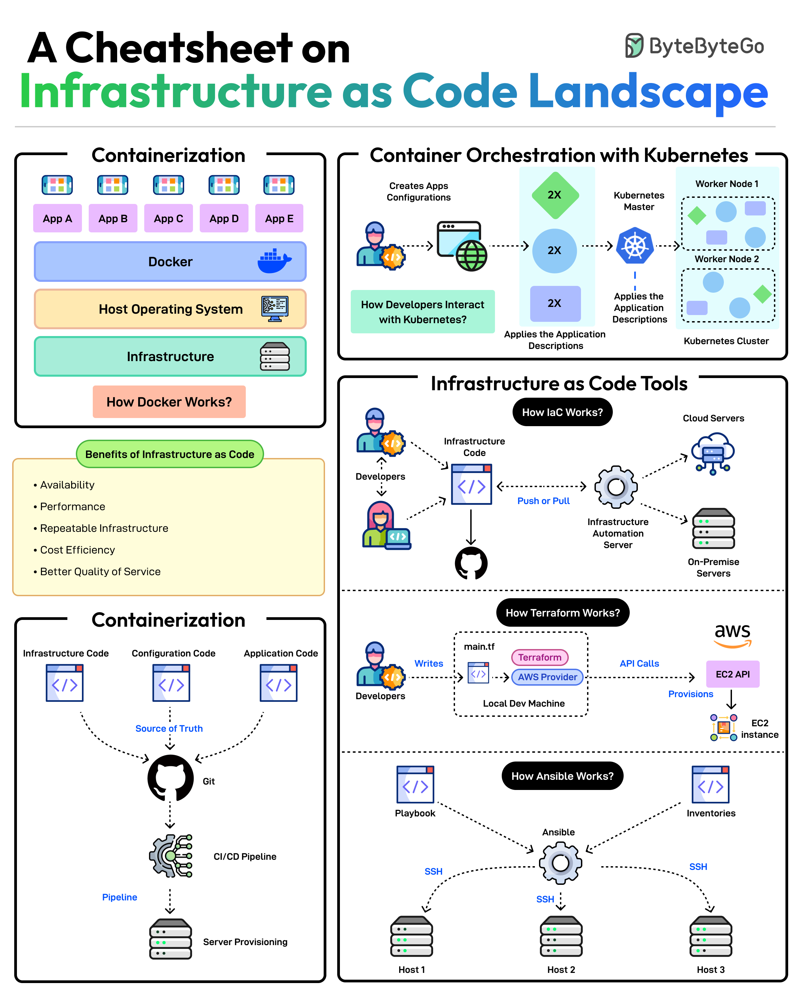

Infrastructure as Code (IaC) is a practice that involves managing infrastructure using code instead of manual configuration. This approach enables improved efficiency, increased consistency, and better version control. The IaC landscape encompasses various concepts, including containerization, IaC tools, and container orchestration with Kubernetes. This knowledge base entry provides an in-depth exploration of the key concepts related to IaC, highlighting their benefits, tools, and best practices.

## Technical Content
### Containerization
Containerization is a process that packages an application and its dependencies into a single container. This approach offers several benefits, including:
* **Improved portability**: Containers can run consistently across different environments, ensuring that applications behave as expected.
* **Simplified deployment**: Containerization streamlines the deployment process by providing a self-contained package that includes all necessary components.
* **Enhanced security**: Containers provide an additional layer of isolation between applications, reducing the risk of data breaches and unauthorized access.

Tools like [Docker](https://www.docker.com/) and [Kubernetes](https://kubernetes.io/) are widely used for containerization. Docker provides a platform for building, shipping, and running containers, while Kubernetes offers a system for automating the deployment, scaling, and management of containers.

### Infrastructure as Code (IaC)
IaC involves managing infrastructure using code instead of manual configuration. This approach provides several benefits, including:
* **Increased efficiency**: IaC enables teams to manage infrastructure more efficiently by reducing the time spent on manual configuration.
* **Improved consistency**: IaC ensures that infrastructure is provisioned consistently across different environments, reducing errors and inconsistencies.
* **Better version control**: IaC allows teams to track changes to infrastructure configurations using version control systems like Git.

Tools like [Terraform](https://www.terraform.io/), [CloudFormation](https://aws.amazon.com/cloudformation/), and [Ansible](https://www.ansible.com/) are popular choices for implementing IaC. Terraform provides a platform-agnostic way to manage infrastructure, while CloudFormation offers a AWS-specific solution. Ansible is an agentless automation tool that can be used for both IaC and configuration management.

### Container Orchestration with Kubernetes
Container orchestration involves automating the deployment, scaling, and management of containers. [Kubernetes](https://kubernetes.io/) is a widely-used system for container orchestration, offering several benefits, including:
* **Simplified container management**: Kubernetes provides a unified way to manage containers across different environments.
* **Improved scalability**: Kubernetes enables teams to scale containers horizontally, ensuring that applications can handle increased traffic.
* **Enhanced high availability**: Kubernetes offers features like self-healing and load balancing, ensuring that applications remain available even in the event of failures.

### Benefits of Infrastructure as Code
The benefits of IaC include:
* **Improved efficiency**: IaC enables teams to manage infrastructure more efficiently by reducing manual configuration.
* **Increased consistency**: IaC ensures that infrastructure is provisioned consistently across different environments, reducing errors and inconsistencies.
* **Better version control**: IaC allows teams to track changes to infrastructure configurations using version control systems like Git.

## Key Takeaways and Best Practices
When implementing IaC, keep the following best practices in mind:
* **Use version control**: Track changes to infrastructure configurations using version control systems like Git.
* **Test and validate**: Thoroughly test and validate infrastructure configurations before deploying them to production environments.
* **Monitor and audit**: Continuously monitor and audit infrastructure configurations to ensure compliance with organizational policies and regulatory requirements.

## References
* [Docker](https://www.docker.com/)
* [Kubernetes](https://kubernetes.io/)
* [Terraform](https://www.terraform.io/)
* [CloudFormation](https://aws.amazon.com/cloudformation/)
* [Ansible](https://www.ansible.com/)
## Source

- Original Tweet: [https://twitter.com/i/web/status/1876305237247766628](https://twitter.com/i/web/status/1876305237247766628)
- Date: 2025-02-20 17:42:34

## Media

### Media 1

**Description:** The image presents a comprehensive infographic titled "A Cheatsheet on Infrastructure as Code Landscape," which provides an overview of various concepts related to infrastructure as code (IaC). The title is prominently displayed at the top of the image in black, green, and blue text.

**Main Points:**

* **Containerization**
	+ Definition: A process that packages an application and its dependencies into a single container.
	+ Benefits:
		- Improved portability
		- Simplified deployment
		- Enhanced security
	+ Tools: Docker, Kubernetes
* **Infrastructure as Code (IaC)**
	+ Definition: The practice of managing infrastructure using code instead of manual configuration.
	+ Benefits:
		- Increased efficiency
		- Improved consistency
		- Better version control
	+ Tools: Terraform, CloudFormation, Ansible
* **Container Orchestration with Kubernetes**
	+ Definition: A system for automating the deployment, scaling, and management of containers.
	+ Benefits:
		- Simplified container management
		- Improved scalability
		- Enhanced high availability
	+ Tools: Kubernetes, Docker Swarm
* **Infrastructure as Code Tools**
	+ Definition: Software tools that enable IaC.
	+ Examples:
		- Terraform
		- CloudFormation
		- Ansible
* **Benefits of Infrastructure as Code**
	+ Improved efficiency
	+ Increased consistency
	+ Better version control

**Summary:**

The infographic provides a concise overview of the key concepts related to infrastructure as code, including containerization, IaC, and container orchestration with Kubernetes. It highlights the benefits of using these technologies, such as improved efficiency, increased consistency, and better version control. The infographic also lists various tools that can be used for each concept, providing a comprehensive resource for those interested in learning more about infrastructure as code.

*Last updated: 2025-02-20 17:42:34*