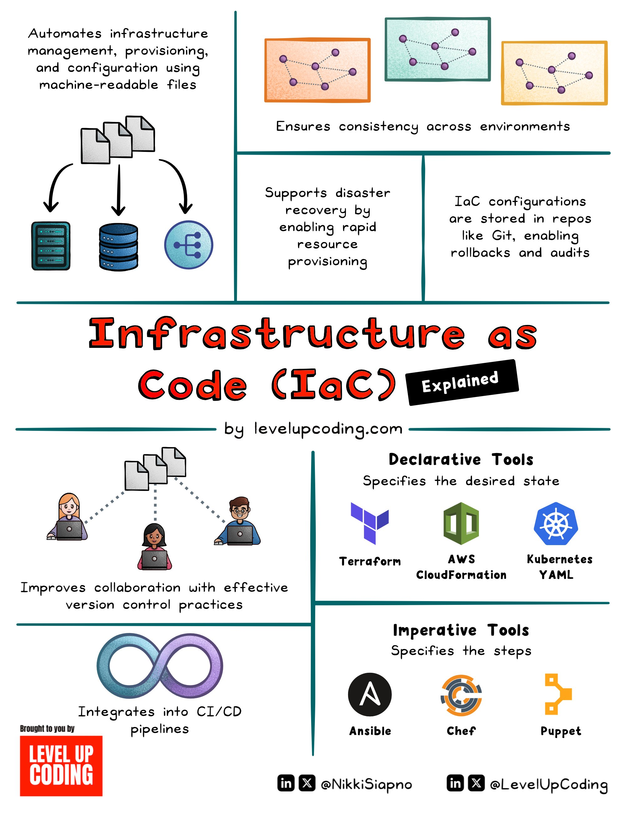

**Source:** [https://twitter.com/i/web/status/1883051547296506179](https://twitter.com/i/web/status/1883051547296506179)
**Original Post Date:** 2025-06-17 12:48:12

# Terraform Infrastructure as Code Best Practices

## Introduction
Infrastructure as Code (IaC) revolutionizes how we manage cloud resources by treating infrastructure like software. This knowledge base focuses specifically on Terraform's role in implementing IaC best practices. By leveraging machine-readable configuration files, teams can achieve consistency across environments while enabling efficient disaster recovery and version control. We'll explore practical implementations of these concepts using real-world scenarios and examples.

## Foundational Concepts of Infrastructure as Code

IaC transforms traditional infrastructure management by representing resources in declarative code files. This approach enables teams to manage complex environments with consistency, automation, and reproducibility across different stages of deployment.

The key advantage lies in treating infrastructure as a code asset, allowing for version control, testing, and collaboration through standard software development practices.

_Example of a basic Terraform configuration defining an AWS EC2 instance_

```HCL
provider "aws" {
  region = "us-west-2"
}

resource "aws_instance" "web" {
  ami           = "ami-0c55b159cbfafe1f0"
  instance_type = "t2.micro"
}
```

- Define infrastructure using declarative code
- Implement version control for configuration files
- Automate deployment processes

## Best Practices for Terraform Implementation

Successful IaC implementation requires adherence to specific best practices. Start with modular design, separating concerns into reusable components. Utilize remote state management and workspaces effectively.

Implement robust version control strategies, including branch management and PR processes. Integrate automated testing within CI/CD pipelines to ensure configuration validity.

1. Use modules for reusable components
1. Enable remote state storage
1. Implement terraform workspaces
1. Set up automated validation in CI

> **Note/Tip:** Always use version constraints for providers to prevent unexpected updates

> **Note/Tip:** Maintain separate environments using workspaces or configuration files

## Integration with CI/CD Pipelines

Terraform's integration with CI/CD pipelines enables automated infrastructure deployment. Configure your pipeline to validate configurations, run drift detection checks, and apply changes safely.

Implement proper approval workflows and audit logging for production deployments.

_Example of a GitHub Actions workflow for Terraform validation_

```bash
# Example GitHub Actions workflow
name: Terraform Validate
tags:
  - terraform-validate
steps:
  - uses: actions/checkout@v2
  - name: Initialize Terraform
    run: |
      terraform init
      terraform validate
```

## Monitoring and Disaster Recovery

Implement comprehensive monitoring to track infrastructure changes and detect drift. Regular backups of state files ensure quick recovery in case of failures.

Use terraform plan extensively before applying changes, and maintain documentation for disaster recovery procedures.

## Key Takeaways

- Treat infrastructure as code with proper version control practices
- Implement modular design patterns using Terraform modules
- Integrate IaC into CI/CD pipelines for automated deployment and validation
- Maintain robust monitoring and disaster recovery strategies

## Conclusion
By following these best practices, teams can leverage Terraform to build reliable, scalable infrastructure while maintaining consistency across environments. The combination of proper tooling, workflow automation, and careful state management creates a solid foundation for modern cloud operations.

## External References

- [Terraform Documentation](https://developer.hashicorp.com/terraform/docs)
- [LevelUpCoding IaC Infographic](https://levelupcoding.com/infographics/iac-explained)


## Media

**Image Description:** ### Image Description: Infrastructure as Code (IaC) Explained

The image is an infographic titled **"Infrastructure as Code (IaC) Explained"**, created by **levelupcoding.com**. It provides a comprehensive overview of Infrastructure as Code, its benefits, tools, and integration with CI/CD pipelines. The infographic is divided into several sections, each highlighting different aspects of IaC. Below is a detailed breakdown:

---

### **1. Top Section: Overview of IaC**
- **Title**: The main title, **"Infrastructure as Code (IaC)"**, is prominently displayed in bold red text.
- **Subtitle**: The subtitle, **"Explained"**, is in black text within a black box.
- **Description**: The section explains that IaC automates infrastructure management, provisioning, and configuration using machine-readable files. This ensures consistency across environments.

#### **Key Points:**
- **Automation**: IaC automates the management of infrastructure.
- **Machine-Readable Files**: Infrastructure is defined in code files, which are machine-readable.
- **Consistency**: Ensures consistency across different environments (e.g., development, testing, production).

#### **Visual Elements:**
- **Icons**: 
  - Multiple files (text documents) are shown, representing code files.
  - Servers and databases are depicted, indicating infrastructure components.
  - A network diagram shows interconnected nodes, symbolizing consistent infrastructure across environments.

---

### **2. Middle Section: Benefits of IaC**
- **Consistency Across Environments**: The infographic emphasizes that IaC ensures consistency by automating infrastructure deployment.
- **Disaster Recovery**: IaC supports disaster recovery by enabling rapid resource provisioning.
- **Version Control**: Configurations are stored in repositories (e.g., Git), enabling rollbacks, audits, and version control.

#### **Visual Elements:**
- **Icons**:
  - A network diagram with consistent nodes across different colored backgrounds (e.g., orange, blue, yellow) represents consistency.
  - A rollback arrow and audit icon highlight version control and rollback capabilities.

---

### **3. Bottom Section: Tools and Integration**
This section is divided into two parts: **Declarative Tools** and **Imperative Tools**.

#### **Declarative Tools**
- **Description**: Declarative tools specify the desired state of the infrastructure. They focus on what the infrastructure should look like, not how to achieve it.
- **Tools Mentioned**:
  - **Terraform**: Represented by its logo (a purple "T").
  - **AWS CloudFormation**: Represented by its logo (a green cube).
  - **Kubernetes**: Represented by its logo (a blue steering wheel).

#### **Imperative Tools**
- **Description**: Imperative tools specify the steps required to achieve the desired state of the infrastructure.
- **Tools Mentioned**:
  - **Ansible**: Represented by its logo (a black "A").
  - **Chef**: Represented by its logo (a red and orange circular design).
  - **Puppet**: Represented by its logo (a yellow and orange design).

#### **Visual Elements:**
- **Icons**: Logos of the respective tools are displayed next to their names.
- **CI/CD Integration**: The section highlights how IaC integrates into CI/CD pipelines, represented by an infinity symbol (a loop), symbolizing continuous integration and delivery.

---

### **4. Collaboration and Version Control**
- **Description**: The infographic emphasizes that IaC improves collaboration by enabling effective version control practices.
- **Visual Elements**:
  - Multiple people working on laptops, connected by dotted lines, symbolize collaboration.
  - Version control icons (e.g., Git) are shown, indicating the use of repositories for storing and managing infrastructure code.

---

### **5. Footer**
- **Branding**: The footer includes the branding of **levelupcoding.com**.
- **Social Media Handles**: Social media icons (LinkedIn, Twitter, etc.) and handles are displayed:
  - **@NikkiSiapno**
  - **@LevelUpCoding**

---

### **Overall Design**
- **Color Scheme**: The infographic uses a clean and professional color scheme with red, blue, green, and yellow accents.
- **Icons and Visuals**: Icons and diagrams are used effectively to convey complex concepts in a visually appealing manner.
- **Typography**: Clear and legible fonts are used, with bold text for emphasis.

---

### **Summary**
The infographic provides a comprehensive explanation of Infrastructure as Code (IaC), highlighting its benefits, tools, and integration with CI/CD pipelines. It emphasizes automation, consistency, disaster recovery, and version control, making it a valuable resource for understanding IaC concepts and practices. The use of visuals and icons enhances the clarity and appeal of the content.
