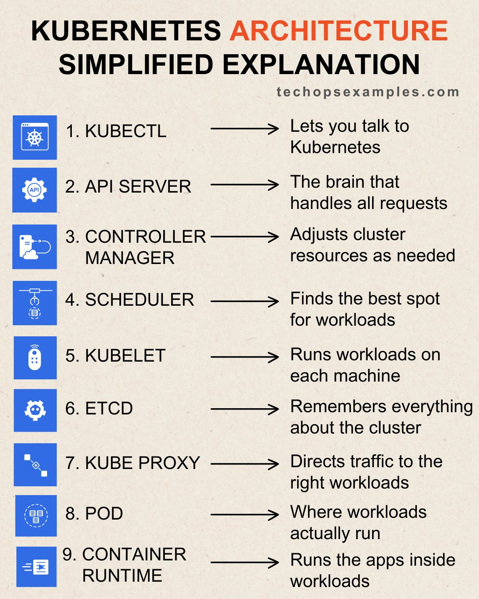

**Source:** [https://twitter.com/i/web/status/1923756151742791927](https://twitter.com/i/web/status/1923756151742791927)
**Original Post Date:** 2025-05-28 08:35:31

# Simplified Kubernetes Architecture: Core Components Overview

## Introduction
Kubernetes has become the de facto standard for container orchestration in modern cloud-native applications. Understanding its core architectural components is crucial for effective cluster management and deployment strategies. This knowledge base item provides a structured overview of the nine essential Kubernetes components, their responsibilities, and how they interact to manage containerized workloads.

## Kubernetes Control Plane Components

The control plane consists of several key components that orchestrate cluster operations:

kubectl serves as the primary interface for interacting with the Kubernetes API. It provides commands to manage deployments, services, and other cluster resources.

The API Server acts as the central nervous system of Kubernetes, handling all incoming requests from clients and ensuring proper validation and authorization.

- API Server manages state transitions through etcd
- Controller Manager maintains desired cluster state
- Scheduler determines optimal Pod placement

> **Note/Tip:** Always secure kubectl access with proper RBAC permissions

> **Note/Tip:** Monitor API Server performance for cluster stability

## Node Components and Workloads

At the node level, Kubernetes employs several components to manage workloads:

kubelet ensures that containers specified in PodSpec are running on each node.

Pods represent the smallest deployable units in Kubernetes, providing a shared network namespace for co-located containers.

- Container runtimes execute application code within isolated environments
- Kube-proxy manages network policies and load balancing
- Etcd stores cluster state data in a distributed manner

> **Note/Tip:** Configure etcd with proper replication for high availability

> **Note/Tip:** Monitor node resource utilization through kubelet metrics

## Component Interactions and Flow

Understanding how components interact is crucial for cluster operations:

Workload requests flow from kubectl to the API Server, then to the Scheduler.

The Controller Manager ensures desired state alignment while etcd maintains persistent data.

1. 1. User issues command via kubectl
1. 2. API Server validates and processes request
1. 3. Scheduler determines node placement
1. 4. Controller Manager enforces state changes
1. 5. Kubelet initiates container execution

> **Note/Tip:** Regular etcd backups are essential for cluster recovery

> **Note/Tip:** Implement proper resource requests and limits in Pod specifications

## Key Takeaways

- Kubernetes architecture separates control plane (API Server, Controller Manager) from node operations (kubelet)
- Components work together to maintain desired state through declarative configuration
- Understanding component interactions enables effective troubleshooting and optimization
- Pods provide the foundation for workload deployment while containers encapsulate application logic

## Conclusion
Mastering Kubernetes architecture requires understanding both individual components and their collective behavior. This knowledge base provides a structured approach to comprehending these essential elements, enabling you to effectively manage containerized applications at scale.

## External References

- [Official Kubernetes Architecture Documentation](https://kubernetes.io/docs/concepts/architecture/)
- [Kubernetes API Server Deep Dive](https://cloud.google.com/kubernetes-engine/docs/concepts/apiserver)

## Media

**Image Description:** The image is a visual representation of the **Kubernetes Architecture**, simplified and explained in a step-by-step manner. It outlines the key components of Kubernetes and their roles in managing containerized applications. Below is a detailed description of the image:

### **Title**
- The title at the top reads: **"KUBERNETES ARCHITECTURE"** in bold, with "ARCHITECTURE" highlighted in orange.
- Below the title, there is a subtitle: **"SIMPLIFIED EXPLANATION"**, also in bold.
- At the bottom right corner, there is a watermark: **"techopsexamples.com"**, indicating the source of the image.

### **Main Content**
The image lists the **nine key components** of Kubernetes, each accompanied by an icon, a label, and a brief explanation. The components are numbered from 1 to 9, and each is connected to its explanation with an arrow.

#### **1. KUBECTL**
- **Icon**: A Kubernetes logo (a ship's wheel inside a square).
- **Explanation**: "Lets you talk to Kubernetes."
- This component is the command-line interface (CLI) tool used by developers and administrators to interact with the Kubernetes cluster.

#### **2. API SERVER**
- **Icon**: An API symbol (a gear with "API" written inside).
- **Explanation**: "The brain that handles all requests."
- The API Server is the central management component of Kubernetes. It exposes the Kubernetes API, allowing users to interact with the cluster and manage resources.

#### **3. CONTROLLER MANAGER**
- **Icon**: A cloud with a flowchart symbol.
- **Explanation**: "Adjusts cluster resources as needed."
- The Controller Manager is responsible for managing the state of the cluster. It ensures that the desired state of the cluster matches the actual state by making necessary adjustments.

#### **4. SCHEDULER**
- **Icon**: A scheduling symbol (a clock with arrows).
- **Explanation**: "Finds the best spot for workloads."
- The Scheduler determines where to run workloads (Pods) in the cluster by selecting the most suitable node based on resource availability and other constraints.

#### **5. KUBELET**
- **Icon**: A robot symbol.
- **Explanation**: "Runs workloads on each machine."
- Kubelet is the primary node agent in Kubernetes. It ensures that the containers described in the PodSpecs are running on the node. It communicates with the API Server to report the status of the node and its Pods.

#### **6. ETCD**
- **Icon**: A gear symbol.
- **Explanation**: "Remembers everything about the cluster."
- ETCD is a distributed key-value store that serves as the backing store for all cluster data. It stores the configuration and state of the cluster, ensuring high availability and consistency.

#### **7. KUBE-PROXY**
- **Icon**: A network symbol (routers or switches).
- **Explanation**: "Directs traffic to the right workloads."
- Kube-Proxy is responsible for implementing a network proxy and load balancer on each node. It ensures that network traffic is directed to the correct Pods within the cluster.

#### **8. POD**
- **Icon**: A Pod symbol (a square with a gear inside).
- **Explanation**: "Where workloads actually run."
- A Pod is the smallest and simplest unit in Kubernetes. It represents a single instance of a running process in the cluster. Pods can contain one or more containers and share resources like networking and storage.

#### **9. CONTAINER**
- **Icon**: A container symbol (a square with a dashed outline).
- **Explanation**: "Runs the apps inside."
- Containers are the actual runtime environment for applications. They are lightweight, portable, and isolated units that encapsulate an application and its dependencies.

### **Layout and Design**
- The image uses a clean, minimalist design with a beige background.
- Each component is represented by a **blue square icon** with a relevant symbol inside.
- The text is organized in a clear, hierarchical manner, with component names in bold and explanations in a smaller font.
- Arrows connect each component to its explanation, enhancing readability and flow.

### **Purpose**
The image serves as an educational tool to help beginners understand the core components of Kubernetes and their roles in managing containerized applications. It simplifies complex concepts by breaking them down into digestible parts.

### **Summary**
The image provides a concise and visually appealing overview of the Kubernetes architecture, highlighting the key components and their functions in a step-by-step manner. It is an effective resource for those learning about Kubernetes and its underlying mechanisms.
