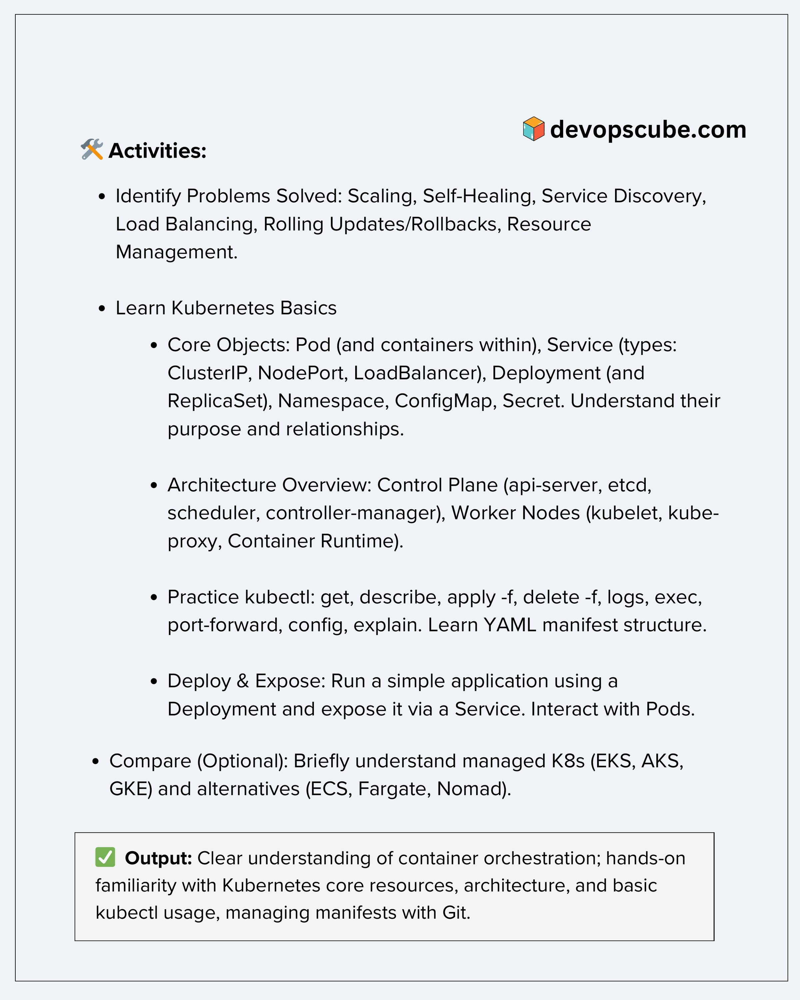
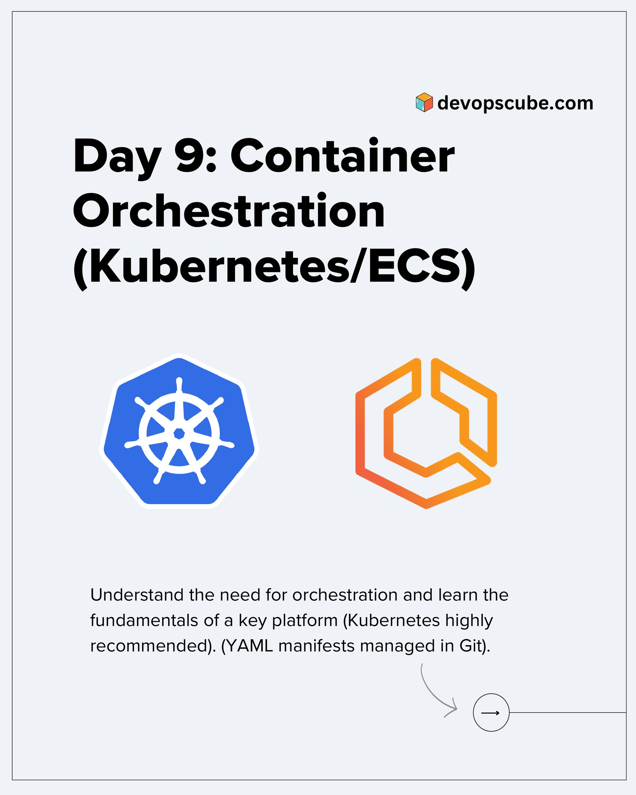

**Source:** [https://twitter.com/i/web/status/1926850871159042542](https://twitter.com/i/web/status/1926850871159042542)
**Original Post Date:** 2025-05-30 11:17:57

# Kubernetes Interview Practice: Core Concepts and Hands-on Exercises

## Introduction
This knowledge base item provides a structured approach to preparing for Kubernetes-focused technical interviews. It covers essential concepts, practical exercises using kubectl, deployment strategies, and comparisons with alternative technologies. Understanding these elements is crucial for demonstrating proficiency in container orchestration and cloud-native architecture design.

## Problems Solved by Kubernetes

Kubernetes addresses several critical challenges in modern application deployment and management:

- Scaling: Manages application capacity to handle varying workloads efficiently
- Self-Healing: Automatically detects and recovers from failures by restarting or replacing containers
- Service Discovery: Enables services to locate and communicate with each other within the cluster
- Load Balancing: Distributes incoming traffic across multiple instances of a service
- Rolling Updates/Rollbacks: Facilitates controlled application updates while maintaining availability, with rollback capabilities if issues arise
- Resource Management: Optimizes compute resources (CPU, memory) allocation to maximize efficiency and minimize costs

> **Note/Tip:** Understanding these problems and how Kubernetes solves them is fundamental for technical interviews. Be prepared to explain real-world scenarios where each feature would be valuable.

## Kubernetes Core Objects

Kubernetes defines several key objects that form the foundation of its functionality:

- Pod: The smallest deployable unit containing one or more containers with shared storage and network
- Service: Abstraction for exposing an application to internal/external traffic using various types (ClusterIP, NodePort, LoadBalancer)
- Deployment: Manages a set of pods as a single entity, handling replica management and rolling updates
- Namespace: Logical separation of cluster resources for multi-tenant environments or project isolation
- ConfigMap: Stores non-sensitive configuration data in key-value pairs accessible to containers
- Secret: Securely stores sensitive information like passwords and tokens

> **Note/Tip:** Be prepared to explain the relationships between these objects and provide examples of when each would be used.

## Kubernetes Architecture Overview

The Kubernetes architecture consists of two primary components:

1. Control Plane: Manages cluster-wide operations

2. Worker Nodes: Host the actual application workloads

- Control Plane Components:
- - API Server: Handles REST operations and provides interface for users/admins
- - etcd: Distributed key-value store for cluster state data
- - Scheduler: Assigns pods to nodes based on resource requirements
- - Controller Manager: Runs controllers that handle routine tasks

- Worker Node Components:
- - kubelet: Manages containers and ensures their state matches desired configuration
- - kube-proxy: Handles network rules to allow communication between services and pods
- - Container Runtime: Executes container images (Docker, containerd, etc.)

> **Note/Tip:** Understanding how these components interact is crucial for troubleshooting and optimizing Kubernetes deployments.

## kubectl Command Practice

Proficiency with kubectl commands demonstrates practical experience in Kubernetes administration:

```bash
# Apply deployment from YAML
kubectl apply -f ./deployment.yaml

# Scale deployment
kubectl scale deployment myapp --replicas=3

# Check pod status
kubectl get pods
```

_Example YAML manifest for a basic deployment_

```yaml
apiVersion: apps/v1
kind: Deployment
metadata:
  name: nginx-deployment
spec:
  replicas: 2
  selector:
    matchLabels:
      app: nginx
  template:
    metadata:
      labels:
        app: nginx
    spec:
      containers:
      - name: nginx
        image: nginx:1.14.2
```

- get: Retrieve information about resources (e.g., kubectl get pods)
- describe: Get detailed information (e.g., kubectl describe pod <pod-name>)
- apply -f: Apply configuration from a file (e.g., kubectl apply -f deployment.yaml)
- delete -f: Remove resources using a configuration file
- logs: View container logs
- exec: Run commands in a container
- port-forward: Forward local port to pod/service

> **Note/Tip:** Be prepared to explain the difference between imperative and declarative approaches in kubectl.

## Deployment and Exposure Strategy

Deploying applications effectively requires understanding how different Kubernetes objects work together:

- Create a deployment to manage application pods
- Expose the service using appropriate type (ClusterIP, NodePort, LoadBalancer)
- Monitor pod health and troubleshoot issues as needed

> **Note/Tip:** Explain scenarios where each service type would be most appropriate.

## Comparing Kubernetes Services

Understanding the landscape of container orchestration services is valuable in technical interviews:

1. Alternative Orchestration Platforms:
1. - Docker Swarm: Simpler alternative to Kubernetes, suitable for smaller deployments
1. - Apache Mesos: General-purpose cluster management system with Marathon scheduler

> **Note/Tip:** Be prepared to discuss the trade-offs between managed services and self-hosted Kubernetes.

## Key Takeaways

- Mastering core Kubernetes concepts, object relationships, and command-line tools is essential for technical interviews
- Understanding architectural components helps explain how the system scales and handles failures
- Practical experience with deployments, service exposure, and troubleshooting demonstrates hands-on knowledge
- Comparing different container orchestration platforms shows broad understanding of cloud-native architecture

## Conclusion
This guide covers fundamental Kubernetes concepts critical for technical interviews. Focus on understanding relationships between core objects, architectural components, and practical command usage. Practice with real deployments using kubectl will solidify your knowledge. Additionally, being able to compare Kubernetes with alternative solutions demonstrates a comprehensive understanding of container orchestration landscape.

## External References

- [Official Kubernetes Documentation](https://kubernetes.io/docs/home/)
- [Kubernetes Patterns and Anti-Patterns Book](https://www.oreilly.com/library/view/kubernetes-patterns/9781492036525/)


## Media

**Image Description:** The image is a structured document outlining a learning plan or curriculum focused on **Kubernetes** and container orchestration. The content is organized into sections, with clear headings and bullet points. Below is a detailed description:

### **Header**
- The top of the document includes a logo and the URL: **devops.cube.com**, indicating the source or platform associated with the content.

### **Main Section: Activities**
The document is titled **"Activities"**, suggesting a list of tasks or learning objectives for someone looking to learn Kubernetes.

#### **1. Identify Problems Solved**
- This section lists the key problems that Kubernetes addresses:
  - **Scaling**: Managing the scaling of applications to handle varying loads.
  - **Self-Healing**: Automatically restarting or replacing failed containers.
  - **Service Discovery**: Enabling services to find and communicate with each other.
  - **Load Balancing**: Distributing traffic across multiple instances of a service.
  - **Rolling Updates/Rollbacks**: Performing updates or reverting changes in a controlled manner.
  - **Resource Management**: Efficiently managing compute resources like CPU and memory.

#### **2. Learn Kubernetes Basics**
- This section emphasizes foundational knowledge of Kubernetes:
  - **Core Objects**: A list of essential Kubernetes objects is provided, along with their purposes:
    - **Pod**: The smallest deployable unit in Kubernetes, which can contain one or more containers.
    - **Service**: A way to expose applications to the network, with types like ClusterIP, NodePort, and LoadBalancer.
    - **Deployment**: A higher-level abstraction for managing Pods, often used with ReplicaSets.
    - **Namespace**: A logical grouping of resources within a cluster.
    - **ConfigMap**: Stores configuration data as key-value pairs.
    - **Secret**: Stores sensitive information securely.
  - The text emphasizes understanding the purpose and relationships between these objects.

#### **3. Learn Kubernetes Objects Basics**
- This section delves deeper into the core objects, reiterating their importance and relationships:
  - **Pod**: Contains one or more containers.
  - **Service**: Types include ClusterIP, NodePort, and LoadBalancer.
  - **Deployment**: Manages Pods and ReplicaSets.
  - **Namespace**: Organizes resources.
  - **ConfigMap**: Stores configuration data.
  - **Secret**: Stores sensitive data securely.

#### **4. Architecture Overview**
- This section provides an overview of the Kubernetes architecture:
  - **Control Plane**: Includes components like the API Server, etcd, Scheduler, and Controller Manager.
  - **Worker Nodes**: Include components like kubelet, kube-proxy, and the container runtime (e.g., Docker, containerd).

#### **5. Practice kubectl**
- This section focuses on hands-on practice with the `kubectl` command-line tool:
  - Commands listed include:
    - `get`: Retrieve information about resources.
    - `describe`: Get detailed information about a resource.
    - `apply -f`: Apply a configuration file.
    - `delete -f`: Delete resources using a configuration file.
    - `logs`: View logs from a container.
    - `exec`: Execute a command in a container.
    - `port-forward`: Forward a local port to a service or pod.
    - `config`: Manage cluster configurations.
    - `explain`: Get detailed explanations of Kubernetes resources.
  - The section also mentions learning the YAML manifest structure, which is used to define Kubernetes resources.

#### **6. Deploy & Expose**
- This section guides the user through deploying and exposing a simple application:
  - Use a **Deployment** to run the application.
  - Expose the application via a **Service**.
  - Interact with **Pods** to manage and monitor the application.

#### **7. Compare (Optional)**
- This section suggests optional comparison with other managed Kubernetes services and alternatives:
  - **Managed K8s Services**: EKS (Amazon EKS), AKS (Azure Kubernetes Service), GKE (Google Kubernetes Engine).
  - **Alternatives**: ECS (Amazon ECS), Fargate, Nomad.

### **Output**
- The final section, **Output**, outlines the expected outcomes of completing the activities:
  - A clear understanding of container orchestration.
  - Hands-on familiarity with Kubernetes core resources and architecture.
  - Basic usage of `kubectl`.
  - Managing manifests using Git.

### **Design and Formatting**
- The document uses a clean, structured format with bullet points for clarity.
- Key terms and concepts are bolded for emphasis.
- The use of indentation helps organize related subtopics.
- The green checkmark in the "Output" section visually highlights the expected learning outcomes.

### **Purpose**
The document serves as a comprehensive learning roadmap for someone new to Kubernetes, covering both theoretical and practical aspects. It emphasizes foundational knowledge, hands-on practice, and comparison with other technologies, ensuring a well-rounded understanding of container orchestration.


**Image Description:** The image appears to be a slide or a presentation page focused on container orchestration, specifically highlighting Kubernetes and ECS (Elastic Container Service). Below is a detailed description of the image:

### **Main Content**
1. **Title:**
   - The title at the top of the image reads:
     **"Day 9: Container Orchestration"**
   - This indicates that the content is part of a series or a learning module, and this is the ninth day of the series.

2. **Subheading:**
   - Below the title, there is a subheading that reads:
     **"(Kubernetes/Kubernetes/Kubernetes/Kubernetes/Kubernetes/ECS/ECS/ECS)"**
   - This repetition of "Kubernetes" and "ECS" emphasizes the focus on these two key container orchestration platforms.

3. **Logos:**
   - Two logos are prominently displayed in the center of the image:
     - **Kubernetes Logo:** A blue hexagon with a white steering wheel-like symbol inside. This is the official logo of Kubernetes, representing its role as a container orchestration platform.
     - **ECS Logo:** An orange geometric shape resembling a stylized "C" or a container, representing AWS Elastic Container Service (ECS), another popular container orchestration service.

4. **Description:**
   - At the bottom of the image, there is a brief description that reads:
     **"Understand the need for orchestration and learn the fundamentals of a key platform (Kubernetes highly recommended). (YAML manifests managed in Git)."**
   - This text explains the purpose of the content:
     - **Orchestration Need:** It highlights the importance of container orchestration in managing and scaling containerized applications.
     - **Focus on Kubernetes:** It emphasizes Kubernetes as the primary platform to learn, with ECS mentioned as an alternative.
     - **YAML and Git:** It mentions the use of YAML manifests (configuration files) and their management in Git, which are essential practices in container orchestration.

5. **Website Reference:**
   - In the top-right corner, there is a reference to a website:
     **"devops-cube.com"**
   - This suggests that the content is part of a series or resource provided by this website, likely related to DevOps or containerization.

6. **Design Elements:**
   - The background is plain white, which helps the text and logos stand out.
   - The text is in a clean, readable font, with the title in bold for emphasis.
   - The logos are colorful and distinct, making them easily recognizable.

### **Technical Details**
- **Kubernetes:** Kubernetes is an open-source platform for automating the deployment, scaling, and management of containerized applications. It uses YAML manifests to define and manage resources.
- **ECS (Elastic Container Service):** ECS is a fully managed container orchestration service provided by AWS, designed to run and scale Docker containers.
- **YAML Manifests:** YAML (Yet Another Markup Language) is a human-readable data serialization format commonly used in Kubernetes and ECS to define the configuration of applications and infrastructure.
- **Git Integration:** Managing YAML manifests in Git is a best practice for version control, collaboration, and automation in DevOps workflows.

### **Overall Impression**
The image is designed to be informative and visually clear, focusing on the key concepts of container orchestration. It effectively uses repetition and emphasis to highlight Kubernetes as the primary topic, while also acknowledging ECS as an alternative. The inclusion of logos and technical terms like "YAML" and "Git" indicates that the content is targeted toward individuals learning about container orchestration in a DevOps context. The reference to "devops-cube.com" suggests that this is part of a structured learning resource.
