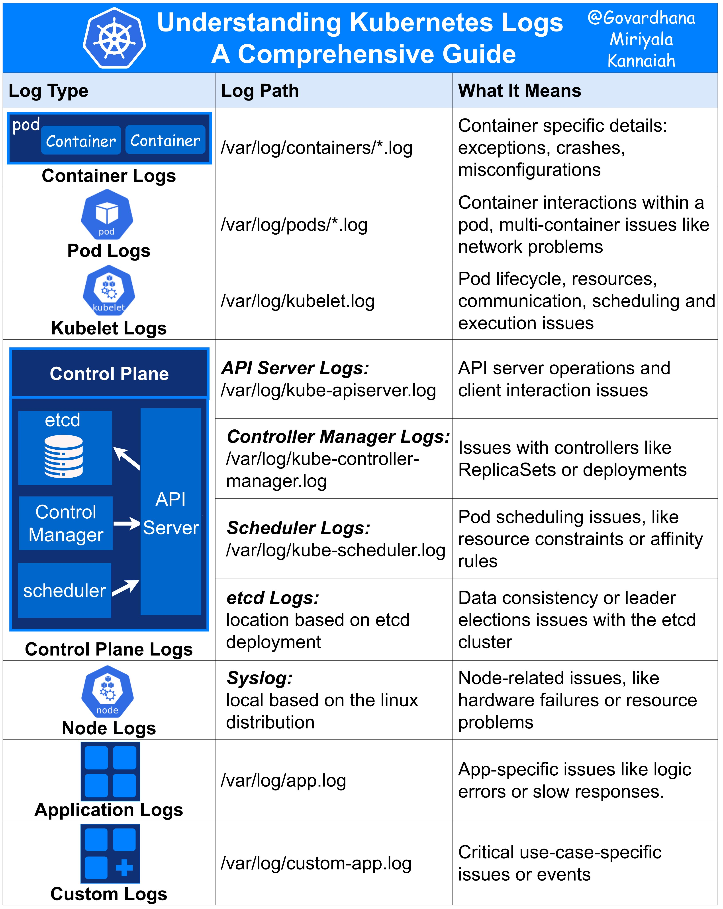

**Source:** [https://twitter.com/i/web/status/1925935590639337538](https://twitter.com/i/web/status/1925935590639337538)
**Original Post Date:** 2025-05-28 07:59:15

# Kubernetes Logging: Understanding Log Types, Paths, and Diagnostic Value

## Introduction
In a distributed Kubernetes environment, logs serve as critical diagnostic tools. This knowledge base item systematically categorizes and explains the different types of logs available in a Kubernetes setup, providing precise paths and insights into what each log type reveals about your cluster's health and operations.

Understanding these logs is essential for effective troubleshooting, debugging, and maintaining system reliability.

## Pod and Container Logs

Pod-level logs consolidate information from all containers within a pod, stored in /var/log/pods/*.log. These logs are crucial for diagnosing multi-container communication issues, network problems, and general pod health.

Container-specific logs are located in /var/log/containers/*.log and provide granular runtime details including exceptions, crashes, and configuration errors.

```bash
kubectl logs <pod-name>              # Container-level logs
kubectl logs -p <pod-name>           # Previous container's logs
kubectl logs <pod-name> -c <container-name>  # Specific container logs
```

- Check pod status before viewing logs using kubectl get pods
- Use tail flags for real-time monitoring (-f)
- Filter logs by timestamp or keyword

## Control Plane Component Logs

The control plane generates critical logs from etcd, API server, controller manager, and scheduler. These logs are essential for diagnosing cluster-wide issues.

Each component has dedicated log files in /var/log/, providing insights into resource management, scheduling decisions, and API interactions.

1. API Server (/var/log/kube-apiserver.log): Client connections, authentication issues
1. Controller Manager (/var/log/kube-controller-manager.log): ReplicaSets, Deployments, state management
1. Scheduler (/var/log/kube-scheduler.log): Pod placement decisions, resource constraints
1. etcd (/var/log/etcd.log): Data consistency, leadership changes

> **Note/Tip:** Enable audit logging for enhanced security monitoring

> **Note/Tip:** Regularly rotate and archive control plane logs to maintain performance

## Node-Level Logs

System-level logs in /var/log/syslog (or similar) capture node-specific events, including hardware failures and resource constraints.

These logs are essential for diagnosing infrastructure issues affecting multiple pods or containers on the same host.

## Key Takeaways

- Pod and container logs provide granular insights into application and runtime behavior
- Control plane logs are crucial for understanding cluster-wide operations and management
- Node-level logs help diagnose hardware and system infrastructure issues
- Proper log management requires regular rotation, archiving, and monitoring strategies

## Conclusion
Effective logging in Kubernetes requires a layered approach: application-specific logs for debugging business logic, container/pod logs for runtime issues, and control plane/node logs for cluster-wide problems. Understanding these different layers enables systematic troubleshooting and maintenance of high-performance Kubernetes clusters.

## External References

- [Kubernetes Official Logging Guide](https://kubernetes.io/docs/concepts/cluster-administration/logging/)
- [Kubernetes Audit Logging Documentation](https://kubernetes.io/docs/tasks/debug-application-cluster/audit-log/)


## Media

**Image Description:** ### Description of the Image

The image is a comprehensive guide titled **"Understanding Kubernetes Logs"**, authored by **@Govardhana Miriyala Kannaiah**. It provides an overview of various types of logs in a Kubernetes environment, detailing their paths and the information they contain. The guide is structured in a tabular format with three main columns: **Log Type**, **Log Path**, and **What It Means**. The content is visually organized with icons representing different components of Kubernetes, making it easier to understand the relationships between the logs and the system components they pertain to.

#### **Main Sections and Details**

1. **Header:**
   - The title is prominently displayed at the top: **"Understanding Kubernetes Logs"**.
   - The author's handle is mentioned: **@Govardhana Miriyala Kannaiah**.
   - The Kubernetes logo (a blue shield with a ship's wheel) is present in the top-left corner, reinforcing the Kubernetes theme.

2. **Table Structure:**
   - The table is divided into three columns:
     - **Log Type**: Describes the type of log being discussed.
     - **Log Path**: Indicates the file path where the logs are stored.
     - **What It Means**: Explains the purpose and significance of the logs.

3. **Log Types and Details:**

   #### **1. Pod and Container Logs**
   - **Pod Logs**:
     - **Log Type**: Pod Logs.
     - **Log Path**: `/var/log/pods/*.log`.
     - **What It Means**: These logs capture interactions and issues within a pod, including multi-container problems, network issues, and other pod-level interactions.
   - **Container Logs**:
     - **Log Type**: Container Logs.
     - **Log Path**: `/var/log/containers/*.log`.
     - **What It Means**: These logs provide container-specific details, such as exceptions, crashes, misconfigurations, and other runtime issues.

   #### **2. Kubelet Logs**
   - **Log Type**: Kubelet Logs.
   - **Log Path**: `/var/log/kubelet.log`.
   - **What It Means**: These logs track the lifecycle of pods, resource management, communication, scheduling, and execution issues handled by the kubelet component.

   #### **3. Control Plane Logs**
   - The control plane is represented by a blue box with arrows pointing to various components, indicating their interconnections.
   - **API Server Logs**:
     - **Log Type**: API Server Logs.
     - **Log Path**: `/var/log/kube-apiserver.log`.
     - **What It Means**: These logs capture operations and interactions with the Kubernetes API server, including client interactions and related issues.
   - **Controller Manager Logs**:
     - **Log Type**: Controller Manager Logs.
     - **Log Path**: `/var/log/kube-controller-manager.log`.
     - **What It Means**: These logs track issues with controllers like ReplicaSets, Deployments, and other control loops managing the state of the cluster.
   - **Scheduler Logs**:
     - **Log Type**: Scheduler Logs.
     - **Log Path**: `/var/log/kube-scheduler.log`.
     - **What It Means**: These logs document pod scheduling issues, such as resource constraints, affinity rules, and scheduling failures.
   - **etcd Logs**:
     - **Log Type**: etcd Logs.
     - **Log Path**: `/var/log/etcd.log`.
     - **What It Means**: These logs focus on data consistency, leader election, and other issues related to the etcd key-value store, which is the backend for Kubernetes configuration data.

   #### **4. Node Logs**
   - **Log Type**: Node Logs.
   - **Log Path**: `/var/log/syslog` (or similar paths depending on the Linux distribution).
   - **What It Means**: These logs capture node-related issues, such as hardware failures, resource problems, and other system-level problems on the node.

   #### **5. Application Logs**
   - **Log Type**: Application Logs.
     - **Log Path**: `/var/log/app.log`.
     - **What It Means**: These logs are specific to the application running in the container, capturing app-specific issues like logic errors, slow responses, and other runtime problems.
   - **Custom Logs**:
     - **Log Type**: Custom Logs.
     - **Log Path**: `/var/log/custom-app.log`.
     - **What It Means**: These logs are for custom applications or services, capturing critical use-case-specific issues or events.

4. **Icons and Visual Elements:**
   - Each log type is accompanied by an icon representing the corresponding Kubernetes component:
     - **Pod**: A blue cube with the word "pod".
     - **Container**: A blue cube with the word "Container".
     - **Kubelet**: A blue icon with the word "kubelet".
     - **etcd**: A blue database icon.
     - **API Server**: A blue API icon.
     - **Controller Manager**: A blue icon with the word "Controller Manager".
     - **Scheduler**: A blue icon with the word "scheduler".
     - **Node**: A blue icon with the word "node".
     - **Application**: A blue icon representing a grid or multiple containers.
     - **Custom**: A blue icon with a plus sign, indicating custom logs.

5. **Overall Layout:**
   - The table is well-organized, with each row clearly delineated and the information presented in a structured manner.
   - The use of icons and color-coding (blue for Kubernetes components) enhances readability and helps in quickly identifying the log types and their associated components.

### Summary

The image is a detailed and visually appealing guide to understanding Kubernetes logs. It categorizes logs into different types, provides their paths, and explains their significance. The use of icons and a structured table format makes it easy for readers to navigate and understand the role of each log type in diagnosing and troubleshooting issues in a Kubernetes cluster. The guide covers both core Kubernetes components (like kubelet, API server, controller manager, scheduler, and etcd) and application-specific logs, making it a comprehensive resource for Kubernetes administrators and developers.
