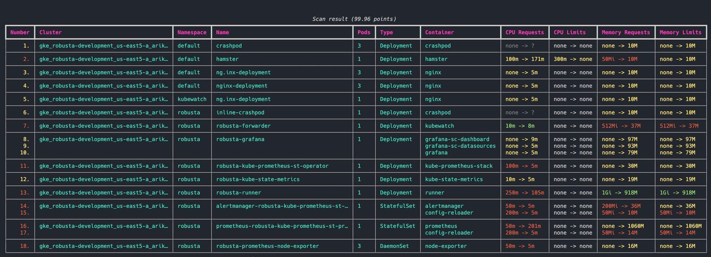

**Source:** [https://twitter.com/i/web/status/1926355284525486130](https://twitter.com/i/web/status/1926355284525486130)
**Original Post Date:** 2025-05-28 08:54:55

# Kubernetes Resource Scan Analysis: Insights from a Production Cluster Evaluation

## Introduction
This article explores the findings from a detailed Kubernetes cluster scan, examining resource allocation patterns across namespaces and deployments. With a score of 99.96 points indicating high compliance, we'll analyze specific areas for potential optimization while understanding how resources are distributed and configured in production environments.

## Understanding the Scan Result Structure

The scan result presents a tabular view of cluster resources across namespaces, showing CPU/memory configurations and pod counts. This visualization helps identify patterns in resource allocation and compliance status.

Key metrics tracked include CPU requests/limits (in millicores), memory requests/limits (Mi/Gi), and number of pods per deployment. The sequential numbering aids in tracking specific resources for further analysis.

```yaml
apiVersion: v1
kind: ResourceQuota
counters:
  requests.cpu: "500m"
  limits.cpu: "2"
```

## Resource Allocation Patterns and Optimizations

The scan reveals several resources with missing or suboptimal CPU/memory configurations. For example, the 'hamster' deployment shows significant adjustments in CPU (100m -> 17m) suggesting potential over-allocation.

Memory limits of 10Mi across multiple deployments might indicate under-provisioning for production workloads, while the robusta-runner's high memory usage (918M) suggests resource intensity.

- Resources with missing CPU requests/limits should be reviewed for performance implications
- Low memory limits (<50Mi) might require investigation and adjustment
- Dynamic adjustments indicate potential optimization opportunities

> **Note/Tip:** Implement gradual resource limit increases to prevent service disruptions

> **Note/Tip:** Use autoscaling where appropriate to handle variable workloads efficiently

## Namespace Analysis and Resource Distribution

Resources are distributed across three namespaces: default, kubewatch, and robusta. The robusta namespace contains critical monitoring components like prometheus-node-exporter, indicating a structured observability setup.

DaemonSets (like the node-exporter) running in all nodes should be monitored for resource consumption to prevent interference with other workloads.

## Key Takeaways

- Resource optimization opportunities exist even in high-scoring clusters
- Missing CPU/memory configurations warrant investigation and adjustment
- Namespace distribution reveals cluster organization patterns

## Conclusion
The scan result provides actionable insights for improving resource utilization while maintaining performance. Regular monitoring of resource metrics and proactive adjustments to requests/limits ensure optimal cluster efficiency.

## External References

- [Kubernetes Best Practices: Resource Management](https://kubernetes.io/docs/tasks/configure-pod-container/assign-cpu-resource/)
- [Monitoring and Optimization Guide](https://cloud.google.com/kubernetes-engine/docs/how-to/metrics-server)


## Media

**Image Description:** The image shows a detailed scan result of a Kubernetes cluster, presented in a tabular format. The table contains various columns that provide insights into the resources, deployments, and configurations within the cluster. Below is a detailed breakdown of the image:

### **Header**
- **Title**: The table is titled "Scan result (99.96 points)," indicating that this is a report summarizing the results of a scan performed on the Kubernetes cluster. The score of 99.96 points suggests a high level of compliance or optimization.

### **Columns**
The table is divided into several columns, each providing specific details about the resources and their configurations:

1. **Number**: A sequential identifier for each entry in the table.
2. **Cluster**: The name of the Kubernetes cluster being scanned. All entries in this column indicate the same cluster: `gke_robusta-development_us-east5-a_arik...`.
3. **Namespace**: The Kubernetes namespace where the resource is deployed. Namespaces include:
   - `default`
   - `kubewatch`
   - `robusta`
4. **Name**: The name of the Kubernetes resource (e.g., deployment, statefulset, daemonset).
5. **Pods**: The number of pods associated with the resource.
6. **Type**: The type of Kubernetes resource, such as:
   - Deployment
   - StatefulSet
   - DaemonSet
7. **Container**: The name of the container running within the resource.
8. **CPU Requests**: The requested CPU resources for the container. Values are shown in millicores (m) or as `none` if not specified.
9. **CPU Limits**: The CPU limits set for the container. Values are shown in millicores (m) or as `none` if not specified.
10. **Memory Requests**: The requested memory resources for the container. Values are shown in megabytes (Mi) or gigabytes (Gi) or as `none` if not specified.
11. **Memory Limits**: The memory limits set for the container. Values are shown in megabytes (Mi) or gigabytes (Gi) or as `none` if not specified.

### **Rows**
The table contains multiple rows, each representing a different Kubernetes resource. Below are some key observations from the rows:

#### **Row 1: Crashpod**
- **Namespace**: `default`
- **Name**: `crashpod`
- **Pods**: 3
- **Type**: Deployment
- **Container**: `crashpod`
- **CPU Requests**: `none -> ?`
- **CPU Limits**: `none -> none`
- **Memory Requests**: `none -> 10M`
- **Memory Limits**: `none -> 10M`

#### **Row 2: Hamster**
- **Namespace**: `default`
- **Name**: `hamster`
- **Pods**: 1
- **Type**: Deployment
- **Container**: `hamster`
- **CPU Requests**: `100m -> 17m`
- **CPU Limits**: `300m -> none`
- **Memory Requests**: `50Mi -> 10M`
- **Memory Limits**: `none -> 10M`

#### **Row 3: NGINX Deployment**
- **Namespace**: `default`
- **Name**: `ng-nginx-deployment`
- **Pods**: 3
- **Type**: Deployment
- **Container**: `nginx`
- **CPU Requests**: `none -> 5m`
- **CPU Limits**: `none -> none`
- **Memory Requests**: `none -> 10M`
- **Memory Limits**: `none -> 10M`

#### **Row 6: Inline Crashpod**
- **Namespace**: `robusta`
- **Name**: `inline-crashpod`
- **Pods**: 1
- **Type**: Deployment
- **Container**: `crashpod`
- **CPU Requests**: `none -> ?`
- **CPU Limits**: `none -> none`
- **Memory Requests**: `none -> 10M`
- **Memory Limits**: `none -> 10M`

#### **Row 7: Robusta Forwarder**
- **Namespace**: `robusta`
- **Name**: `robusta-forwarder`
- **Pods**: 1
- **Type**: Deployment
- **Container**: `kubewatch`
- **CPU Requests**: `10m -> 8m`
- **CPU Limits**: `none -> none`
- **Memory Requests**: `512Mi -> 37M`
- **Memory Limits**: `51Mi -> 37M`

#### **Row 13: Robusta Runner**
- **Namespace**: `robusta`
- **Name**: `robusta-runner`
- **Pods**: 1
- **Type**: Deployment
- **Container**: `runner`
- **CPU Requests**: `250m -> 105m`
- **CPU Limits**: `none -> none`
- **Memory Requests**: `1Gi -> 918M`
- **Memory Limits**: `1Gi -> 918M`

#### **Row 17: Prometheus Node Exporter**
- **Namespace**: `robusta`
- **Name**: `robusta-prometheus-node-exporter`
- **Pods**: 3
- **Type**: DaemonSet
- **Container**: `node-exporter`
- **CPU Requests**: `50m -> 5m`
- **CPU Limits**: `none -> none`
- **Memory Requests**: `none -> none`
- **Memory Limits**: `none -> 16M`

### **Key Observations**
1. **Resource Allocation**:
   - Many resources have `none` set for CPU and memory requests/limits, indicating that they are not explicitly configured.
   - Some resources have dynamic adjustments (e.g., `100m -> 17m` for CPU requests), suggesting that the scan might be analyzing resource usage and recommending optimizations.

2. **Namespaces**:
   - Resources are distributed across different namespaces (`default`, `kubewatch`, `robusta`), indicating a structured organization of the cluster.

3. **Resource Types**:
   - The cluster includes various types of Kubernetes resources, such as Deployments, StatefulSets, and DaemonSets, showcasing a diverse set of workloads.

4. **Memory and CPU Limits**:
   - Some resources have memory limits set to `10M` or `10M`, which might be too low for production environments.
   - The `robusta-runner` has high memory requests and limits (`1Gi -> 918M`), indicating it might be a resource-intensive component.

5. **Dynamic Adjustments**:
   - The scan result shows dynamic adjustments for CPU and memory, suggesting that the scan tool is analyzing current usage and recommending optimized values.

### **Overall Context**
The image is a detailed report from a Kubernetes cluster scan, likely performed by a tool that evaluates resource usage, configuration, and compliance. The scan highlights areas where resource requests and limits are not explicitly set, suggesting potential optimizations. The high score of 99.96 points indicates that the cluster is well-configured, but there are opportunities for further optimization, especially in terms of resource management.

This type of report is valuable for DevOps teams to ensure efficient resource utilization, identify potential bottlenecks, and maintain high performance in Kubernetes environments.
