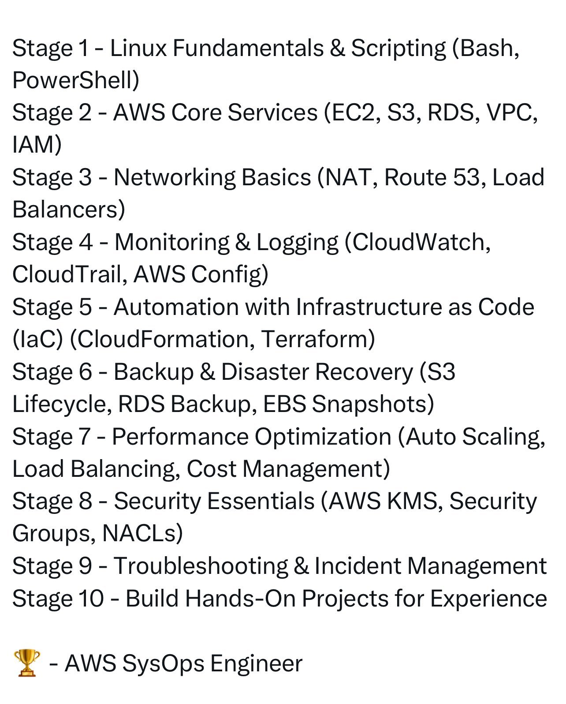

**Source:** [https://twitter.com/i/web/status/1890715428307038441](https://twitter.com/i/web/status/1890715428307038441)
**Original Post Date:** 2025-05-28 06:11:06

# AWS SysOps Engineer Learning Roadmap: From Fundamentals to Production Mastery

## Introduction
This structured learning roadmap provides a comprehensive journey from foundational concepts to advanced AWS system administration. The program spans ten stages, each building upon previous knowledge to develop expertise in cloud operations, infrastructure automation, and secure deployment practices. This curriculum specifically prepares professionals for the AWS SysOps Engineer role by covering essential technologies including Linux fundamentals, core AWS services, networking, security, and incident management.

The roadmap emphasizes hands-on experience through practical projects and exercises, ensuring learners gain both theoretical knowledge and real-world application skills.

## Stage 1: Building the Foundation - Linux Fundamentals

Master essential Linux command-line operations including file system management, process control, and user administration. Gain proficiency in Bash scripting for automation tasks critical to cloud operations.

_Demonstrates basic automation using Bash scripting for routine tasks_

```bash
# Example: Automated backup script
#!/bin/bash
timestamp=$(date +%Y%m%d)
mysqldump -u root -p database > /backup/db_$timestamp.sql
```

## Stage 2: Core AWS Infrastructure Services

Deep dive into EC2 instance management, S3 bucket configuration, RDS database setup, VPC networking, and IAM role creation. Learn best practices for deploying production-ready cloud resources.

_Sample CloudFormation template demonstrating EC2 instance provisioning_

```yaml
# CloudFormation template for basic EC2 instance
Resources:
  WebServer:
    Type: AWS::EC2::Instance
    Properties:
      ImageId: ami-12345678
      InstanceType: t2.micro
      KeyName: my-key-pair
```

## Stage 3: Network Architecture Fundamentals

Explore advanced networking concepts including VPC peering, subnet design, and security group configuration. Master Route53 DNS management for scalable web applications.

1. Configure VPC with public and private subnets
1. Set up NAT gateways for outbound internet access
1. Implement security groups for network isolation

## Stage 10: Production Environment Mastery

Apply comprehensive knowledge through real-world projects, including building a fully automated CI/CD pipeline and implementing disaster recovery strategies.

> **Note/Tip:** Practice in AWS free tier environment to minimize costs

> **Note/Tip:** Document all configurations and procedures for future reference

## Key Takeaways

- Systematic approach to building AWS SysOps expertise through structured stages
- Hands-on experience with essential tools like CloudFormation and Terraform
- Focus on security, automation, and incident management practices
- Real-world project experience through practical exercises

## Conclusion
This learning plan provides a comprehensive pathway to becoming an expert AWS SysOps Engineer. By following each stage methodically and completing hands-on projects, learners will develop the skills needed for managing complex cloud environments effectively.

## External References

- [AWS Official Documentation](https://docs.aws.amazon.com)
- [AWS Certified SysOps Administrator Associate Study Guide](https://aws.amazon.com/certification/certified-sysops-administrator-associate/)


## Media

**Image Description:** The image is a text-based outline of a structured learning or training program focused on AWS (Amazon Web Services) and related technologies. The content is organized into ten stages, each covering specific technical topics and skills. Below is a detailed breakdown of the image:

### **Main Subject**
The main subject of the image is a **training roadmap or curriculum** designed for individuals looking to become proficient in AWS and related cloud computing technologies. The stages are sequentially numbered, and each stage focuses on a specific set of skills or concepts.

### **Technical Details and Breakdown of Each Stage**

#### **Stage 1: Linux Fundamentals & Scripting**
- **Topics Covered**: 
  - Linux fundamentals, including basic commands, file systems, and system administration.
  - Scripting using Bash and PowerShell.
- **Purpose**: This stage lays the foundation by teaching essential Linux skills and scripting, which are crucial for cloud operations and automation.

#### **Stage 2: AWS Core Services**
- **Topics Covered**: 
  - EC2 (Elastic Compute Cloud): Virtual servers.
  - S3 (Simple Storage Service): Object storage.
  - RDS (Relational Database Service): Managed relational databases.
  - VPC (Virtual Private Cloud): Networking infrastructure.
  - IAM (Identity and Access Management): Security and access control.
- **Purpose**: Introduces the core AWS services that are fundamental for building and managing cloud infrastructure.

#### **Stage 3: Networking Basics**
- **Topics Covered**: 
  - NAT (Network Address Translation): Managing network traffic.
  - Route 53: DNS (Domain Name System) management.
  - Load Balancers: Distributing traffic across resources.
- **Purpose**: Focuses on understanding and configuring networking components in AWS, which are essential for scalable and reliable cloud setups.

#### **Stage 4: Monitoring & Logging**
- **Topics Covered**: 
  - CloudWatch: Monitoring and logging for AWS resources.
  - CloudTrail: Auditing and tracking API calls.
  - AWS Config: Configuration management and compliance.
- **Purpose**: Teaches how to monitor, log, and audit AWS resources to ensure performance, security, and compliance.

#### **Stage 5: Automation with Infrastructure as Code (IaC)**
- **Topics Covered**: 
  - CloudFormation: AWS-native IaC tool.
  - Terraform: Third-party IaC tool.
- **Purpose**: Introduces automation techniques using IaC to manage and provision AWS resources efficiently and consistently.

#### **Stage 6: Backup & Disaster Recovery**
- **Topics Covered**: 
  - S3 Lifecycle Policies: Automating data lifecycle management.
  - RDS Backup: Database backups.
  - EBS Snapshots: Storage snapshots.
- **Purpose**: Focuses on strategies for backing up data and ensuring business continuity in case of failures or disasters.

#### **Stage 7: Performance Optimization**
- **Topics Covered**: 
  - Auto Scaling: Dynamically adjusting resources based on demand.
  - Load Balancing: Distributing traffic to optimize performance.
  - Cost Management: Managing and optimizing cloud costs.
- **Purpose**: Teaches techniques for optimizing the performance and cost efficiency of AWS resources.

#### **Stage 8: Security Essentials**
- **Topics Covered**: 
  - AWS KMS (Key Management Service): Managing encryption keys.
  - Security Groups: Controlling network traffic.
  - NACLs (Network Access Control Lists): Fine-grained network control.
- **Purpose**: Focuses on securing AWS resources and ensuring compliance with security best practices.

#### **Stage 9: Troubleshooting & Incident Management**
- **Topics Covered**: 
  - Techniques for identifying and resolving issues in AWS environments.
  - Incident management processes for handling disruptions.
- **Purpose**: Prepares learners to handle and resolve issues in production environments effectively.

#### **Stage 10: Build Hands-On Experience**
- **Topics Covered**: 
  - Practical projects and exercises to apply the skills learned in previous stages.
- **Purpose**: Provides hands-on experience to solidify understanding and build confidence in using AWS services.

### **Additional Notes**
- **Typography and Formatting**: 
  - The text is presented in a clean, structured format with clear headings for each stage.
  - Some terms are repeated multiple times (e.g., "Load Balancing," "Disaster Recovery"), which might be a formatting or copying error.
- **Icon**: 
  - At the bottom, there is a trophy icon followed by the text "- AWS SysOps Engineer," indicating that the curriculum is designed to prepare individuals for a SysOps (Systems Operations) role in AWS.

### **Overall Purpose**
The image outlines a comprehensive learning path for becoming proficient in AWS and cloud computing, covering foundational skills, core services, networking, monitoring, automation, security, and hands-on experience. It is structured to guide learners from basic concepts to advanced, real-world applications, ultimately preparing them for a SysOps role in AWS environments.
