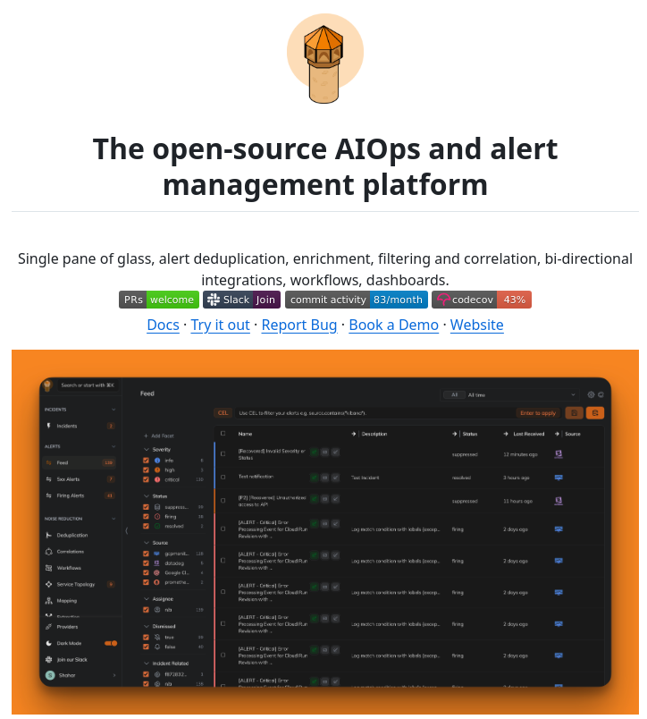

The Alert Manager is an open-source platform designed for alert management and AIOps (Artificial Intelligence for IT Operations). It provides a single-pane-of-glass interface for managing alerts, real-time monitoring, and customizable dashboards. This platform is tailored to meet the needs of IT teams and organizations seeking to streamline their operations and enhance system visibility.

#### Technical Content
The Alert Manager platform offers several key features that make it an indispensable tool for DevOps and monitoring tasks:
- **Single-Pane-of-Glass Alert Management**: This feature allows users to view, manage, and respond to alerts from a single interface. It simplifies the process of dealing with multiple alerts by providing a centralized location for all alert-related activities.
- **Real-Time Monitoring**: The platform enables real-time monitoring of systems, applications, and infrastructure. This capability is crucial for identifying issues as they occur, thereby reducing downtime and improving overall system reliability.
- **Customizable Dashboards**: Users can create personalized dashboards that display the most relevant metrics and data. This customization option ensures that each user has immediate access to the information they need, enhancing productivity and efficiency.

The open-source nature of the Alert Manager platform is one of its most significant advantages. By being open-source:
- **Community Contributions**: Developers from around the world can contribute to the platform's development. This leads to a faster pace of innovation, as more minds are working together to solve common challenges.
- **Customization and Extensibility**: Users have the freedom to modify the platform according to their specific needs. Whether it's integrating with existing tools, developing new features, or tweaking performance, the open-source model provides unparalleled flexibility.

#### Examples
For instance, an IT team using the Alert Manager can set up customized dashboards for different roles within the team. The operations team might have a dashboard focused on system uptime and alert statuses, while the development team could have a dashboard that highlights application performance metrics and code health indicators. This tailored approach ensures that each team member is always looking at the data most relevant to their responsibilities.

#### Key Takeaways and Best Practices
- **Adopt a Proactive Approach**: Use real-time monitoring to identify potential issues before they become incidents.
- **Customize Effectively**: Tailor your dashboards and alerts to fit your specific operational needs for maximum efficiency.
- **Engage with the Community**: Contribute to the open-source community by sharing customizations, reporting bugs, or participating in feature development discussions.

#### References
- **AIOps**: Artificial Intelligence for IT Operations, which involves using AI and machine learning to automate and enhance IT operations tasks.
- **DevOps**: A set of practices that combines software development (Dev) and IT operations (Ops) to improve the speed, quality, and reliability of software releases and deployments.
- **Open-Source Software**: Software that is released under a license which allows users to view, modify, and distribute the software to anyone and for any purpose.

By leveraging the Alert Manager platform, organizations can significantly enhance their ability to manage alerts, monitor systems in real-time, and make data-driven decisions. Its open-source nature ensures that it remains adaptable and relevant to evolving IT landscapes.
## Source

- Original Tweet: [https://twitter.com/i/web/status/1880367545330372700](https://twitter.com/i/web/status/1880367545330372700)
- Date: 2025-02-20 20:47:39

## Media

### Media 1

**Description:** The image displays a screenshot of an open-source AIOps and alert management platform, with a title at the top that reads "The open-source AIOps and alert management platform". 

* The title is written in dark gray text and features a small logo above it, which appears to be a stylized illustration of a light bulb.
	+ The logo is likely intended to represent illumination or insight, possibly symbolizing the platform's ability to provide clarity and understanding for its users.
* Below the title, there is a paragraph of text that describes the platform's features and capabilities.
	+ The text mentions that the platform offers single-pane-of-glass alert management, real-time monitoring, and customizable dashboards.
	+ It also highlights the platform's open-source nature, which allows developers to contribute to its development and customize it to suit their specific needs.

In summary, the image presents a user-friendly interface for managing alerts and monitoring systems in real-time. The platform's open-source nature enables users to customize and extend its functionality as needed, making it a versatile tool for IT teams and organizations.

*Last updated: 2025-02-20 20:47:39*