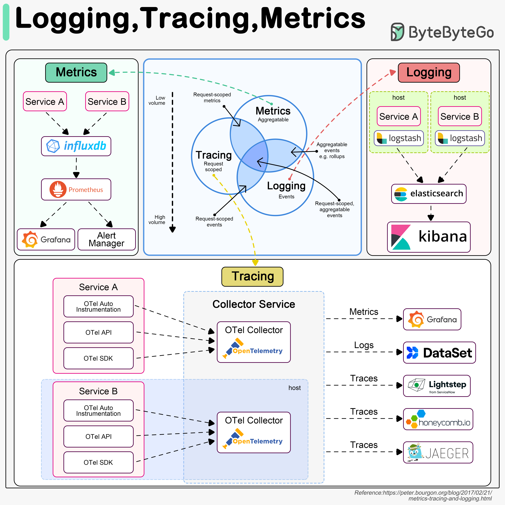

# Observability Fundamentals

## Description
The Foundation of Observability...

## Content
The Foundation of Observability

## Category Information

- Main Category: devops
- Sub Category: monitoring
- Item Name: observability_fundamentals

## Source

- Original Tweet: [https://twitter.com/i/web/status/1889906611487121477](https://twitter.com/i/web/status/1889906611487121477)
- Date: 2025-02-20 15:36:34

## Media

### Media 1

**Description:** The image presents a comprehensive overview of logging, tracing, and metrics in software development, highlighting their interconnectedness and importance in ensuring system performance and reliability.

* **Logging**
	+ Definition: The process of recording events that occur within an application or system.
	+ Importance: Facilitates debugging, troubleshooting, and monitoring of system behavior.
	+ Tools:
		- Grafana
		- Prometheus
		- InfluxDB
* **Tracing**
	+ Definition: A technique used to analyze the performance and behavior of complex systems by tracing the flow of requests through different components or services.
	+ Importance: Enables identification of bottlenecks, optimization of system performance, and improved error handling.
	+ Tools:
		- OpenTelemetry
		- Jaeger
* **Metrics**
	+ Definition: Quantifiable data used to measure and evaluate the performance, behavior, and health of a system or application.
	+ Importance: Essential for monitoring system performance, detecting anomalies, and making informed decisions about resource allocation and optimization.
	+ Tools:
		- Prometheus
		- Grafana

The image effectively illustrates the relationships between logging, tracing, and metrics, demonstrating how these tools work together to provide a comprehensive view of system behavior. By understanding how these components interact, developers can optimize their systems for better performance, reliability, and scalability.

In summary, the image provides a detailed explanation of logging, tracing, and metrics in software development, highlighting their importance and interconnectivity in ensuring system performance and reliability.

*Last updated: 2025-02-20 15:36:34*