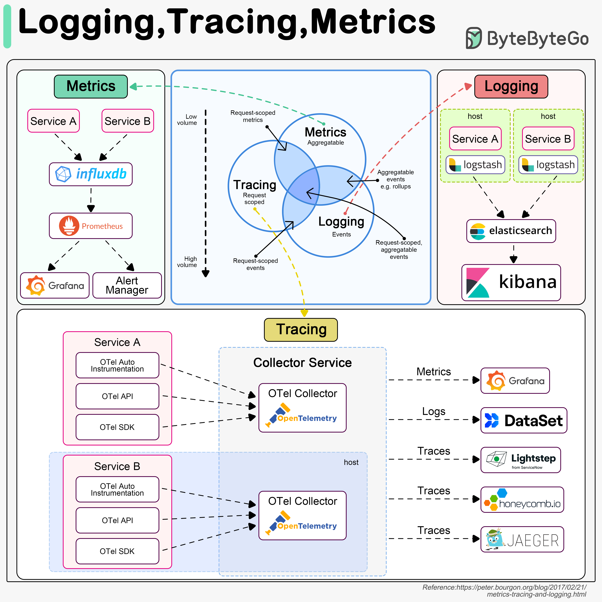

Observability is a critical aspect of software development that enables developers to understand the behavior and performance of their systems. At its core, observability consists of three fundamental components: logging, tracing, and metrics. This entry provides an in-depth exploration of these components, their importance, and how they work together to ensure system performance and reliability.

#### Observability Fundamentals
Observability is essential for monitoring system behavior, debugging issues, and optimizing performance. The three pillars of observability are:

##### Logging
Logging refers to the process of recording events that occur within an application or system. This includes errors, warnings, information messages, and debug statements. Logging is crucial for:
* Debugging and troubleshooting issues
* Monitoring system behavior and performance
* Auditing and compliance purposes

Some popular logging tools include:
* **Grafana**: A visualization tool for metrics and logs
* **Prometheus**: A monitoring system and time series database
* **InfluxDB**: A time-series database optimized for high-performance storage and retrieval of log data

Example use case: Using Grafana to visualize log data from a web application, allowing developers to identify trends and patterns in user behavior.

##### Tracing
Tracing involves analyzing the performance and behavior of complex systems by tracking the flow of requests through different components or services. This technique enables:
* Identification of bottlenecks and optimization of system performance
* Improved error handling and debugging
* Better understanding of system behavior and interactions

Some popular tracing tools include:
* **OpenTelemetry**: An open-source observability framework for distributed systems
* **Jaeger**: A distributed tracing system for microservices-based architectures

Example use case: Using OpenTelemetry to trace requests through a microservices-based e-commerce platform, allowing developers to identify performance bottlenecks and optimize resource allocation.

##### Metrics
Metrics refer to quantifiable data used to measure and evaluate the performance, behavior, and health of a system or application. This includes metrics such as:
* CPU usage
* Memory utilization
* Request latency
* Error rates

Some popular metrics tools include:
* **Prometheus**: A monitoring system and time series database
* **Grafana**: A visualization tool for metrics and logs

Example use case: Using Prometheus to collect metrics on a web server's performance, allowing developers to identify trends and patterns in resource utilization and optimize configuration settings.

#### Key Takeaways and Best Practices
To effectively implement observability in your software development workflow:
1. **Implement comprehensive logging**: Ensure that all components of your system are logging relevant events and errors.
2. **Use tracing to understand system behavior**: Implement tracing tools to analyze the flow of requests through your system and identify performance bottlenecks.
3. **Collect and visualize metrics**: Use metrics tools to collect and visualize data on system performance, allowing for informed decisions about resource allocation and optimization.
4. **Integrate observability into your CI/CD pipeline**: Incorporate logging, tracing, and metrics into your continuous integration and delivery pipeline to ensure that issues are identified and addressed early in the development cycle.

#### References
* [Grafana](https://grafana.com/)
* [Prometheus](https://prometheus.io/)
* [InfluxDB](https://www.influxdata.com/products/influxdb/)
* [OpenTelemetry](https://opentelemetry.io/)
* [Jaeger](https://www.jaegertracing.io/)
## Source

- Original Tweet: [https://twitter.com/i/web/status/1889906611487121477](https://twitter.com/i/web/status/1889906611487121477)
- Date: 2025-02-20 16:26:22

## Media

### Media 1

**Description:** The image presents a comprehensive overview of logging, tracing, and metrics in software development, highlighting their interconnectedness and importance in ensuring system performance and reliability.

* **Logging**
	+ Definition: The process of recording events that occur within an application or system.
	+ Importance: Facilitates debugging, troubleshooting, and monitoring of system behavior.
	+ Tools:
		- Grafana
		- Prometheus
		- InfluxDB
* **Tracing**
	+ Definition: A technique used to analyze the performance and behavior of complex systems by tracing the flow of requests through different components or services.
	+ Importance: Enables identification of bottlenecks, optimization of system performance, and improved error handling.
	+ Tools:
		- OpenTelemetry
		- Jaeger
* **Metrics**
	+ Definition: Quantifiable data used to measure and evaluate the performance, behavior, and health of a system or application.
	+ Importance: Essential for monitoring system performance, detecting anomalies, and making informed decisions about resource allocation and optimization.
	+ Tools:
		- Prometheus
		- Grafana

The image effectively illustrates the relationships between logging, tracing, and metrics, demonstrating how these tools work together to provide a comprehensive view of system behavior. By understanding how these components interact, developers can optimize their systems for better performance, reliability, and scalability.

In summary, the image provides a detailed explanation of logging, tracing, and metrics in software development, highlighting their importance and interconnectivity in ensuring system performance and reliability.

*Last updated: 2025-02-20 16:26:22*