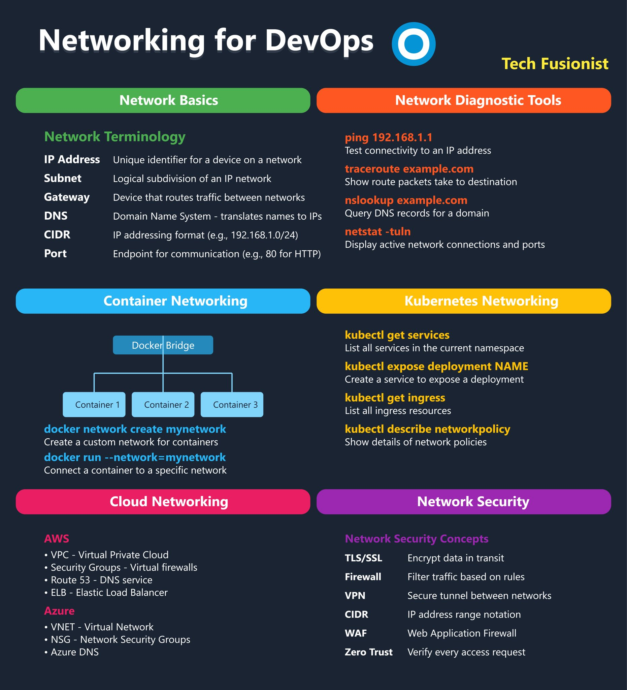

**Source:** [https://twitter.com/i/web/status/1918901182560714906](https://twitter.com/i/web/status/1918901182560714906)
**Original Post Date:** 2025-05-27 17:19:45

# Networking Essentials for Modern DevOps Environments

## Introduction
Network knowledge is foundational to modern DevOps practices. This guide covers essential concepts from basic terminology to advanced cloud networking. Understanding these principles enables effective infrastructure design, troubleshooting, and secure deployment strategies across various environments.

## 1. Network Basics

Core networking concepts form the foundation for DevOps operations. These fundamental elements define how systems communicate within and between networks.

- IP Address: Unique identifier for network devices
- Subnet: Logical network division (e.g., 192.168.1.0/24)
- Gateway: Network traffic routing point
- DNS: Domain name to IP address translation service
- CIDR: Modern IP addressing notation
- Port: Communication endpoint identifier

> **Note/Tip:** Understanding these terms is crucial for configuring networked services and troubleshooting connectivity issues

## 2. Network Diagnostic Tools

Essential command-line tools help diagnose network problems efficiently.

```bash
ping 192.168.1.1
traceroute example.com
nslookup example.com
docker network inspect mynetwork
```

- ping: Verify connectivity
- traceroute: Map route paths
- nslookup: DNS resolution

## 3. Container Networking

Docker provides isolation through network namespaces and various networking options.

```bash
docker network create mynetwork
docker run --network=mynetwork container_name
```

> **Note/Tip:** Custom networks improve container communication security

## 4. Kubernetes Networking

Kubernetes networking enables service discovery and load balancing.

```bash
kubectl get services
kubectl expose deployment deployment-NAME
kubectl describe networkpolicy
```

- Services: Expose container ports
- Ingress: External traffic routing

## 5. Cloud Networking

Cloud providers offer specialized networking services for scalable deployments.

1. AWS VPC
1. Security Groups
1. Route 53
1. Azure Virtual Networks

## 6. Network Security

Security is critical for protecting network resources and data in transit.

- TLS/SSL encryption
- Firewall rules
- VPN tunnels

> **Note/Tip:** Implement zero trust principles to minimize attack surfaces

## Key Takeaways

- Master network fundamentals for effective DevOps operations
- Container networking requires understanding of isolation and communication patterns
- Kubernetes services provide robust service discovery and load balancing
- Cloud platforms offer specialized networking features for scalable applications

## Conclusion
Understanding these networking concepts enables developers to design, deploy, and maintain secure, efficient cloud-native applications. Regular practice with diagnostic tools and security practices ensures reliable network operations.

## External References

- [Docker Networking Documentation](https://docs.docker.com/network/)
- [Kubernetes Networking Guide](https://kubernetes.io/docs/concepts/services-networking/service/)


## Media

**Image Description:** ### Description of the Image

The image is a comprehensive infographic titled **"Networking for DevOps"**, designed to provide an overview of networking concepts, tools, and practices relevant to DevOps professionals. The layout is organized into six main sections, each focusing on a different aspect of networking. Below is a detailed breakdown of each section:

---

### **1. Network Basics**
- **Network Terminology**: This section defines fundamental networking terms:
  - **IP Address**: A unique identifier for a device on a network.
  - **Subnet**: A logical subdivision of an IP network.
  - **Gateway**: A device that routes traffic between networks.
  - **DNS (Domain Name System)**: Translates domain names to IP addresses.
  - **CIDR (Classless Inter-Domain Routing)**: An IP addressing format (e.g., 192.168.1.0/24).
  - **Port**: An endpoint for communication (e.g., port 80 for HTTP).

---

### **2. Network Diagnostic Tools**
- This section lists essential tools for diagnosing network issues:
  - **ping**: Tests connectivity to an IP address (e.g., `ping 192.168.1.1`).
  - **traceroute**: Shows the route packets take to a destination (e.g., `traceroute example.com`).
  - **nslookup**: Queries DNS records for a domain (e.g., `nslookup example.com`).
  - **netstat -tuln**: Displays active network connections and ports.

---

### **3. Container Networking**
- This section explains networking concepts for Docker containers:
  - **Docker Bridge**: A default network bridge created by Docker.
  - **Custom Network**: Creating a custom network for containers using:
    ```bash
    docker network create mynetwork
    ```
  - **Connecting Containers to a Network**: Running a container with a specific network:
    ```bash
    docker run --network=mynetwork
    ```
  - **Diagram**: A visual representation shows containers connected to a custom network.

---

### **4. Kubernetes Networking**
- This section covers networking in Kubernetes:
  - **kubectl get services**: Lists all services in the current namespace.
  - **kubectl expose deployment**: Exposes a deployment as a service:
    ```bash
    kubectl expose deployment deployment-NAME
    ```
  - **kubectl get ingress**: Lists all ingress resources.
  - **kubectl describe networkpolicy**: Describes network policies.

---

### **5. Cloud Networking**
- This section details networking services in major cloud platforms:
  - **AWS**:
    - **VPC (Virtual Private Cloud)**: A logically isolated network.
    - **Security Groups**: Virtual firewalls.
    - **Route 53**: DNS service.
    - **ELB (Elastic Load Balancer)**: Balances traffic across instances.
  - **Azure**:
    - **VNET (Virtual Network)**: A virtual network.
    - **NSG (Network Security Group)**: Controls network traffic.
    - **Azure DNS**: Manages DNS records.

---

### **6. Network Security**
- This section outlines key security concepts and tools:
  - **TLS/SSL**: Encrypts data in transit.
  - **Firewall**: Filters traffic based on rules.
  - **VPN (Virtual Private Network)**: Secure tunnel between networks.
  - **CIDR**: IP address range notation.
  - **WAF (Web Application Firewall)**: Protects web applications from attacks.
  - **Zero Trust**: Verifies every access request.

---

### **Design and Layout**
- The infographic uses a dark background with colored sections to differentiate topics:
  - **Green**: Network Basics.
  - **Orange**: Network Diagnostic Tools.
  - **Blue**: Container Networking.
  - **Yellow**: Kubernetes Networking.
  - **Pink**: Cloud Networking.
  - **Purple**: Network Security.
- The text is clear and concise, with bullet points and code snippets for practical examples.
- Visual elements, such as diagrams and icons, are used to enhance understanding.

---

### **Overall Purpose**
The infographic serves as a quick reference guide for DevOps professionals, covering essential networking concepts, tools, and practices across various environments (local, containerized, Kubernetes, and cloud). It is designed to be informative and actionable, providing both theoretical knowledge and practical commands.

---

### **Key Takeaways**
1. **Fundamentals**: Covers basic networking terminology and tools.
2. **Containerization**: Explains Docker networking and custom networks.
3. **Kubernetes**: Focuses on service exposure and ingress management.
4. **Cloud**: Highlights networking services in AWS and Azure.
5. **Security**: Emphasizes secure networking practices and tools.

This structured approach makes the infographic a valuable resource for anyone working in DevOps or networking.
