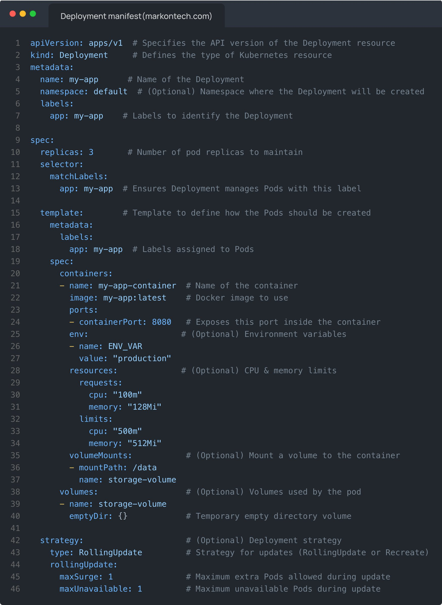

# Kubernetes Deployment Structure

## Description
** Kubernetes deployment manifest file structure explained **

In the Kubernetes deployment YAML we define how an application should be deployed and managed within a Kubernetes cluster. 

Below is a b...

## Content
** Kubernetes deployment manifest file structure explained **

In the Kubernetes deployment YAML we define how an application should be deployed and managed within a Kubernetes cluster. 

Below is a breakdown of the YAML structure with explanations.

** Explanation of the key sections **

- apiVersion & kind: Defines that this is a deployment resource and uses apps/v1 Kubernetes API.
- metadata: Contains details like the name and labels for app organization.
- spec.replicas: Defines the desired number of running instances (pods).
- spec.selector.matchLabels: Ensures the deployment controls only pods with matching labels.
- spec.template:
   - Defines the pod template (metadata and spec).
   - The containers section defines container details such as the image, ports, and resources.
   - Environment variables, volume mounts, and resource limits can also be set.
- spec.strategy: Controls the deployment update strategy (RollingUpdate or Recreate).
- volumes: Allows defining persistent storage like ConfigMaps, Secrets, or Persistent Volumes.

** Optional additions **

    - Liveness & Readiness Probes (for health checks)
    - Affinity & Node Selectors (for scheduling)
    - Init Containers (for pre-processing tasks)

## Category Information

- Main Category: devops
- Sub Category: orchestration
- Item Name: kubernetes_deployment_structure

## Source

- Original Tweet: [https://twitter.com/i/web/status/1888703569395654704](https://twitter.com/i/web/status/1888703569395654704)
- Date: 2025-02-20 15:36:34

## Media

### Media 1

**Description:** The image presents a code snippet for deployment, showcasing the structure and organization of the code through indentation.

*   The code is organized into sections using indentation, with each section having its own set of attributes.
    *   The first section defines the API version as "1" and specifies the kind of deployment as "Deployment".
        *   This indicates that the code is for a Kubernetes deployment.
    *   The second section lists various metadata about the deployment, including name, namespace, labels, and replicas.
        *   These attributes provide information about the deployment's identity and configuration.
    *   The third section defines the container template for the deployment.
        *   It specifies the image to use, the port number, and the command to run when the container starts.
    *   The fourth section defines the environment variables for the containers.
        *   These variables can be used by the containers to configure their behavior or access external resources.
*   The code also includes several comments that provide additional information about the deployment's purpose and configuration.
    *   These comments are written in a clear and concise manner, making it easy to understand the intent behind the code.

Overall, the code snippet provides a comprehensive overview of how to deploy an application using Kubernetes. It demonstrates how to define the deployment's metadata, container template, and environment variables, as well as how to configure the deployment's behavior through comments.

*Last updated: 2025-02-20 15:36:34*